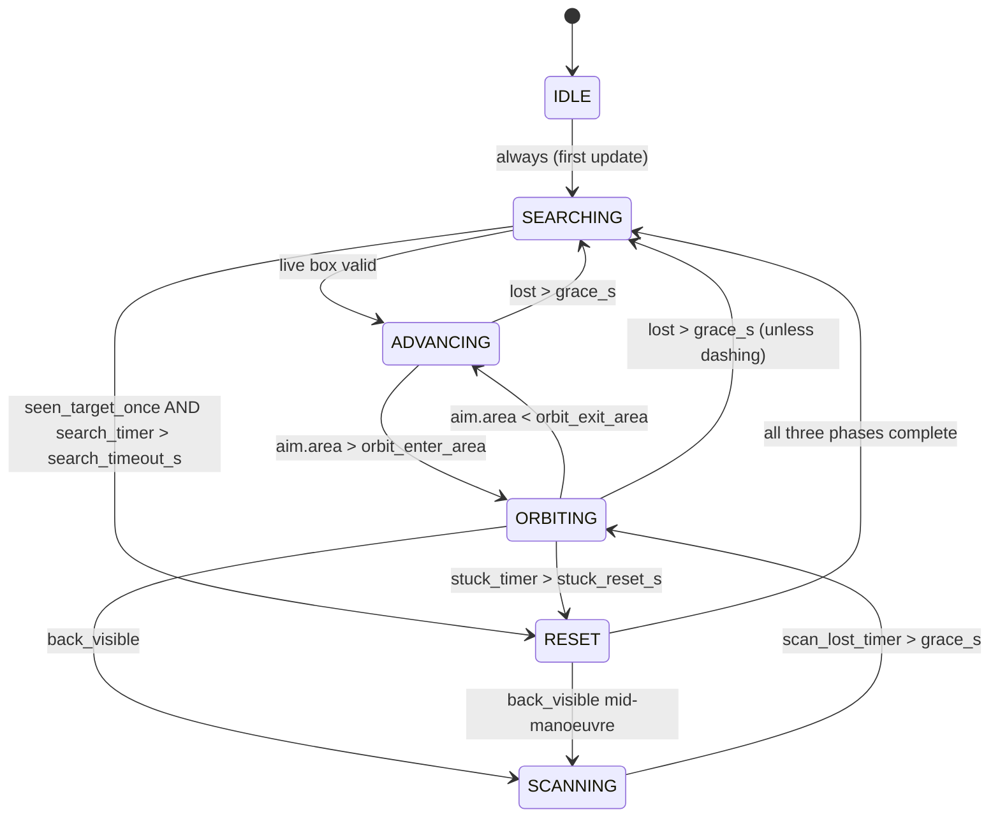

# BlueROV2 Autonomy Stack — Complete Engineering Handoff

**Audience:** an engineer with *zero* prior exposure to this repository, this vehicle, or
underwater robotics. By the end of this document you should be able to (a) explain how
every subsystem works and why it was built that way, (b) run the vehicle in a pool,
(c) run the simulator, (d) change the autonomy behaviour with confidence, and
(e) find and fix the known rough edges.

**Scope:** the whole system — Raspberry Pi firmware-level drivers, the onboard server,
the network protocol, the topside operator application, the perception pipeline, the
autonomy state machine, the Unity physics simulator, the sim-to-real tuning procedure,
and the operational runbooks.

**Status of the codebase:** two consecutive competition wins (2025 and 2026). The 2026
winning configuration is preserved verbatim under `client/2026/2026-mit(WINNER)/`.
Treat that directory as a frozen, known-good reference — never edit it, only copy from it.

---

## 0. How to read this document

| If you are… | Read |
|---|---|
| Completely new to robotics | Part 1 → Part 2 (concepts primer) → Part 3, then skim the rest |
| A software engineer who needs to change autonomy behaviour | Part 1.3 → Part 6 → Part 8 → Part 14 |
| Trying to get the sub wet today | Part 4 → Part 12 (runbooks) → Part 12.6 (sign conventions) |
| Working on the simulator | Part 2.6 → Part 9 → Part 10 |
| Working on vision | Part 11, then Part 7.3 |
| Debugging something weird | Part 14 (known issues) first, always |

### A note on source fidelity

This document was written by reading the source. Some files are described from their
*full source*, others only from how they are *referenced elsewhere* in the repo. Know
which is which before you trust a detail:

**Documented from full source (high confidence):**

- `server/rov-server.py`
- `client/TESTED-new-rov-client-...-move-forward.py` (the main topside app)
- `client/new_strategy_full.py`, `client/strategy_gains.json`
- `client/controller_id_tester.py`, `client/videos/render.py`
- All of `drivers/` (`pca9685`, `ms5837`, `icm20602`, `ak09915`, `mmc5983`, `bmp280`)
- `drivers/config.txt`, `drivers/i2c_scan_results.txt`, `drivers/setup_drivers.sh`
- Unity: `Hydrodynamics.cs`, `SimBridge.cs`, `ThrusterMixer.cs` (via the mix it
  documents), `TuningHarness.cs`, `SubCameraToggle.cs`, `RandomSpawn.cs` (via its
  description in the README and TuningHarness interplay)
- `run_sim.py`
- `client/2025/*` and `client/archive/*` (historical context)

**Documented from references only (verify before relying on):**

- `SubController.cs` — its public API is fully pinned down by its callers
  (`ApplyCommand`, `manualInputEnabled`, `surgeGain`, `strafeGain`, `heaveGain`,
  `yawGain`), but the body of the file was not available.
- `Pool.cs` — described in the README as pool geometry only.
- `train.py`, `extract_frames.py` — described in the README; CLI shape is known.
- `run_evade.py`, `strategy_target.py` — described in the README and by the port
  numbers they use.
- `bench/light_finder.py`, `bench/camera_aim.py`, `bench/gamepad_test.py` — described
  in the README; behaviour is unambiguous but the code was not read.
- `pool_test.py`, `real_test_gui.py` — described in the README as CLI/legacy
  equivalents of the client's test panel.

Anywhere this document *infers* rather than reports, it says so explicitly with the word
**inference**.

---

# PART 1 — ORIENTATION

## 1.1 What the vehicle physically is

The vehicle is a **BlueROV2 (r1 frame)** — a small, box-shaped, tethered underwater
robot roughly the size of a carry-on suitcase. Relevant physical facts:

- **Six thrusters.** Four mounted horizontally at 45° angles (the "vectored"
  configuration) and two mounted vertically. The four angled horizontals let it move
  forward/backward, sideways, and rotate — all without tilting. The two verticals move
  it up and down.
- **Positively buoyant.** Left alone with motors off, it floats *upward*. This is a
  deliberate safety property (a dead vehicle surfaces instead of sinking) and it is why
  the depth controller has an integral term — see Part 7.6.
- **Self-righting.** Its centre of buoyancy sits *above* its centre of gravity, so if
  tipped it rolls back upright by itself, like a weeble. The simulator reproduces this
  (Part 9.2).
- **Onboard compute:** a Raspberry Pi 4B. All heavy computation (neural networks,
  strategy) happens *topside* on a laptop; the Pi is a fast, dumb I/O bridge.
- **Tether:** carries Ethernet. Everything between laptop and vehicle is UDP over that
  link.
- **Sensors:** a depth (pressure) sensor, an IMU (gyroscope + accelerometer), a camera,
  and a controllable LED light.

## 1.2 The competition task

Two identical submarines are placed in a pool facing *away* from each other. Each
carries **AprilTags** (black-and-white fiducial markers, like chunky QR codes) on its
**back**. The objective is to find the *other* submarine, manoeuvre until you can see
the tags on its back, and read as many unique tag IDs as possible.

This produces a genuinely adversarial geometry problem, and understanding it is the key
to understanding the whole autonomy design:

- To read the opponent's tags you must get **behind** it.
- The opponent is simultaneously trying to get behind **you**, which means it keeps its
  own nose pointed at you — which means its back stays pointed away from you.
- If both vehicles run a naive "face the target and circle it" policy, they
  counter-rotate forever and *neither* ever sees a tag. This is a stable deadlock.

Everything labelled "anti-stall" in the code exists to break that deadlock (Part 8.5).

## 1.3 The one big idea

> **There is exactly one command language, and two interchangeable things that speak it.**

Every controller in this system — a human on a gamepad, the finite state machine, a
future reinforcement-learning policy — emits the same four numbers:

```
surge   forward / backward   ∈ [-1, +1]
strafe  right / left         ∈ [-1, +1]
heave   up / down            ∈ [-1, +1]
yaw     turn right / left    ∈ [-1, +1]
```

Those four numbers pass through **one mixing function** that turns them into six
thruster values, which are packed into **one 14-byte binary packet**. Two things listen
for that packet and are indistinguishable from the sender's point of view:

1. `server/rov-server.py` on the real Raspberry Pi, which drives real motors.
2. `SimBridge.cs` inside Unity, which drives a simulated rigid body.

Because the mixing function is byte-for-byte identical in Python and C# (including the
clamping behaviour, which matters — see Part 6.2), and because the packet format is
identical, **the same strategy file runs in both places with zero modification**. This
is not a convenience; it is the load-bearing architectural decision of the entire
project. It is what makes it possible to develop and tune behaviour at a desk and trust
it in a pool.

The corollary — and the reason so much of this repo is a *simulator tuning harness* — is
that the idea only pays off if the simulated vehicle **moves like the real one**. A
simulator that responds differently to the same command is worse than no simulator,
because it teaches you wrong lessons confidently. Part 10 is the procedure for
establishing and maintaining that agreement.

### The data flow, end to end

```
                          TOPSIDE LAPTOP
  ┌────────────────────────────────────────────────────────────────┐
  │                                                                │
  │  camera frames ──► VideoReceiver thread                        │
  │                      ├─► AprilTag detector (every 5th frame)   │
  │                      ├─► YOLO worker  (SEPARATE PROCESS)       │
  │                      │      └─► bounding box ──┐               │
  │                      └─► pygame display        │               │
  │                                                ▼               │
  │  gamepad ──────────────────────────►  Strategy FSM (brain)     │
  │       │                                        │               │
  │       │      strategy_gains.json ─hot-reload──►│               │
  │       │                                        ▼               │
  │       └──────────────────────────►  surge / strafe / heave / yaw│
  │                                                │               │
  │                          depth+yaw PI holds ──►│               │
  │                          depth safety guard ──►│               │
  │                                                ▼               │
  │                                         mix() → 6 thrusters    │
  │                                                │               │
  └────────────────────────────────────────────────┼───────────────┘
                                                   │ UDP  "<7H"  14 bytes
                    ┌──────────────────────────────┴──────────────────┐
                    ▼                                                 ▼
      REAL VEHICLE (Raspberry Pi)                        UNITY SIMULATOR
      rov-server.py                                      SimBridge.cs
        ├─ thruster thread → PCA9685 → ESCs → motors       ├─ invert mix
        ├─ video thread    → JPEG chunks ──┐               ├─ ApplyCommand → forces
        └─ sensor thread   → depth+yaw ────┤               └─ project target → bbox ──┐
                                           │                                          │
                                           └──────────► back to topside ◄──────────────┘
```

## 1.4 Concept glossary (skip if these are familiar)

| Term | Meaning in this project |
|---|---|
| **ROV** | Remotely Operated Vehicle — tethered, human-driven. |
| **AUV** | Autonomous Underwater Vehicle — decides for itself. This vehicle is physically an ROV that we drive autonomously. |
| **DOF** | Degree of freedom. An independent way to move. This vehicle controls 4 of the 6 possible (it does not command roll or pitch). |
| **Surge / Strafe (Sway) / Heave** | Marine names for forward, sideways, and vertical translation. |
| **Yaw / Pitch / Roll** | Rotation about the vertical, side-to-side, and fore-aft axes. |
| **Thruster** | An electric motor with a propeller. |
| **ESC** | Electronic Speed Controller. A small board between the battery and a motor that reads a servo-style pulse signal and delivers the corresponding current to the motor. |
| **PWM** | Pulse Width Modulation. Here it means "a repeating pulse whose *width* encodes a command." 1500 µs = stop, 1100 µs = full reverse, 1900 µs = full forward. |
| **I²C / SPI** | Two serial buses for talking to chips on a circuit board. See Part 2.3. |
| **UDP** | A network protocol that fires packets without guaranteeing delivery or order. Chosen deliberately — see Part 2.4. |
| **struct packing** | Converting numbers to raw bytes for transmission. See Part 2.4. |
| **PI / PID controller** | A feedback loop that steers a measured value toward a target. See Part 2.5. |
| **Added mass** | The mass of *water* the hull has to drag along with it when it accelerates. Underwater it is comparable to the vehicle's own mass, so ignoring it makes a simulator badly wrong. See Part 2.6. |
| **Bounding box** | A rectangle in the camera image saying "the thing is here." The universal currency between perception and control in this repo. |
| **YOLO** | A family of real-time object detectors. Takes an image, returns bounding boxes. |
| **AprilTag** | A fiducial marker. Unlike YOLO it gives you an *identity* (a numeric ID) and a *pose* (distance and orientation), because its geometry is known exactly. |
| **FSM** | Finite State Machine. The vehicle is always in exactly one named mode, and named events move it between modes. |
| **Watchdog** | A timer that takes a safe action if it is not reset in time. Here: "no packet for 0.5 s → stop all motors." |
| **GIL** | Python's Global Interpreter Lock. Prevents two Python threads from running Python bytecode simultaneously. The reason the neural net lives in a separate *process*, not a thread. See Part 7.1. |
| **MCAP** | A robotics log-file format readable by Foxglove Studio. Think "black box flight recorder." |
| **Sim-to-real gap** | The behavioural difference between simulator and hardware. Minimising it is the point of Part 10. |

## 1.5 Repository map

```
.
├── client/                                  TOPSIDE (laptop) code
│   ├── TESTED-new-rov-client-with-state-machine-with-depth-
│   │        with-yaw-with-distance-tag-with-move-forward.py    ★ THE MAIN APP
│   ├── new_strategy_full.py                 ★ THE AUTONOMY BRAIN
│   ├── strategy_gains.json                  ★ ALL 27 TUNABLES (hot-reloaded)
│   ├── controller_id_tester.py              gamepad button/axis discovery
│   ├── requirements-client.txt
│   ├── videos/render.py                     off-vehicle model benchmark
│   ├── 2025/                                last year's simpler split clients
│   │   ├── thruster_client.py               gamepad → UDP only
│   │   ├── udp_video_client.py              video only
│   │   └── udp_video_client_april_tag.py    video + tags
│   ├── 2026/
│   │   ├── 2026-mit(WINNER)/                ★ FROZEN WINNING CONFIG — do not edit
│   │   │   ├── TESTED-new-rov-client-...py
│   │   │   ├── new_strategy_full.py
│   │   │   └── strategy_gains.json
│   │   ├── TESTED-new-rov-client-...py      working copy
│   │   ├── UNTESTED-qualifier-...py         qualifier variant (different AMP scale!)
│   │   ├── new_strategy_full.py
│   │   └── strategy_gains.json
│   └── archive/                             history; useful for "why is it like this"
│       ├── strategy_full.py                 earlier brain (no dash/reset)
│       ├── old_new_strategy_full.py         intermediate brain
│       ├── tune_gui.py, new_tune_gui.py     standalone Tk slider panels (superseded)
│       ├── rov-client*.py                   earlier client generations
│       ├── students/{aqua,navy}.py          teaching strategies
│       └── backup_strategies/aqua.py
│
├── server/                                  ONBOARD (Raspberry Pi) code
│   ├── rov-server.py                        ★ THE ONBOARD SERVER (3 threads)
│   ├── requirements-server.txt
│   └── 2025/
│       ├── thruster_server.py               last year's split servers
│       └── udp_video_server.py
│
├── drivers/                                 VENDORED HARDWARE DRIVERS + Pi setup
│   ├── pca9685-python/                      ★ PWM generator (drives the ESCs)
│   ├── ms5837-python/                       ★ depth / pressure sensor
│   ├── icm20602-python/                     ★ IMU (gyro used for heading)
│   ├── ak09915-python/                      magnetometer (present, NOT used)
│   ├── mmc5983-python/                      magnetometer (present, NOT used)
│   ├── bmp280-python/                       air-pressure sensor (present, NOT used)
│   ├── config.txt                           ★ Pi boot config — enables the buses
│   ├── cmdline.txt                          Pi kernel cmdline
│   ├── setup_drivers.sh                     pip install -e each driver
│   ├── i2c_config.sh                        scan all I²C buses to a file
│   ├── i2c_scan_results.txt                 a captured scan (see Part 3.1 caveat)
│   ├── make_pi_static.txt                   static-IP command history
│   └── README.md
│
├── Unity project (C#)                       THE SIMULATOR
│   ├── Hydrodynamics.cs                     ★ 6-DOF Fossen physics
│   ├── SubController.cs                     gamepad + ApplyCommand → forces
│   ├── ThrusterMixer.cs                     ★ C# copy of the Python mix
│   ├── SimBridge.cs                         ★ speaks the real vehicle's UDP protocol
│   ├── TuningHarness.cs                     ★ step tests + auto-match solver
│   ├── RandomSpawn.cs                       randomised match starts
│   ├── SubCameraToggle.cs                   onboard ↔ chase camera (key C)
│   ├── Pool.cs                              pool geometry
│   └── Assets/parameters/sub_tuning.json     saved tuned physics parameters
│
├── run_sim.py                               ★ Strategy ↔ Unity glue (do not edit)
├── run_evade.py                             runs the frozen opponent brain
├── strategy_target.py                       the frozen opponent brain
├── train.py                                 YOLO fine-tuning
├── extract_frames.py                        video → labelling frames
├── pool_test.py                             CLI single-axis step test
├── real_test_gui.py                         legacy step-test GUI (superseded)
├── bench/
│   ├── light_finder.py                      find which PCA channel the light is on
│   ├── camera_aim.py                        aim the camera servo (channel 15)
│   └── gamepad_test.py                      print button/axis names
├── wiki/{WIKI.md, wiki.html}                earlier wiki (see Part 14 for its errors)
└── README.md
```

★ = read this file if you read nothing else.

### The naming convention, explained

File names like `TESTED-new-rov-client-with-state-machine-with-depth-with-yaw-with-distance-tag-with-move-forward.py`
look chaotic but encode real information, and you should preserve the convention:

- `TESTED` / `UNTESTED` — has this exact file been run on the real vehicle in water?
  This distinction mattered enormously at competition, where you need to know at 2 a.m.
  which file you are allowed to trust.
- `with-<feature>` — the accumulated feature list, appended as capabilities landed.
- `2026-mit(WINNER)/` — a frozen snapshot of exactly what ran during the winning match.

The lesson to carry forward: **freeze what wins, timestamp what is unproven.** If you
modernise the naming, keep the tested/untested signal somewhere obvious.

---

# PART 2 — CONCEPTS PRIMER

Skip any section you already know. Each one exists because a specific design decision in
this repo cannot be understood without it.

## 2.1 Degrees of freedom, and body frame vs world frame

A rigid body in 3D has **six degrees of freedom**: three translations and three
rotations. This vehicle *commands* four of them:

| DOF | Marine name | Sign convention in this repo |
|---|---|---|
| translate fore/aft | surge | `+` = forward |
| translate side/side | strafe (sway) | `+` = right |
| translate up/down | heave | `+` = up |
| rotate about vertical | yaw | `+` = turn right (clockwise from above) |
| rotate about lateral | pitch | not commanded |
| rotate about fore/aft | roll | not commanded |

Pitch and roll are left to physics: the self-righting buoyancy arrangement keeps them
near zero without any control effort. That is a hardware solution to a software problem,
and it is why the controller only has to think in four numbers.

**Body frame vs world frame** is the single most common source of sign bugs in robotics.

- **Body frame** = "relative to the vehicle." *Forward* means whichever way the nose is
  pointing right now.
- **World frame** = "relative to the pool." *North* is always north.

All four commands are **body frame**. `surge = +1` means "go where your nose is
pointing," not "go north." Depth is world-frame (down is down regardless of vehicle
attitude), which is why heave and depth interact simply.

In the simulator this shows up constantly as `transform.InverseTransformDirection(...)`
(world → body) and `transform.TransformDirection(...)` (body → world). Every
hydrodynamic force is *computed* in body frame — because drag depends on which way the
hull is presenting to the flow — and then *applied* in world frame, because that is what
the physics engine wants.

## 2.2 PWM, ESCs, and how a number becomes thrust

The chain is:

```
command (-1 … +1)  →  pulse width (1100 … 1900 µs)  →  ESC  →  motor current  →  thrust
```

An ESC is a servo-protocol device. It expects a pulse repeated 50 times a second (every
20 ms = 20,000 µs). The **width** of the pulse is the command:

- 1100 µs → full reverse
- 1500 µs → stop (neutral)
- 1900 µs → full forward

Note that neutral is in the *middle*, not at zero. This is a legacy of hobby servo
protocol and it is why `1500` appears as a magic number all over this codebase.

Generating six precisely-timed pulse trains is a hard-real-time job, and Linux on a
Raspberry Pi is not a real-time operating system — a scheduler hiccup would jitter the
pulse and make a motor twitch. So the Pi does not generate the pulses. It offloads that
to a **PCA9685**, a dedicated chip that generates 16 independent hardware pulse trains
and holds them steady forever until told otherwise. The Pi's only job is to occasionally
write new pulse widths into the chip's registers. Part 3.2 covers this in depth.

An important safety consequence: **the PCA9685 keeps doing whatever it was last told.**
If the topside software crashes, the motors do not stop — they keep running at the last
commanded value. This is exactly why the watchdog in Part 4.5 exists, and why it is not
optional.

## 2.3 I²C and SPI — the two buses

Both are ways for the Pi to talk to chips over a few wires.

**I²C** (two wires: clock + data). Every chip on the bus has a 7-bit **address**. The Pi
says "chip 0x40, write these bytes to register 0x08." Slow-ish (100 kHz–1 MHz here) but
you can hang many devices on two wires. Used for: PCA9685 (0x40), MS5837 depth sensor
(0x76), magnetometers.

Handy consequence: you can *scan* an I²C bus and see which addresses answer. That is what
`drivers/i2c_config.sh` does, and it is your first diagnostic when a sensor goes missing
(Part 12.5).

**SPI** (four wires: clock, data-in, data-out, chip-select). Faster (10 MHz here),
full-duplex, and instead of addresses each chip gets its own chip-select wire. Used for:
ICM20602 IMU.

The one SPI detail that bites people appears in `icm20602.py`:

```python
xferdata[0] = reg | 0x80   # set the top bit => this is a READ
```

In SPI there is no separate "read" command. The convention on most sensor chips is that
the high bit of the register address means read-vs-write. Forget the `| 0x80` and you
will silently *write* to the register you meant to read. This bit-twiddling being
convention rather than protocol is why SPI drivers look cryptic.

## 2.4 UDP, and why the packets look like that

**TCP** guarantees that every byte arrives, in order. To do that it retransmits lost
data, which means a single lost packet *stalls everything behind it* (head-of-line
blocking). For a control link that is precisely wrong: a 200 ms-old thruster command is
worthless. You do not want it retransmitted; you want it thrown away and replaced by a
fresh one.

**UDP** just fires packets and forgets. Some may vanish. Some may arrive out of order.
For a stream where **only the newest value matters**, that is the correct trade. We send
commands 30–50 times a second; losing one is invisible.

This shapes the code in two visible ways:

1. **Every stream is idempotent-latest.** Nothing is incremental. Every thruster packet
   contains the *complete* state of all six motors plus the light — never a delta. Lose
   a packet and the next one fully corrects you.
2. **Receivers drain to the newest packet.** `run_sim.py` does this explicitly:

```python
recv.setblocking(False)
latest = None
while True:
    try:
        data, _ = recv.recvfrom(64)
        if len(data) == struct.calcsize(BBOX_FMT):
            latest = data          # keep overwriting; only the last one survives
    except BlockingIOError:
        break                      # socket empty, stop
```

Unity renders at ~60 fps and sends a bounding box per frame; the control loop runs at
50 Hz. Without draining, the socket buffer accumulates and you end up acting on
progressively staler data — latency that grows without bound. Draining costs three lines
and removes an entire class of bug.

### struct packing and endianness

Numbers must become bytes. Python's `struct` module does this with a format string:

```python
packet = struct.pack("<7H", fl, fr, rl, rr, v1, v2, light)   # → exactly 14 bytes
```

- `<` — **little-endian**: least-significant byte first. Chosen because both ARM (the Pi)
  and x86 (the laptop) are natively little-endian, so neither side pays a byte-swap.
- `7H` — seven **unsigned 16-bit** integers. `H` = 2 bytes, range 0–65535. Pulse widths
  are 1100–1900, so 16 bits is plenty.
- Total: 7 × 2 = **14 bytes**. This is a *tiny* packet — well under any MTU, so it can
  never be fragmented.

The video stream uses `!` instead of `<`. `!` means **big-endian** ("network order"). This
is a genuine inconsistency in the codebase — the video header is big-endian while
everything else is little-endian — but it is harmless because both sides agree. Do not
"fix" one side without the other. See Part 14.

**Why fixed binary instead of JSON?** A JSON thruster command would be ~120 bytes and
require parsing on both ends. The binary form is 14 bytes and decodes in a single
instruction. At 50 Hz across three streams that difference is real, and — more
importantly — a fixed-width format cannot be *partially* valid. `len(data) != 14` is a
complete validity check, which is exactly the check both servers perform.

## 2.5 Feedback control: P, I, deadband, windup, saturation

Two problems in this system are *feedback* problems: "hold this depth" and "hold this
heading." The pattern is:

```
error = measured − target
output = Kp·error  +  Ki·∫error dt
```

**The P (proportional) term** is the intuition everyone has: the further off you are, the
harder you push. `Kp = 2.0` for depth means "0.3 m too deep → command 0.6 upward
thrust." P alone gets you close but leaves a **steady-state error**: as the error shrinks,
so does the correction, until the correction is too weak to overcome whatever constant
force is pushing you off.

For this vehicle that constant force is **positive buoyancy** — it is always trying to
float up. Pure P would settle somewhere permanently *above* the target, at the depth
where P's downward push exactly balances buoyancy.

**The I (integral) term** fixes that. It accumulates error over time, so a small
persistent error grows a correction until it wins. Physically, the integrator "learns"
the constant buoyancy bias and holds a steady offsetting thrust. This is why the code
comment says the integrator settles at "a small DOWN bias."

Two failure modes must be handled, and both are handled here:

**Integral windup.** If the target is unreachable (blocked, tether snagged, sensor dead),
the integrator keeps accumulating without limit. Then when the obstruction clears, it
dumps an enormous correction and the vehicle overshoots wildly. The fix is a hard clamp:

```python
i_cap = HOLD_I_LIMIT / HOLD_KI       # cap in error·seconds
self._hold_i = max(-i_cap, min(i_cap, self._hold_i))
```

Note the clamp is expressed in *output* units (`HOLD_I_LIMIT = 0.5`, i.e. "the integral
alone may never command more than half thrust") and then divided by `Ki` to convert to
accumulator units. That is a nice bit of design: the tunable is stated in the units you
actually care about.

**Deadband.** Sensors are noisy. Within ±2 cm of target the depth reading jitters, and a
controller chasing that noise vibrates the thrusters constantly (audible, wasteful,
wears hardware). So inside a small band, stop reacting.

But — and this is a subtle, deliberate distinction in this codebase — **the two holds
treat the deadband differently:**

```python
# DEPTH hold: inside the band, FREEZE the integrator (keep its value)
if dt > 0.0 and abs(err) >= HOLD_DEADBAND:
    self._hold_i += err * dt
# ...the integral term is still applied, every tick.

# YAW hold: inside the band, DUMP the integrator and command nothing
if abs(err) < YAW_HOLD_DEADBAND:
    self._yaw_hold_i = 0.0
    return 0.0
```

The reasoning, straight from the code comments: depth fights a **constant load**
(buoyancy), so the integrator's accumulated value is *useful information* — throw it away
and the vehicle immediately starts drifting up again. Yaw has **no constant load** (water
does not push you around a vertical axis), so any accumulated yaw integral is windup from
the slew you just finished; keeping it would make the vehicle keep rotating past target.

If you take one control-theory lesson from this codebase, take that one: *whether to keep
or dump an integrator depends on whether the disturbance you are fighting is persistent.*

**Saturation.** Actuators have limits. Every output is clamped to `[-1, +1]`. This is
physically necessary and it has a non-obvious consequence explored in Part 6.2: when two
commands both saturate the same motor, the axes stop being independent.

## 2.6 Hydrodynamics intuition (why underwater ≠ air)

Four forces matter, and they are exactly the four terms in `Hydrodynamics.cs`.

**1. Restoring (gravity + buoyancy).** Weight pulls down at the centre of gravity.
Buoyancy pushes up at the centre of buoyancy. If the two points are separated
*vertically*, the pair produces a **torque** whenever the vehicle tilts, and that torque
rights it. Put the centre of buoyancy above the centre of gravity and self-righting is
free — no control law needed. In the sim this is one line:

```csharp
Vector3 cb = cg + transform.up * centreOfBuoyancyHeight;   // 1 cm above CG
```

With `buoyancyFactor = 1.0` the net *force* is ~zero (neutral buoyancy, holds depth) but
the righting *torque* remains. That decoupling is the whole trick.

**2. Added mass.** This is the one that surprises people. To accelerate underwater you
must also accelerate the water that has to get out of your way. That water behaves like
extra mass bolted to your hull. For a blunt object like this vehicle it is **comparable
to the vehicle's own mass** — the tuned value for sideways motion is 12.7 kg of added
mass. A simulator that ignores added mass will show a vehicle that accelerates roughly
twice as fast as reality, and no amount of thrust-gain tuning fixes it, because the error
is in the *shape* of the acceleration curve, not its scale.

Added mass is also **anisotropic** — direction-dependent. Pushing this box nose-first
(5.5 kg added) is much easier than pushing it broadside (12.7 kg). Heave is worst of all
(14.57 kg) because the flat top and bottom shove a lot of water. Part 9.2 explains the
trick used to fake anisotropic mass inside a physics engine that only supports a single
scalar mass.

**3. Damping (drag).** Two components, summed:

```
drag_force = (linear_coefficient + quadratic_coefficient·|v|) · v
```

- **Linear** term dominates at low speed. Physically: skin friction, viscous shear.
- **Quadratic** term dominates at speed. Physically: form drag — the energy spent
  churning a wake. Doubling speed quadruples this.

You need both. Linear-only makes the vehicle glide unrealistically far after cutting
thrust. Quadratic-only makes it never quite stop. Look at the tuned numbers — quadratic
(18.18) is ~4.5× linear (4.03) for surge, so at operating speeds form drag is the
dominant effect, which matches physical intuition for a box in water.

Drag is the term that determines **how far the vehicle coasts after you cut power**, and
that observable is the key to the tuning procedure in Part 10: coasting distance depends
*only* on drag and mass, not on thrust, so measuring it isolates drag from thrust.

**4. Coriolis / centripetal coupling.** If the vehicle translates *and* rotates at the
same time, the anisotropic added mass generates a sideways force and a torque. It is
exactly zero for pure straight-line motion and exactly zero for pure rotation — it only
appears in combined motion. Which is, of course, precisely what the orbiting behaviour
does constantly (strafing sideways while yawing to stay pointed at a target). It is
implemented, and it is behind a toggle so you can A/B its influence.

## 2.7 Vision: detectors vs fiducials

The vehicle needs two different visual capabilities and uses two different technologies,
which is worth understanding as a design decision rather than an accident.

**YOLO (a learned object detector)** answers: *"where in this image is a submarine?"*
It is trained on labelled photographs of the actual opponent vehicle in the actual pool.
Output: a bounding box `(x, y, width, height)` plus a confidence score. Properties:

- Works at long range and at any orientation.
- Tolerant of murky water, glare, partial occlusion — it has *seen* those conditions in
  training.
- Gives you no identity and no reliable metric distance.
- Needs a GPU-ish amount of compute and produces false positives.

**AprilTags (engineered fiducials)** answer: *"which specific marker is this, and exactly
where is it relative to me?"* Because the tag's pattern and physical size are known
exactly, four detected corners are enough to solve for full 3D pose. Properties:

- Gives an integer **ID** — which is what the competition actually scores.
- Gives metric **distance** and orientation.
- Cheap-ish to detect, essentially zero false positives.
- Requires a good look: close enough, square-ish, well-lit, in focus.

The system uses them **hierarchically**, and this is the elegant part:

```
long range  →  YOLO says "sub is over there"            →  drive toward it
close range →  AprilTag says "I can see tags: 3, 7"     →  hold still and read them
```

Better still, tag *visibility* is repurposed as a geometric signal. Tags only live on the
opponent's back. Therefore:

```python
back_visible = bool(self.video.get_tag_ids())
```

"I can see a tag" is *identically* "I am behind the opponent." One boolean collapses a
hard relative-pose-estimation problem into a fact you already have. The state machine
consumes exactly that boolean to decide when to stop circling. This is the kind of
substitution worth looking for: the tag detector was already running for scoring, so the
geometric information was free.

## 2.8 Finite state machines

An FSM says: the system is always in exactly one named **state**; each state has its own
behaviour; named **conditions** move you between states. That is all.

Why this rather than one big controller? Because the required behaviours are genuinely
*different in kind*, not different in degree:

- Cannot see the target → spin and look around.
- Can see it, far away → drive at it.
- Can see it, close → circle it.
- Can see its tags → freeze and read.

Trying to express those in one continuous control law produces something unreadable and
untunable. As separate states, each has a handful of gains you can reason about in
isolation, and the transition conditions are individually testable.

The debuggability payoff is large and shows up in the operator UI: the current state name
is printed on screen and written to every log row. When something goes wrong in the pool,
"it was stuck in ORBITING for 40 seconds" is an actionable bug report. "It behaved
strangely" is not.

The cost of an FSM is **chattering** — flipping rapidly between two states when a
condition sits right on its threshold. This codebase defends against that in three
distinct ways, all worth copying:

1. **Grace periods.** A lost detection does not immediately change state; a timer must
   expire first (`grace_s = 0.5`).
2. **Hysteresis.** Enter orbit when the target's box exceeds 3.5 % of the frame; leave
   only when it drops below 46 % *of that* (~1.6 %). The gap between the two thresholds
   is the hysteresis band. Using one threshold for both directions is the classic way to
   build an oscillator by accident.
3. **Coasting on stale data.** During the grace window the controller keeps steering on
   the *last known* box rather than going blind, so a one-frame dropout produces no
   visible twitch at all.

---

# PART 3 — HARDWARE AND LOW-LEVEL DRIVERS

## 3.1 Bus map and Raspberry Pi boot configuration

The Pi's peripheral buses are not all enabled by default; they are turned on by
`drivers/config.txt`, which must be installed to `/boot/firmware/config.txt`. The
relevant lines:

```ini
[pi4]
dtoverlay=spi1-3cs                                   # SPI bus 1, three chip-selects
dtoverlay=spi0-led
dtparam=spi=on
dtoverlay=i2c6,pins_22_23,baudrate=400000            # I²C-6 on GPIO 22/23 @ 400 kHz
dtoverlay=i2c4,pins_6_7,baudrate=1000000             # I²C-4 on GPIO 6/7  @ 1 MHz
dtparam=i2c_arm_baudrate=1000000                     # I²C-1 @ 1 MHz
dtoverlay=i2c1
dtparam=i2c_vc=on
dtoverlay=uart1 / uart3 / uart4 / uart5              # spare serial ports
enable_uart=1
gpio=37=op,pd,dl                                     # GPIO 37 output, pull-down, low
gpio=11,24,25=op,pu,dh                               # GPIO 11/24/25 output, pull-up, high
arm_boost=1                                          # run the SoC as fast as allowed
gpu_mem=128
start_x=1                                            # camera stack
otg_mode=1
```

Two things worth understanding here:

- **Multiple I²C buses at different speeds, on purpose.** The PCA9685 tolerates 1 MHz
  and benefits from it (lower write latency in the control path). The MS5837 depth sensor
  is specified to 400 kHz maximum. Putting them on separate buses lets each run at its
  own ceiling instead of dragging the fast device down to the slow device's limit.
- **`arm_boost=1`** matters because the Pi is decoding nothing but is encoding JPEG
  frames continuously; thermal/clock headroom shows up directly as video frame rate.

### The declared bus assignments

| Device | Bus | Address / CS | Set by |
|---|---|---|---|
| PCA9685 (PWM) | I²C-4 | `0x40` (+ `0x70` all-call) | `pca9685.py` default `bus=4` |
| MS5837 (depth) | I²C-6 | `0x76` | `rov-server.py --depth-bus 6` |
| ICM20602 (IMU) | SPI-1 | CS 2 | `rov-server.py --imu-bus 1 --imu-cs 2` |
| AK09915 (mag) | I²C-1 | `0x0C` | driver default (unused by server) |

> ### ⚠️ Discrepancy you must resolve on first contact with the hardware
>
> The committed scan in `drivers/i2c_scan_results.txt` shows:
>
> - **bus 4**: `0x40` and `0x70` → PCA9685 present. ✅ Matches.
> - **bus 1**: `0x0C`, `0x48`, **`0x76`** → something at the MS5837's address.
> - **bus 6**: *completely empty.*
>
> But `rov-server.py` defaults to `--depth-bus 6`. Either that scan was captured with
> the depth sensor unplugged / on a different harness, or the depth sensor is physically
> on bus 1 and the default is wrong for this build.
>
> **Do this before your first dive:** run `./i2c_config.sh`, look at the fresh scan, and
> confirm which bus answers at `0x76`. Then either fix the default or always pass
> `--depth-bus <n>` explicitly. Symptom of getting it wrong: server prints
> `[sensors] depth sensor unavailable (...)` and every depth feature silently disables
> — including the depth safety guard, which then lets the vehicle go as deep as it likes.
>
> Also note `0x48` on bus 1 is unaccounted for by any driver in this repo (an ADC, most
> likely — **inference**). Harmless, but do not be confused by it.

### Installing the drivers

`drivers/setup_drivers.sh` walks every subdirectory containing a `setup.py` and runs
`pip install -e .` (editable install — the installed package points back at the source
tree, so edits take effect immediately without reinstalling):

```bash
for setup_file in $(find . -maxdepth 2 -name setup.py); do
    DIR=$(dirname "${setup_file}")
    (cd "${DIR}" && python3 -m pip install -e .)
done
```

Verification one-liner:

```bash
python3 -c "import pca9685, icm20602, ms5837; print('drivers OK')"
```

## 3.2 PCA9685 — turning integers into pulses

**Job:** generate six 50 Hz pulse trains for the ESCs, one for the light, one for the
camera servo.

### The clock chain

The chip counts ticks from a clock, and one full 4096-tick sweep is one PWM period. So
the PWM frequency is set by choosing a **prescaler** that divides the clock:

```
frequency = clock / (4096 × (prescaler + 1))
```

Critically, **this driver uses an external 24.567 MHz clock, not the chip's internal
25 MHz oscillator.** You can see it in two places:

```python
self.extclk = 24.567e6                                    # in __init__
self.write(REG_MODE1, [MODE1_EXTCLK | MODE1_SLEEP | MODE1_AI])   # EXTCLK bit set
```

Therefore, for 50 Hz:

```
prescaler = round(24.567e6 / (4096 × 50)) − 1
          = round(119.956) − 1
          = 120 − 1
          = 119        (0x77)
```

> **The existing `wiki/WIKI.md` states 121 (0x79)**, which is the answer for the
> *internal* 25 MHz oscillator. That is wrong for this driver as configured. Anywhere the
> old wiki and this document disagree on a number, prefer this document — the numbers
> here were recomputed from the driver source. See Part 14.

### The sleep-mode dance

Datasheet rule: **the prescaler register can only be written while the chip is asleep.**
So changing frequency is a three-step sequence, and the driver has one more subtlety
buried in it:

```python
def set_prescaler(self, prescaler):
    # 1. enter sleep (prescaler is write-protected while awake)
    self.write(REG_MODE1, [MODE1_EXTCLK | MODE1_SLEEP | MODE1_AI])

    if prescaler < 3 or prescaler > 0xff:
        return False                    # hardware minimum is 3

    # 2. undocumented but necessary: after entering sleep the output counters are
    #    disabled until one of the output registers is written. Touch channel 0.
    self.raw[0] = self.raw[0]

    # 3. write the prescaler, then clear sleep
    self.write(REG_PRESCALE, [prescaler & 0xff])
    self.write(REG_MODE1, [MODE1_EXTCLK | MODE1_AI])

    # 4. read it back and verify
    return self.get_prescaler() == prescaler
```

That step 2 — `self.raw[0] = self.raw[0]`, a read-modify-write of a value to itself — is
the kind of line that looks like dead code and is not. Its comment says it plainly: the
outputs stay dead after a sleep transition until *some* output register is written. If
you delete it, outputs go silent after a frequency change and the failure looks like a
wiring problem. **Do not remove it.**

### Microseconds to register ticks

`period_us` is cached whenever the prescaler is read, so the conversion is a
multiplication:

```python
def pwm_to_raw(self, pwm_us):
    return round(0xfff * pwm_us / self.period_us)     # 0xfff = 4095
```

At 50 Hz (`period_us = 20000`):

| Command | Pulse | Ticks |
|---|---|---|
| full reverse / light off | 1100 µs | 225 |
| neutral | 1500 µs | 307 |
| full forward / light on | 1900 µs | 389 |

Resolution is ~4.9 µs per tick — about 1.2 % of the ±400 µs command range. Finer than
the thrusters can meaningfully act on, so quantisation is not a limitation here.

### Write verification

Every channel write reads itself back and raises on mismatch:

```python
def channel_set_raw(self, channel, raw):
    data = self.raw_to_data(raw)
    offreg = self.offreg(channel)          # 0x08 + channel*4
    self.write(offreg, data)
    read = self.read(offreg, len(data))
    if read != data:
        raise Exception(f'pca9685 register write failed\noffreg:{offreg}\n'
                        f'wrote:{data}\nread:{read}')
```

This is unusual and it is correct for this application. A corrupted I²C write to a motor
channel is a safety event, not a cosmetic one — a garbled value could command full
thrust. Better to raise loudly than to run silently wrong. The cost is a second bus
transaction per write, affordable at 1 MHz.

### The Pythonic access layers

The driver exposes three list-like views over the same registers, which is why calling
code reads so cleanly:

```python
pca.raw[0]   = 307      # raw 12-bit ticks
pca.duty[0]  = 0.5      # fraction 0.0–1.0
pca.pwm[0]   = 1500     # microseconds   ← what this project uses everywhere
```

There is also a batched path — `channels_set_pwm(list_of_7)` — that writes all channels
in **one** I²C transaction by exploiting the chip's auto-increment mode
(`MODE1_AI`). `rov-server.py` currently assigns channels one at a time
(`pca.pwm[0] = fl`, `pca.pwm[1] = fr`, …), which is 7 write+verify round trips per
packet instead of 1.

> **Optimisation available (untried):** switching the thruster loop to the batched call
> would cut per-packet bus traffic ~7×. At 50 Hz on a 1 MHz bus there is no evidence this
> is a bottleneck today, so it is filed as a known opportunity rather than a fix. If you
> ever raise the command rate substantially, do this first. Note the batched path writes
> `REG_LED0_ON_L` for all channels and does a single bulk verify.

### Output enable — the hardware kill switch

The PCA9685 has an **OE** (output enable) pin, active-low, wired to **GPIO 26**:

```python
GPIO.setup(26, GPIO.OUT)
def output_enable(self):  GPIO.output(26, GPIO.LOW)    # outputs live
def output_disable(self): GPIO.output(26, GPIO.HIGH)   # outputs dead, instantly
```

This is a genuine hardware-level cutoff independent of register contents — pull OE high
and every pulse train stops regardless of what the registers say. `safe_shutdown()` in
`rov-server.py` calls it last, after commanding neutral:

```python
def safe_shutdown(*_):
    stop_event.set()
    neutral_all()          # 1. command neutral through the normal path
    time.sleep(0.05)       # 2. let those pulses actually go out
    pca.output_disable()   # 3. then cut the outputs at the pin
```

The ordering is deliberate — neutral first *then* disable, so the ESCs see an explicit
stop command rather than a signal that simply vanishes. ESC behaviour on signal loss is
manufacturer-dependent and not something you want to rely on.

### Channel assignment

| Channel | Function | Range |
|---|---|---|
| 0 | Front-Left horizontal (FL) | 1100–1900 µs |
| 1 | Front-Right horizontal (FR) | 1100–1900 µs |
| 2 | Rear-Left horizontal (RL) | 1100–1900 µs |
| 3 | Rear-Right horizontal (RR) | 1100–1900 µs |
| 4 | Vertical 1 (V1) | 1100–1900 µs |
| 5 | Vertical 2 (V2) | 1100–1900 µs |
| 6–8 | unused | — |
| **9** | LED light | 1100 = off, 1900 = on |
| 10–14 | unused | — |
| **15** | Camera tilt servo | aim value, persists in register |

The light landing on channel 9 rather than 6 is why `bench/light_finder.py` exists —
it was found empirically by blinking channels one at a time. That tool deliberately skips
0–5 (motors) and 15 (camera), so nothing spins or swings while you hunt.

The camera servo is notable for what the software *doesn't* do: nothing writes channel 15
at runtime. You aim it once with `bench/camera_aim.py` and the value lives in the chip's
register, surviving server restarts. Camera aim is treated as a physical setting, not a
software one.

## 3.3 MS5837 — depth from pressure

**Job:** measure absolute water pressure, convert to depth.

**Principle:** water weighs ~1000 kg/m³, so pressure rises linearly with depth. Measure
pressure, subtract atmospheric, divide by (density × gravity).

### Startup: factory calibration and CRC

Each sensor is individually calibrated at the factory; six coefficients (`C1`–`C6`) live
in its onboard PROM. The driver reads them and validates a 4-bit CRC:

```python
for i in range(7):
    c = self._bus.read_word_data(self._MS5837_ADDR, self._MS5837_PROM_READ + 2*i)
    c = ((c & 0xFF) << 8) | (c >> 8)     # SMBus word reads are little-endian; swap
    self._C.append(c)

crc = (self._C[0] & 0xF000) >> 12
if crc != self._crc4(self._C):
    print("PROM read error, CRC failed!")
    return False
```

If the CRC fails, `init()` returns `False` and the server disables the whole sensor
thread rather than trusting garbage coefficients. Good failure discipline: a bad
coefficient set produces plausible-looking but wrong depths, which is far more dangerous
than no depth at all.

### Model auto-detection

The 02BA (2 bar) and 30BA (30 bar) variants are the same chip with different
sensitivities. The driver can distinguish them from the `C1` coefficient:

```python
MS5837_02BA_MAX_SENSITIVITY = 49000
MS5837_02BA_30BA_SEPARATION = 37000
MS5837_30BA_MIN_SENSITIVITY = 26000
```

**But `rov-server.py` deliberately bypasses this** and hard-codes the model:

```python
sensor = ms5837.MS5837_30BA(bus=depth_bus)   # "Bar30 = 30BA; auto-detect was failing"
```

The inline comment records that auto-detect misfired on this unit. Worth knowing: if you
swap in a Bar02 sensor, this line must change or every depth reading will be wrong by a
large factor (different `_calculate()` branch entirely).

### Reading a sample

Pressure and temperature are separate conversions, each requiring a start command, a
wait, and a 3-byte read:

```python
self._bus.write_byte(ADDR, CONVERT_D1_256 + 2*oversampling)   # start pressure
sleep(2.5e-6 * 2**(8 + oversampling))                          # wait for ADC
d = self._bus.read_i2c_block_data(ADDR, ADC_READ, 3)
self._D1 = d[0] << 16 | d[1] << 8 | d[2]                       # 24-bit result
```

The sleep formula is the datasheet's max conversion time (2.2 µs per ADC step) with
overhead. At the default `OSR_8192` that is ~20 ms per conversion, so ~40 ms for a full
pressure+temperature sample — about 25 Hz ceiling. The server's sensor thread sleeps
0.02 s per iteration, so **the achieved rate is set by the sensor's conversion time, not
by the loop delay.** If you need faster depth, lower the oversampling (at the cost of
resolution); changing the sleep alone will not help.

### Second-order temperature compensation

Silicon piezoresistance drifts with temperature, so the raw values go through a
polynomial correction. First order:

```python
dT = self._D2 - self._C[5] * 256
self._temperature = 2000 + dT * self._C[6] / 8388608      # in hundredths of °C
SENS = self._C[1]*32768 + (self._C[3]*dT)/256             # 30BA branch
OFF  = self._C[2]*65536 + (self._C[4]*dT)/128
```

Then, below 20 °C — i.e. in essentially any real pool — additional correction terms are
subtracted:

```python
if (self._temperature/100) < 20:
    Ti    = (3*dT*dT) / 8589934592
    OFFi  = (3*(T-2000)**2) / 2
    SENSi = (5*(T-2000)**2) / 8
    if (self._temperature/100) < -15:        # very cold; still handled
        OFFi  += 7*(T+1500)**2
        SENSi += 4*(T+1500)**2
```

You do not need to derive these — they are transcribed from the datasheet and should be
treated as such. What you *should* take away is that skipping them introduces a
temperature-dependent depth bias, which in practice looks like "depth hold drifts as the
pool warms up over the afternoon." A maddening bug to diagnose from the outside.

### Depth

```python
def depth(self):
    return (self.pressure(UNITS_Pa) - 101300) / (self._fluidDensity * 9.80665)
```

- `101300` Pa is hard-coded sea-level atmospheric pressure. Actual atmospheric pressure
  varies by ~±3 kPa with weather, which is ~±0.3 m of apparent depth. **This is why the
  operator UI has a ZERO DEPTH button** — you tare at the surface before every dive and
  work in relative depth thereafter, which cancels the error entirely. Never trust the
  absolute number; always tare.
- Density is selectable: `DENSITY_FRESHWATER = 997`, `DENSITY_SALTWATER = 1029`
  (`--salt` flag on the server). Getting this wrong is a ~3 % depth scale error.

## 3.4 ICM20602 — heading by integrating a gyroscope

**Job:** provide a heading (yaw angle) measurement.

### Why not a magnetic compass?

The vehicle carries **two** magnetometers (AK09915 and MMC5983) and the drivers for both
are vendored in this repo. **Neither is used.** The reason is in the code comments and it
is a good piece of engineering judgement:

> High thruster current draws (up to 60+ Amperes) generate massive localized
> electromagnetic fields (B ∝ I) that distort magnetic compasses.

Sixty amps through wiring inches from a magnetometer produces a field that swamps
Earth's ~50 µT field. Worse, the distortion is *correlated with your own commands* — turn
harder and your compass lies more, in the direction you are turning. That is the most
pernicious possible sensor failure for a control loop: it looks like a real measurement
and it reinforces the error.

So heading comes from the **gyroscope** instead — a rate sensor, immune to magnetic
fields — integrated over time.

### The trade you are accepting

A gyro measures *rate of turn*, not *angle*. To get angle you integrate. Integration
accumulates error without bound: any tiny bias in the rate becomes a heading that drifts
linearly forever. There is no absolute reference to correct it.

This is acceptable here because of the mission profile: matches last minutes, and every
heading use is *relative* (turn 90° from where I am, hold this heading for 20 s). It
would be unacceptable for a long survey mission, and the README notes a Mahony
sensor-fusion filter exists in the archive for that case.

### Bias estimation at startup

The dominant drift source is a constant offset in the rate reading, and that is
measurable — if you hold still:

```python
class HeadingTracker:
    def __init__(self, bus=1, cs=2):
        self.imu = icm20602.ICM20602(bus=bus, cs=cs)
        n, acc = 60, 0.0
        for _ in range(n):
            acc += self.imu.read_all().g.z
            time.sleep(0.005)
        self.bias = acc / n              # 60 samples over ~300 ms
        self.heading = 0.0
        self.last_t = time.time()
        print(f"[sensors] IMU ready (yaw-rate bias {self.bias:+.3f} deg/s)")

    def update(self):
        now = time.time()
        dt  = now - self.last_t
        self.last_t = now
        rate = self.imu.read_all().g.z - self.bias
        self.heading += rate * dt
        return self.heading
```

> ### ⚠️ Operational requirement
>
> **The vehicle must be physically still while the server starts.** Those 300 ms of
> samples become the bias for the entire session. Start the server while the vehicle is
> being carried, swinging on a tether, or already in a current, and you bake motion into
> the bias — after which heading drifts steadily at a rate proportional to how much it
> was moving during startup.
>
> The printed bias line is your check. Expect a small value (a fraction of a deg/s). A
> large printed bias means restart the server with the vehicle at rest.

Note also that `dt` is measured from wall-clock time per call, not assumed. That makes
the integration correct even when the loop rate wobbles under load — important, since
this thread shares a CPU with JPEG encoding.

### The rest of the driver

Configuration at init, for reference:

```python
self.write(self.REG_I2C_IF, [0x40])           # disable the I²C interface (SPI only)
self.write(self.REG_CONFIG, [self._dlpf_cfg]) # gyro low-pass filter, 1 kHz sample rate
self.write(self.REG_GYRO_CONFIG,  [...])      # ±250 deg/s full scale
self.write(self.REG_ACCEL_CONFIG, [...])      # ±2 g full scale
self.write(self.REG_ACCEL_INTEL_CTRL, [0x2])  # OUTPUT_LIMIT — see below
self.write(self.REG_PWR_MGMT_1, [0x01])       # exit sleep
time.sleep(0.1)                               # let sensors stabilise
```

Scale factors, from the datasheet:

```python
self.a = self.a_raw * (2.0 / 0x8000)      # ±2 g   over a signed 16-bit range
self.g = self.g_raw * (250.0 / 0x8000)    # ±250 deg/s
self.t = 25 + self.t_raw / 326.8          # °C, per TEMP_OUT register spec
```

Two lines deserve a flag:

- `REG_ACCEL_INTEL_CTRL = 0x2` sets **OUTPUT_LIMIT**. The datasheet says: *"To avoid
  limiting sensor output to less than 0x7FFF, set this bit to 1. This should be done
  every time the ICM-20602 is powered up."* Undocumented-feeling, mandatory, easy to
  drop in a rewrite.
- **`self_test()` is a stub** (`pass`). The chip supports a real self-test that applies a
  known electrostatic force and checks the response. Implementing it would give you a
  genuine pre-dive "is the IMU healthy" check. Filed as future work.

### ±250 deg/s is a real limit

Full scale is ±250 deg/s. The reset manoeuvre commands aggressive yaw. **Inference:** it
is unlikely but not impossible for a hard spin plus a wall bounce to clip the gyro; if
it does, the heading integral loses that motion permanently and cannot recover it. If you
ever see heading that is confidently wrong after a violent manoeuvre, raise
`_gyro_fs_sel` to the ±500 deg/s setting and halve the scale factor accordingly.

## 3.5 The unused drivers

Present, installed, working, not wired into the server:

| Driver | Device | Why it is here | Why unused |
|---|---|---|---|
| `ak09915-python` | Magnetometer, I²C `0x0C` | Ships on the BlueROV sensor board | Thruster EMI (Part 3.4) |
| `mmc5983-python` | Magnetometer, SPI or I²C `0x30` | Alternative mag, has set/reset self-calibration | Same |
| `bmp280-python` | Air pressure + temperature | Barometer inside the sealed enclosure | Not needed for depth; *could* detect an enclosure leak — see below |

Each ships a `*-test` console script (`ak09915-test`, `bmp280-test`, …) that prints
readings at a chosen rate. Useful for hardware bring-up even though the server ignores
them.

> **Genuinely good idea sitting unused:** the BMP280 measures pressure *inside* the
> sealed electronics enclosure. A slow leak shows up as internal pressure rising with
> depth — before water reaches anything. A single "internal pressure deviated from
> surface baseline → surface immediately" check would be a cheap, high-value safety
> feature. Filed as recommended future work.

## 3.6 What is not instrumented, and why it matters

There is **no measurement of horizontal position.** No DVL, no acoustic positioning, no
overhead camera, no GPS (impossible underwater). The vehicle knows its depth and its
relative heading and nothing else about where it is.

Consequences that ripple through the whole design:

- Surge and strafe distances during tuning are measured **with a tape measure along the
  pool deck** (Part 10). That is not a joke or a placeholder — it is the actual
  procedure, and it is why the tuning workflow is structured around a small number of
  careful runs rather than automated sweeps.
- The autonomy is entirely **reactive** — it navigates relative to what it can see. There
  is no map, no waypoint following, no dead-reckoned position estimate. This is a
  *feature* given the sensor suite: a dead-reckoned position from a drifting gyro and no
  velocity sensor would be confidently wrong within seconds, and a controller trusting it
  would be worse than one that never had it.

---

# PART 4 — NETWORK PROTOCOL SPECIFICATION

This is the contract between every component. If you change anything in this section you
must change it in **all** of: `rov-server.py`, the topside client, `run_sim.py`, and
`SimBridge.cs`. There is no shared schema file — the format is duplicated by hand in four
places, which is the main structural weakness of the design (see Part 15.6).

## 4.1 Port map

| Port | Direction | Payload | Format | Bytes |
|---|---|---|---|---|
| **60000** | topside → vehicle | thruster + light | `<7H` | 14 |
| **60001** | vehicle → topside | depth + heading | `<dff` | 20 |
| **60002** | vehicle → topside | video (chunked JPEG) | `!HHH` + payload | ≤60006 |
| **60010** | Unity → Python | target bounding box (main sub) | `<4f` | 16 |
| **60011** | Python → Unity | thruster + light (main sub) | `<7H` | 14 |
| **60012** | Unity → Python | target bounding box (opponent sub) | `<4f` | 16 |
| **60012** | Unity → Python | *also:* live strategy gain from TuningHarness | `<f` | 4 |
| **60013** | Python → Unity | thruster + light (opponent sub) | `<7H` | 14 |

> ### ⚠️ Port 60012 is double-booked
>
> `run_evade.py` uses 60012 for the opponent's inbound bounding boxes, while
> `TuningHarness.cs` sends a single float `centeringKp` to 60012 as a live-tuning channel.
>
> In practice this is currently **latent, not active**, because the TuningHarness GUI field
> that sets `centeringKp` is commented out:
>
> ```csharp
> // kpStr = Field("Centering kp", kpStr);
> // if (float.TryParse(kpStr, out var kpv)) centeringKp = kpv;
> ```
>
> …but `Update()` still transmits it unconditionally, twice a second. If you run
> `run_evade.py` while a TuningHarness is in the scene, the opponent's bbox receiver will
> get 4-byte packets mixed into its 16-byte stream. Those are rejected by the length check
> (`if len(data) == struct.calcsize(BBOX_FMT)`), so it degrades gracefully — but it is
> noise on a control path and it should be fixed by moving the tune channel to an unused
> port. See Part 14.

## 4.2 Thruster + light — `<7H`, 14 bytes

The primary control packet. Sent 30–50 times a second, continuously, forever — including
when idle (see Part 4.5).

```python
NEUTRAL = 1500

def to_pwm(x, amp):
    return int(NEUTRAL + x * amp)

def thruster_packet(thr, amp, light=LIGHT_OFF):
    fl, fr, rl, rr, v1, v2 = thr
    return struct.pack("<7H",
        to_pwm(fl, amp), to_pwm(fr, amp), to_pwm(rl, amp),
        to_pwm(rr, amp), to_pwm(v1, amp), to_pwm(v2, amp),
        light)
```

| Offset | Field | Meaning |
|---|---|---|
| 0–1 | FL | front-left horizontal thruster pulse, µs |
| 2–3 | FR | front-right horizontal |
| 4–5 | RL | rear-left horizontal |
| 6–7 | RR | rear-right horizontal |
| 8–9 | V1 | vertical 1 |
| 10–11 | V2 | vertical 2 |
| 12–13 | LIGHT | 1100 = off, 1900 = on, anything between is undefined-but-passed-through |

Design properties worth naming:

- **Complete state, never a delta.** A lost packet costs one control period, nothing more.
- **The light rides in the control packet.** No separate light protocol, no separate
  socket, no separate watchdog. It also means the light state is available on the vehicle
  even during a thruster test, which is how the AprilTag flash keeps working in all modes.
- **The receiver's only validity check is length.** `if len(data) == 14`. There is no
  checksum, no sequence number, no timestamp. On a wired point-to-point Ethernet link this
  is defensible. On WiFi it is a considered risk — a corrupted-but-correct-length packet
  would be applied directly to motors. **Inference:** adding a sequence number and a
  cheap checksum would be a low-cost robustness win, especially for the `--wifi` mode.

### The neutral packet

```python
def neutral_packet(light=LIGHT_OFF):
    return struct.pack("<7H", *([NEUTRAL] * 6), light)
```

This one function is the safety primitive of the whole system. It is sent:

- on every mode exit (`_stop_autonomy`, `_stop_joystick`, `_stop_depth_hold`, …) — **five
  times in a row**, deliberately, because UDP can drop packets and "stop" is the one
  message you cannot afford to lose;
- as the idle keep-alive at ~20 Hz whenever nothing else is driving;
- by the server's own watchdog;
- on STOP, on quit, on `SIGINT`, on `SIGTERM`.

## 4.3 Sensor telemetry — `<dff`, 20 bytes

```python
SENSOR_FMT = "<dff"   # (epoch_time, depth_m, yaw_deg)
packet = struct.pack(SENSOR_FMT, time.time(), sensor.depth(), yaw)
```

| Offset | Type | Field | Notes |
|---|---|---|---|
| 0–7 | `double` | epoch timestamp | vehicle-side clock; see caveat below |
| 8–11 | `float` | depth, metres | positive = deeper, raw (untared) |
| 12–15 | `float` | heading, degrees | integrated gyro, relative to server start |

Sent at up to 50 Hz (the sensor thread sleeps 0.02 s, but the true rate is capped by
MS5837 conversion time — Part 3.3).

Two things to know:

- **`double` for the timestamp is correct and deliberate.** A `float32` has ~7 significant
  digits; a Unix epoch second count needs 10 before you even reach fractions. Storing the
  time in `float32` would quantise it to ~64-second steps. This is a classic bug and the
  code avoids it.
- **The topside never uses that timestamp.** `SensorReceiver.get()` returns
  `(depth, yaw)` and stamps freshness with the *topside's* `time.time()`. So the two
  clocks never need to agree. **Inference:** this is fine, but it means you cannot compute
  true one-way link latency from the logs. If you want that, use the field.

### Staleness handling

```python
def get(self):
    with self.lock:
        if self.latest is None or time.time() - self.last_time > 2.0:
            return None                      # stale → explicitly "no data"
        return self.latest[1], self.latest[2]
```

Returning `None` rather than the last known value is the right call, and callers honour
it: `effective_depth()` returns `None`, the depth guard passes commands through
unmodified, the hold loops zero their integrators and command neutral, and the UI prints
"Sensors: no data (depth guard inactive)" in grey. The failure is **visible**, not silent.

## 4.4 Video — chunked JPEG with a `!HHH` header

A JPEG frame is far larger than a UDP datagram can safely carry, so frames are split.

**Sender** (`rov-server.py`):

```python
ok, buf = cv2.imencode(".jpg", frame, [cv2.IMWRITE_JPEG_QUALITY, quality])
data   = buf.tobytes()
blocks = (len(data) - 1) // chunk + 1                # chunk = 60000
for idx in range(blocks):
    part   = data[idx*chunk : idx*chunk + chunk]
    header = struct.pack("!HHH", fid & 0xFFFF, blocks, idx)
    sock.sendto(header + part, (client_ip, port))
fid += 1
```

| Offset | Field | Meaning |
|---|---|---|
| 0–1 | frame id | increments per frame, wraps at 65535 |
| 2–3 | total blocks | how many chunks make up this frame |
| 4–5 | block index | 0-based position of this chunk |

Note `!` = **big-endian** here, unlike every other packet in the system. Historical
inconsistency, harmless because both ends agree, do not half-fix it.

**Receiver** (topside `VideoReceiver`):

```python
buffers = defaultdict(lambda: {"total": None, "parts": {}, "ts": time.time()})

fid, total, idx = struct.unpack("!HHH", packet[:6])
buf = buffers[fid]
buf["ts"] = time.time()
if buf["total"] is None:
    buf["total"] = total
buf["parts"][idx] = packet[6:]

if len(buf["parts"]) == buf["total"]:                 # complete
    jpg = b"".join(buf["parts"][i] for i in range(buf["total"]))
    del buffers[fid]
    frame = cv2.imdecode(np.frombuffer(jpg, np.uint8), cv2.IMREAD_COLOR)

# garbage collect abandoned partial frames
now = time.time()
for k in [k for k, v in buffers.items() if now - v["ts"] > 0.5]:
    del buffers[k]
```

Properties:

- **Out-of-order arrival is handled for free** — chunks are stored in a dict keyed by
  index and only reassembled in order at the end.
- **A partial frame is simply dropped.** No retransmission request, no partial decode. If
  one chunk of a frame is lost, that entire frame is discarded and the next one is used.
  For 30 fps video this is invisible.
- **The 0.5 s sweep prevents an unbounded memory leak** from frames that will never
  complete. Without it, every dropped chunk permanently leaks a partial frame.
- **Chunk size 60000** is chosen against UDP's 65507-byte payload ceiling with headroom.
  Note it is well above Ethernet's 1500-byte MTU, so the IP layer fragments each chunk
  further — meaning losing *any* IP fragment loses the whole 60 KB chunk and therefore the
  whole frame. **Inference:** a chunk size closer to the MTU (~1400 bytes) would degrade
  more gracefully on a lossy link, at the cost of more packets. On a clean wired tether the
  current choice is fine and cheaper.

**Filtering:** the receiver ignores packets not from the expected vehicle IP unless
configured to accept any:

```python
if self.server_ip != "any" and addr[0] != self.server_ip:
    continue
```

## 4.5 Watchdogs and failsafes

Layered, so no single failure is unhandled.

### Layer 1 — vehicle-side thruster watchdog

```python
THR_TIMEOUT = 0.5
sock.settimeout(THR_LOOP_DT)      # 0.02 s → recvfrom returns often

while not stop_event.is_set():
    try:
        data, _ = sock.recvfrom(size)
        if len(data) == size:
            ...apply...
            last_rx = time.time()
    except socket.timeout:
        if time.time() - last_rx > THR_TIMEOUT:
            for ch in range(6):
                pca.pwm[ch] = NEUTRAL_PULSE
            last_rx = time.time()      # re-arm; do not spam every 20 ms
```

Cover this scenario: tether severed, laptop crashed, client killed, network cable kicked.
Within 500 ms all six motors go neutral and the vehicle floats up. Note the loop uses a
short socket timeout (20 ms) so it checks the watchdog frequently — the timeout is what
makes `recvfrom` return control rather than blocking forever.

Note also that the watchdog **only touches motors 0–5** — the light is left alone. A
comms failure should not plunge you into darkness while you are trying to find the
vehicle. Small detail, clearly deliberate.

### Layer 2 — Unity-side watchdog (identical timing)

```csharp
int age = System.Environment.TickCount - lastPacketMs;
fresh = age >= 0 && age < (int)(packetTimeout * 1000f);   // packetTimeout = 0.5f
if (fresh) controller.ApplyCommand(s, st, h, y);
else       controller.ApplyCommand(0f, 0f, 0f, 0f);
```

Same 0.5 s, so a strategy that trips the watchdog behaves the same in sim and in water.

Worth noting the use of `System.Environment.TickCount` rather than `Time.time`: the
packet arrives on a **background thread**, and Unity's `Time.*` API is main-thread only.
Calling it off-thread is undefined behaviour. This is the kind of detail that produces
rare, unreproducible crashes — and the code gets it right, with a comment saying why.

### Layer 3 — topside idle keep-alive

```python
elif now - last_keepalive >= 0.05:                 # ~20 Hz
    self.sock.sendto(neutral_packet(self.current_light()), self.thr_addr)
    last_keepalive = now
```

Even with nothing driving, the client streams neutral packets. Two purposes: the vehicle's
watchdog never fires spuriously during normal idle, and the light channel stays live so
LIGHT / TAG FLASH work when no mode is active.

### Layer 4 — depth safety envelope (topside)

An independent guard that clamps *heave specifically*, applied on the autonomy path, the
joystick path, and the thruster-test path (Part 7.5). It is the only failsafe that
constrains the vehicle's *position* rather than just stopping it.

### Layer 5 — signals and shutdown paths

```python
signal.signal(signal.SIGINT,  safe_shutdown)     # Ctrl+C
signal.signal(signal.SIGHUP,  safe_shutdown)     # terminal closed / SSH dropped
```

`SIGHUP` matters specifically because the server is typically started over SSH. Without
it, closing your laptop lid kills the shell and leaves motors running at their last value.

On the topside, `shutdown()` is idempotent (`_shutdown_done` flag) and reachable from
three paths — window close, `KeyboardInterrupt`, and a `SIGTERM` handler that converts the
signal into a `KeyboardInterrupt` so it unwinds through the same `finally`:

```python
def _term(_sig, _frame):
    raise KeyboardInterrupt
signal.signal(signal.SIGTERM, _term)
...
try:    app.run()
except KeyboardInterrupt: print("\n[exit] interrupted - closing logs")
finally: app.shutdown()
```

The reason for all that ceremony is not the motors — it is the **MCAP log**. An MCAP file
is only readable after `finish()` writes its index. Miss that and Foxglove reports "the
file is empty" and your entire match recording is gone. Every exit path must reach
`shutdown()`.

## 4.6 The credentials file

Both ends read a config file describing addresses and ports:

```ini
[DEFAULT]
thruster_port      = 60000
imu_and_depth_port = 60001
video_port         = 60002
video_quality      = 75

[lan]
rov_ip    = 192.168.2.10
client_ip = 192.168.2.1

[wifi]
rov_ip    = 192.168.2.150
client_ip = 192.168.2.200
```

`--wifi` selects the `[wifi]` section; the default is `[lan]`. `rov_ip` is where the
client sends; `client_ip` is where the vehicle sends video and telemetry.

> ### ⚠️ Gotcha: the path is not what it looks like
>
> ```python
> path = os.path.expanduser(".rov_server_creds")
> ```
>
> `expanduser` only does something if the string **starts with `~`**. This string does
> not. So the file is resolved **relative to the current working directory**, not to the
> home directory.
>
> Practical consequence: you must launch both the server and the client **from the
> directory containing `.rov_server_creds`**, or it exits immediately with
> `✗ ERROR: Config file not found or empty`. Running the same command from one directory
> up fails for reasons that look like nothing to do with paths.
>
> If you fix this, `os.path.expanduser("~/.rov_server_creds")` is probably what was
> intended — but check with the team first, because muscle memory around this is real and
> the README documents the file as `~/.rov_server_creds`, which does *not* match the code.

---

# PART 5 — THE ONBOARD SERVER (`server/rov-server.py`)

Roughly 300 lines. It has one job: be a fast, boring, unkillable I/O bridge. All
intelligence is topside. Understand this file completely — it is the smallest and most
safety-critical piece of the system.

## 5.1 Structure: three independent threads

```python
threads = [threading.Thread(target=thruster_loop, args=(cfg,), daemon=True)]
if not args.no_video:
    threads.append(threading.Thread(target=video_loop,  args=(...), daemon=True))
if not args.no_sensors:
    threads.append(threading.Thread(target=sensor_loop, args=(...), daemon=True))
for t in threads:
    t.start()

while not stop_event.is_set():
    time.sleep(0.2)              # main thread just waits for shutdown
```

**Why three threads instead of one loop?** Isolation of failure. Each subsystem blocks on
something different and fails differently:

- The **thruster** thread blocks on a socket with a 20 ms timeout. Safety-critical.
- The **video** thread blocks on `cam.read()`. A USB camera glitch can hang or return
  failure for seconds at a time.
- The **sensor** thread blocks on I²C conversion sleeps (~40 ms per depth sample) and can
  raise on bus errors.

In a single loop, a camera stall would stall thruster commands, the watchdog would fire,
and a perfectly healthy vehicle would go dead in the water because a webcam hiccuped.
Threads make each failure local. Every non-thruster loop wraps its work in `try/except`
and prints rather than dies:

```python
try:
    yaw = heading.update() if heading is not None else 0.0
    if sensor.read():
        sock.sendto(struct.pack(SENSOR_FMT, time.time(), sensor.depth(), yaw), ...)
except Exception as e:
    print(f"[sensors] read error: {e}")
    time.sleep(0.1)
```

Python's GIL means these threads do not run *simultaneously* on separate cores — but that
is not the goal. The goal is that a **blocking** call in one does not block the others,
and the GIL is released during I/O waits, so it works.

`daemon=True` on all three means they die with the process; no thread can keep the
program alive after shutdown.

## 5.2 Graceful degradation

Every optional subsystem checks itself and disables *only itself* on failure:

```python
try:
    import ms5837
    sensor = ms5837.MS5837_30BA(bus=depth_bus)
    if not sensor.init():
        print("[sensors] depth sensor init failed; sensors disabled")
        return
except Exception as e:
    print(f"[sensors] depth sensor unavailable ({e}); sensors disabled")
    return

heading = None
try:
    heading = HeadingTracker(bus=imu_bus, cs=imu_cs)
except Exception as e:
    print(f"[sensors] IMU unavailable ({e}); yaw will read 0")
```

The hierarchy is explicit and correct:

- Depth sensor dead → **whole sensor thread exits.** Depth is load-bearing (guard, hold),
  and streaming yaw with a fake depth of 0 would be actively dangerous — the guard would
  believe it was at the surface.
- IMU dead → **heading reads 0, depth keeps streaming.** Yaw is a nice-to-have.
- Camera dead → **video thread exits, everything else continues.** You can still drive.
- Thruster socket cannot bind → nothing works; this is not survivable and should not be.

Result: the vehicle is drivable in a degraded state. At a competition that is the
difference between a bad run and no run.

## 5.3 The thruster loop in full

```python
def thruster_loop(cfg):
    port = cfg.getint("DEFAULT", "thruster_port")
    sock = socket.socket(socket.AF_INET, socket.SOCK_DGRAM)
    sock.bind(("", port))                # "" = all interfaces (LAN and WiFi both work)
    sock.settimeout(THR_LOOP_DT)         # 0.02 s
    last_rx = time.time()
    fmt, size = "<7H", 14

    try:
        while not stop_event.is_set():
            try:
                data, _ = sock.recvfrom(size)
                if len(data) == size:
                    fl, fr, rl, rr, v1, v2, light = struct.unpack(fmt, data)
                    pca.pwm[0] = fl
                    pca.pwm[1] = fr
                    pca.pwm[2] = rl
                    pca.pwm[3] = rr
                    pca.pwm[4] = v1
                    pca.pwm[5] = v2
                    pca.pwm[LIGHT_CHANNEL] = light
                    last_rx = time.time()
            except socket.timeout:
                if time.time() - last_rx > THR_TIMEOUT:
                    for ch in range(6):
                        pca.pwm[ch] = NEUTRAL_PULSE
                    last_rx = time.time()
    finally:
        sock.close()
```

Observations:

- **No validation of pulse values.** Whatever arrives is written to the PWM chip. A
  malformed 14-byte packet could command anything in 0–65535 µs. The mixing layer topside
  guarantees 1100–1900, so this is trusting the sender. **Inference:** clamping to
  `[1100, 1900]` here would be two lines and would make the vehicle robust against a buggy
  *or* corrupted client. Recommended.
- **`sock.bind(("", port))`** binds all interfaces, which is why LAN and WiFi both work
  without a server-side flag — only the *client* needs `--wifi` (to know where to send).
- **Seven separate `pca.pwm[n] =` assignments** — see the batching note in Part 3.2.

## 5.4 Command-line interface

```bash
python3 rov-server.py                    # LAN, everything on
python3 rov-server.py --wifi             # use [wifi] config section
python3 rov-server.py --no-video         # thrusters + sensors only
python3 rov-server.py --no-sensors       # skip depth/IMU
python3 rov-server.py --depth-bus 1      # override I²C bus for MS5837
python3 rov-server.py --imu-bus 1 --imu-cs 2
python3 rov-server.py --salt             # saltwater density (1029 vs 997 kg/m³)
python3 rov-server.py --source 0         # camera index
python3 rov-server.py --quality 60       # JPEG quality override
python3 rov-server.py --chunk 60000      # UDP chunk size
```

`--no-video` is the practical debugging flag: it removes the largest source of CPU load
and the most failure-prone dependency, so if something is misbehaving it is the first
thing to try.

## 5.5 Startup sequence

```python
mode = "wifi" if args.wifi else "lan"
cfg  = load_config()                     # exits hard if the creds file is missing
print(f"✓ Loaded '{mode}' settings")
neutral_all()                            # motors neutral + light off BEFORE anything else
...start threads...
print("Server running. Press Ctrl+C to stop.")
```

`neutral_all()` before starting any thread is important: the PCA9685 may still hold values
from a previous session (its registers are not cleared by a Pi reboot — only by power
loss). Without this, restarting the server could briefly re-apply whatever the previous
run left behind.

## 5.6 What the server deliberately does *not* do

It contains no control logic whatsoever — no PID, no strategy, no vision, no state
machine, no logging beyond `print`. That is the point:

- **All intelligence is topside**, where you have a real CPU/GPU, a screen, a debugger,
  and the ability to edit and restart in two seconds without touching the vehicle.
- **The vehicle-side code changes almost never**, so its reliability compounds over time.
- **Iteration speed** during a pool session is limited by how fast you can restart the
  thing you are changing. Restarting a topside Python app: instant. Reflashing or even
  SSH-restarting something on a sealed vehicle: minutes.

The trade you accept is that autonomy dies if the tether dies. For a tethered pool
competition, correct call. For a free-swimming vehicle it would be wrong, and the
migration path is clear: the strategy brain has no networking in it at all
(Part 8.1), so it could be moved onto the Pi as-is.

---

# PART 6 — THE SHARED KINEMATIC CORE

This is the single most-duplicated code in the repo, and duplicating it was deliberate.
It appears in:

1. `client/TESTED-...py` — the operator application
2. `run_sim.py` — the simulator runner
3. `pool_test.py` — the CLI step test
4. `ThrusterMixer.cs` — Unity
5. (inverted) `SimBridge.cs` — Unity, to recover commands from a packet

Every copy must remain byte-for-byte equivalent.

## 6.1 The mixing matrix

The four horizontal thrusters sit at 45° to the hull's long axis:

```
                Bow (front)
        FL ↗                 ↖ FR
              ┌───────────┐
         V1 → │           │
              │    ROV    │
         V2 → │           │
              └───────────┘
        RL ↘                 ↙ RR
               Stern (rear)
```

```python
def clamp(x):
    return max(-1.0, min(1.0, x))

def mix(surge, strafe, heave, yaw):
    fl = clamp(surge - strafe - yaw)
    fr = clamp(surge + strafe + yaw)
    rl = clamp(surge + strafe - yaw)
    rr = clamp(surge - strafe + yaw)
    v1 = clamp(heave)
    v2 = clamp(-heave)
    return fl, fr, rl, rr, v1, v2
```

As a matrix:

```
        │ surge  strafe  heave   yaw │
   FL   │   +1     −1      0     −1  │
   FR   │   +1     +1      0     +1  │
   RL   │   +1     +1      0     −1  │
   RR   │   +1     −1      0     +1  │
   V1   │    0      0     +1      0  │
   V2   │    0      0     −1      0  │
```

Read it by column to build intuition:

- **surge** — all four horizontals same sign → net forward force, no net torque. ✅
- **strafe** — FR and RL positive, FL and RR negative. Because of the 45° mounting, the
  fore-aft components cancel and the lateral components add → pure sideways translation
  with no rotation. This is the payoff of vectored thrusters and the reason this vehicle
  can strafe at all.
- **yaw** — FR and RR positive, FL and RL negative → a torque couple about the vertical
  axis with no net force. Turns in place.
- **heave** — verticals get `+h` and `−h`. **Opposite signs** because the two vertical
  thrusters are mounted in opposite orientations (one pushing, one pulling for the same
  water-flow direction). If you ever rebuild the vehicle and mount them the same way, this
  line must change to `v1 = v2 = heave` — and you will find out because heave will produce
  a violent roll instead of vertical motion.

Any two columns are orthogonal, which is why the four commands can be treated as
independent — **up to saturation**, which is the next section.

## 6.2 Saturation, and why it must be replicated exactly

Consider full forward *and* full right turn simultaneously:

```
fr_unclamped = surge + strafe + yaw = 1.0 + 0.0 + 1.0 = 2.0  →  clamped to 1.0
fl_unclamped = surge - strafe - yaw = 1.0 - 0.0 - 1.0 = 0.0  →  0.0
```

FR wanted twice its maximum and got its maximum. The consequence is that the vehicle no
longer executes the command you gave it. Effectively you asked for surge 1.0 + yaw 1.0
and physically received something closer to surge 0.5 + yaw 0.5 — the *ratio* is preserved
but the *magnitude* is not, and the asymmetry between the pairs distorts the turn.

This nonlinearity is unavoidable — you cannot exceed full throttle. What matters is that
**the simulator reproduces it identically**, and `ThrusterMixer.cs` does:

```csharp
public static ThrusterOutput Mix(float surge, float strafe, float heave, float yaw) {
    return new ThrusterOutput {
        fl = Mathf.Clamp(surge - strafe - yaw, -1f, 1f),
        fr = Mathf.Clamp(surge + strafe + yaw, -1f, 1f),
        rl = Mathf.Clamp(surge + strafe - yaw, -1f, 1f),
        rr = Mathf.Clamp(surge - strafe + yaw, -1f, 1f),
        v1 = Mathf.Clamp(heave, -1f, 1f),
        v2 = Mathf.Clamp(-heave, -1f, 1f),
    };
}
```

Had the simulator clamped differently — or scaled the whole command down proportionally
to avoid clipping, which is a defensible alternative design — then any strategy tuned in
sim near full throttle would behave differently in water. Since `advance_surge = 1.0` and
`dash_strafe = 1.0` in the current gains, the vehicle **operates in saturation routinely**,
not as an edge case. This detail is load-bearing.

**Note for future work:** if you switch to a proportional-scaling anti-saturation scheme
(often nicer to control), you must change it in all five places at once, and you must
re-verify the gains, because the effective authority at high command will change.

## 6.3 Command → pulse: the throttle scale

```python
def to_pwm(x, amp):
    return int(NEUTRAL + x * amp)         # 1500 + x·amp
```

`amp` is the microsecond swing corresponding to a full-scale ±1.0 command. It is the
system's master gain, and the operator sets it live from the UI as a **throttle
percentage**.

```python
AMP_MIN = 0
AMP_MAX = 400
AMP_FULL_SCALE = 600.0
THROTTLE_DEFAULT = 20.0

def amp_percent(amp):
    return 100.0 * float(amp) / AMP_FULL_SCALE

def amp_from_percent(pct):
    return max(AMP_MIN, min(AMP_MAX, int(round(float(pct) / 100.0 * AMP_FULL_SCALE))))
```

The intent is good design: the operator thinks in "throttle %", and `amp` (a PWM
implementation detail) never appears on screen or in a log.

> ### ⚠️ Real bug: throttle saturates at 66.7 %
>
> `AMP_FULL_SCALE = 600` but `AMP_MAX = 400`. Work it through:
>
> | You type | pct/100 × 600 | after clamp to AMP_MAX | displayed back as % |
> |---|---|---|---|
> | 20 % | 120 | 120 | 20.0 % |
> | 50 % | 300 | 300 | 50.0 % |
> | **66.7 %** | 400 | **400** | **66.7 %** |
> | 80 % | 480 | **400** | **66.7 %** |
> | 100 % | 600 | **400** | **66.7 %** |
>
> Anything above ~66.7 % silently clamps, and the box snaps back to 66.7 %. **The top
> third of the throttle range does not exist.**
>
> This is the kind of bug that is invisible in competition (you tune around it — you find
> the throttle that works and stop) but will waste a new person's afternoon. It also means
> "we ran at 66.7 %" in a log actually means "we ran at the maximum available."
>
> The qualifier variant `client/2026/UNTESTED-qualifier-...py` sets
> `AMP_FULL_SCALE = 400.0` with `THROTTLE_DEFAULT = 30.0`, which is **self-consistent** —
> there, 100 % genuinely means 400. So two files in this repo have *different physical
> meanings for the same displayed number*.
>
> **Before changing anything:** decide which convention you want, note that changing
> `AMP_FULL_SCALE` from 600 to 400 **rescales every throttle number in every log and every
> operator's muscle memory by 1.5×**, and then change it once, everywhere, deliberately.
> Do not "fix" this the night before a competition.

`run_sim.py` and `SimBridge.cs` both hard-code `AMP = 400`, matching `AMP_MAX`, so the
PWM round-trip through the simulator is exact and unaffected by the above.

## 6.4 The round trip through the simulator

`SimBridge.cs` inverts the mix to recover the original commands from a packet:

```csharp
float Pwm(int i) => System.BitConverter.ToUInt16(data, i * 2);
float fl = (Pwm(0) - 1500f) / amp;      // amp = 400
...
cmdSurge  = ( fl + fr + rl + rr) * 0.25f;
cmdStrafe = (-fl + fr + rl - rr) * 0.25f;
cmdYaw    = (-fl + fr - rl + rr) * 0.25f;
cmdHeave  = ( v1 - v2) * 0.5f;
```

This is the pseudo-inverse of the mixing matrix (each column has four ±1 entries for the
horizontals, hence ×0.25; two for heave, hence ×0.5).

Two important properties:

- **Exact when nothing saturates.** `mix()` then invert returns your original numbers to
  within PWM quantisation (~0.25 % of full scale).
- **Deliberately lossy when something saturates.** If FR clipped, the recovered commands
  are what the vehicle *could actually execute*, not what you asked for. That is the
  correct behaviour: Unity then applies forces corresponding to the physically achievable
  command, exactly as the real ESCs would. The saturation nonlinearity survives the round
  trip instead of being papered over.

---

# PART 7 — THE TOPSIDE CLIENT

**File:** `client/TESTED-new-rov-client-with-state-machine-with-depth-with-yaw-with-distance-tag-with-move-forward.py`

~2,600 lines. One pygame window that is simultaneously: a manual pilot station, an
autonomy supervisor, a hardware test bench, a live gain-tuning panel, a video monitor, and
a flight recorder. It is the most complex file in the repo and it is where you will spend
most of your time.

## 7.1 Process and thread topology

```
MAIN PROCESS  (pygame, OpenCV, no torch — ever)
│
├── MAIN THREAD ─── 30 Hz pygame loop
│     ├── event handling (mouse, keyboard, gamepad)
│     ├── mode arbitration + idle keep-alive
│     ├── 10 Hz telemetry tick (CSV + MCAP)
│     ├── flash-frame capture on rising edge
│     ├── debounced gains write
│     └── draw()
│
├── VideoReceiver THREAD
│     ├── UDP receive + chunk reassembly + JPEG decode
│     ├── AprilTag detect (every 5th frame) + overlay redraw (every frame)
│     ├── push frame → YOLO queue, pop boxes ← YOLO queue
│     ├── set box_event  ← wakes the autonomy thread
│     └── mp4 recording (clean stream, pre-overlay)
│
├── SensorReceiver THREAD
│     └── UDP receive depth/yaw, hold latest + staleness stamp
│
├── Autonomy WORKER THREAD  (only while AUTONOMOUS is on)
│     └── wait(box_event) → Strategy.update() → guard → mix → send
│
└── YOLO WORKER  ***SEPARATE OS PROCESS***  (spawn)
      └── torch + ultralytics live here and ONLY here
```

### Why the detector is a process, not a thread

Python's **GIL** allows only one thread to execute Python bytecode at a time. Neural
network inference is a long CPU-bound operation. As a thread it would hold the GIL and
freeze the pygame UI in visible chunks — an operator display that stutters during a match
is unacceptable.

A separate **process** has its own interpreter and its own GIL, so it genuinely runs in
parallel on another core.

There is a second, harder reason, stated in the code:

```python
ctx = mp.get_context("spawn")   # fresh interpreter, NOT fork
```

`spawn` starts a brand-new Python interpreter rather than copying the current one. With
`fork`, the child inherits the parent's memory — including partially-initialised SDL
(pygame), OpenCV, and threading state. Torch, OpenCV, and SDL2 all ship their own native
libraries and thread pools, and mixing forked copies of them **segfaults**. The comment is
blunt about it:

```python
"""Runs in a SEPARATE process with a clean interpreter.
Imports torch/ultralytics here only -- never in the pygame+cv2 process,
which avoids the native-library (SDL/cv2/torch) collision that segfaults
when they share one process."""
```

This was clearly learned the hard way. **Do not import torch in the main process.** Not
for a type hint, not for a version check, not "just to see."

### The queue discipline

```python
self.yolo_in  = ctx.Queue(maxsize=1)
self.yolo_out = ctx.Queue(maxsize=1)
```

`maxsize=1` is the key design choice. Combined with explicit drop-stale logic:

```python
# producer side (video thread): make room by discarding the un-consumed frame
if self.yolo_in.full():
    try:    self.yolo_in.get_nowait()
    except Exception: pass
self.yolo_in.put_nowait(frame.copy())
```

```python
# worker side: before publishing, clear any result nobody collected
while not out_q.empty():
    out_q.get_nowait()
out_q.put(boxes)
```

The semantics: **the queue is a mailbox holding at most the newest item, not a buffer.**
If the detector is slower than the camera, frames are dropped rather than queued. A queue
would grow, and every element added to it adds latency — the detector would be analysing
progressively older images while claiming to be current. Same principle as the UDP drain
in Part 2.4, applied to inter-process communication.

The worker also runs `max_det=1`:

```python
res = model(frame, conf=conf, max_det=1, verbose=False)[0]
boxes = [(*map(int, b.xyxy[0]), float(b.conf[0])) for b in res.boxes]
```

There is exactly one opponent, so returning more than one detection would only create an
ambiguity the strategy would have to resolve. Constrain the problem at the source.

Worker failure is reported in-band and degrades gracefully:

```python
except Exception as e:
    out_q.put(("__error__", str(e)))     # parent detects the tuple, disables detection
    return
```

```python
got = self.yolo_out.get_nowait()
if isinstance(got, tuple) and got and got[0] == "__error__":
    print(f"[yolo] worker failed: {got[1]} - detection off")
    self.yolo_on = False                 # video keeps working; autonomy button greys out
```

## 7.2 Mode arbitration

Five mutually-exclusive driving modes, plus an idle keep-alive. Enforcement is via
per-button `enabled` predicates rather than a central state variable — every button knows
the conditions under which it may be pressed:

```python
idle = lambda: (not self.running and not self.autonomous
                and not self.joystick_on and not self.depth_hold and not self.yaw_hold)
```

| Mode | Flag | May start when | Drives via |
|---|---|---|---|
| Idle | (none set) | — | 20 Hz neutral keep-alive |
| Thruster test | `running` | `idle()` | `_worker` thread |
| Manual gamepad | `joystick_on` | no autonomy/test/hold | `send_joystick()` in main loop |
| Depth hold | `depth_hold` | no test/autonomy/joystick, depth data live | `step_holds()` |
| Yaw hold | `yaw_hold` | no test/autonomy/joystick, yaw data live | `step_holds()` |
| Autonomous | `autonomous` | no test/joystick/hold, brain imported, YOLO on | `_autonomy_worker` thread |

Two deliberate asymmetries:

- **Depth hold and yaw hold may run simultaneously.** They command different axes (heave
  vs yaw), so `step_holds()` merges them into one packet. When both are on, the FORWARD
  latch becomes available, giving translation-while-station-keeping (Part 7.6).
- **Every toggle can always be turned OFF**, regardless of state. The enable predicates
  all read `self.autonomous or (…)`, so the button never greys out while its mode is
  active. You can never get stuck in a mode you cannot exit — an important property when
  the vehicle is doing something you did not intend.

`STOP` is the master abort and clears everything at once:

```python
def stop(self):
    self.abort = True
    self.autonomous = False
    self.joystick_on = False
    self.depth_hold = False
    self.yaw_hold = False
    self.hold_forward = False
    self._stop_fwd_log()
    for _ in range(5):
        self.sock.sendto(neutral_packet(self.current_light()), self.thr_addr)
    self.set_status("STOP - neutral sent")
```

Note it clears the flags *before* sending neutral, so no worker thread can send one more
command after the neutral. And note five neutrals, not one.

## 7.3 VideoReceiver internals

### AprilTag frame skipping

Tag detection is CPU-expensive and runs on the same thread as reassembly and display. So
it runs on every 5th frame (~6 Hz at 30 fps) while the *overlay* is redrawn every frame
from a cache:

```python
self.tag_interval = 5
...
if self.tag_det is not None and rf % self.tag_interval == 0:
    gray = cv2.cvtColor(frame, cv2.COLOR_BGR2GRAY)
    fx, fy, cx0, cy0 = camera_intrinsics(frame.shape[1], frame.shape[0])
    self._last_tag_ids   = []
    self._last_tag_hits  = []
    self._last_tag_dists = {}
    dets = self.tag_det.detect(gray, estimate_tag_pose=True,
                               camera_params=(fx, fy, cx0, cy0), tag_size=TAG_SIZE_M)
    ...
ids = self._last_tag_ids
# redraw cached hits EVERY frame so the overlay looks smooth
for pts, (cx, cy), tid, dist in self._last_tag_hits:
    ...
```

The visible result: tag boxes appear to track smoothly at 30 fps even though detection
runs at 6 Hz. The consequence you must remember: **`back_visible` in the strategy updates
at 6 Hz, not 30 Hz.** For a "hold still and read tags" state that is ample; if you ever
make tag visibility drive a fast reflex, revisit `tag_interval`.

### Tag distance estimation, and a calibration smell

```python
TAG_SIZE_M       = 0.03145   # outer edge of the tag's BLACK square
TAG_CELL_M       = 0.00912   # one module — reference only, NOT used in math
CAMERA_HFOV_DEG  = 110.0     # BlueROV2 low-light lens, ~110° in air
DIST_SCALE       = 4.63      # calibration: true_metres / measured_reading at 1 m
TAG_NEAR_M       = 1.0

def camera_intrinsics(w, h):
    f = (w / 2.0) / np.tan(np.radians(CAMERA_HFOV_DEG) / 2.0)
    return f, f, w / 2.0, h / 2.0
```

```python
dist = (float(np.linalg.norm(tag.pose_t)) * DIST_SCALE
        if tag.pose_t is not None else None)
```

The intrinsics are an idealised pinhole model derived from field of view — no calibration
target, no distortion coefficients. `DIST_SCALE` then rescales the result so that a tag
known to be 1 m away reads 1 m.

> ### ⚠️ `DIST_SCALE = 4.63` is telling you something
>
> A one-point calibration factor of **4.63×** is not a small correction; it means the
> geometric model is off by a factor of nearly five. In a pinhole solve, distance scales
> *linearly* with the assumed tag size. So a 4.63× under-read is exactly what you would
> see if `TAG_SIZE_M` were 4.63× too small:
>
> ```
> 0.03145 m × 4.63 ≈ 0.1456 m
> ```
>
> **Inference (strong):** the real tag's black square is likely ~14.6 cm, not 3.1 cm, and
> `TAG_SIZE_M` was left at a wrong value while `DIST_SCALE` was used to paper over it.
> Note also `TAG_CELL_M = 0.00912` — for a tag36h11 marker the black square spans 8 cells,
> and 8 × 0.00912 ≈ 0.073 m, which agrees with *neither* number. The three constants are
> mutually inconsistent.
>
> **Why it matters even though distances "work":** the scale factor fixes the number at
> one distance and along the optical axis. It does **not** fix the *shape* of the error.
> Off-axis tags and tags at other ranges will be wrong by a varying amount, and the
> orientation part of the pose (which nothing currently uses) is meaningless.
>
> **Recommended fix, in order:** (1) measure the black square with calipers and set
> `TAG_SIZE_M` correctly; (2) set `DIST_SCALE = 1.0`; (3) verify at 0.5 m, 1 m, 2 m; (4)
> if error remains, do a proper OpenCV checkerboard calibration **in water** (refraction
> through the dome changes the effective focal length substantially) and replace the body
> of `camera_intrinsics()` with real values. The function's own docstring already tells you
> to do this.
>
> Until then: treat `TAG_NEAR_M = 1.0` as "a tuned threshold that happens to work,"
> not "one metre."

### Detection event queue

Tag detections are published to a bounded deque for the logger, rather than being polled:

```python
self.det_seq = 0
self.det_events = deque(maxlen=256)
...
if self._last_tag_hits:
    with self.lock:
        self.det_seq += 1
        self.det_events.append((time.time(), self.det_seq,
                                [(tid, dist) for _p, _c, tid, dist in self._last_tag_hits]))
```

The logger runs at 10 Hz but detection runs at ~6 Hz and could go faster. Publishing
*events* rather than exposing *current state* means the logger's `drain_detections()`
never misses a detection between polls:

```python
def drain_detections(self):
    with self.lock:
        out = list(self.det_events)
        self.det_events.clear()
    return out
```

`maxlen=256` bounds memory if the logger ever stops draining. This event-queue-plus-drain
pattern appears three times in this codebase (UDP, IPC, detections) and is worth
internalising as the house style for "producer faster than consumer, don't lose data,
don't grow without bound."

### Latency instrumentation

There is a small but genuinely valuable measurement subsystem:

```python
self._box_ready_t = 0.0    # wall time the current box was popped from the worker
self._det_period  = 0.0    # smoothed interval between worker results
self.box_event    = threading.Event()   # set when a fresh box lands
```

```python
if got_new_box:
    if self._last_pop_t:
        p = pop_t - self._last_pop_t
        self._det_period = (p if self._det_period == 0.0
                            else 0.9 * self._det_period + 0.1 * p)   # EMA
    self._last_pop_t  = pop_t
    self._box_ready_t = pop_t
    self.box_event.set()
```

```python
def get_box_lag(self):
    with self.lock:
        t = self._box_ready_t
        period = self._det_period
    age_ms = (time.time() - t) * 1000.0 if t else 0.0
    hz = (1.0 / period) if period > 0 else 0.0
    return age_ms, hz
```

Note `_box_ready_t` only advances when a genuinely new box arrives — so the reported age
is the age of the *real detection*, not the time since the last overlay redraw. Getting
that distinction wrong would produce a reassuring number that measures nothing.

Displayed bottom-left of the video panel as either `box lag` (a 30 Hz display proxy) or
`ctrl lag` (the autonomy loop's own reading), plus `det` in Hz.

**Read it like a health gauge:**

| Reading | Meaning |
|---|---|
| `det` ≈ video fps (~30) | detector keeping up |
| `det` collapses to 5–10 | detector is the bottleneck (CPU thermal throttle? wrong device? too-large `imgsz`?) |
| `ctrl lag` in single digits | event-driven path healthy |
| `ctrl lag` climbing | something is stalling between detection and control |
| both fine but behaviour bad | the problem is your gains, not your pipeline |

That last row is the real value: it tells you which half of the system to debug.

### Clean-stream recording

```python
raw = frame.copy()      # BEFORE any overlay is drawn
... draw tag boxes, YOLO boxes ...
self.rec.write(raw)     # record the clean copy
```

The mp4 is recorded pre-annotation — so recorded footage is usable as **training data**
for the next model. If overlays were burned in, every recording would be contaminated with
boxes drawn by the previous model, and training on it would teach the new model to detect
green rectangles. This closes the data loop cleanly (Part 11.1).

## 7.4 Manual gamepad mode

```python
def read_joystick(self):
    def dz(v):
        return 0.0 if abs(v) < JOY_DEADZONE else v      # 0.12

    surge = dz(-self.joy.get_axis(1))     # left stick Y, up = forward
    strafe = dz(self.joy.get_axis(3))     # right stick Y, + = right
    heave_up   = self._trigger_amount(5)  # RT
    heave_down = self._trigger_amount(2)  # axis 2 — a trigger on this pad
    heave = heave_up - heave_down
    yaw = 0.0
    if self.joy.get_button(5): yaw += 1.0   # XBOX button → right
    if self.joy.get_button(4): yaw -= 1.0   # BACK button → left
    return clamp(surge), clamp(strafe), clamp(heave), clamp(yaw)
```

The mapping is unconventional (strafe on right-stick *Y*, yaw on *buttons* rather than an
axis) which means it was arrived at empirically with a specific controller. That is what
`controller_id_tester.py` is for — it prints names as you press things:

```python
buttons = {0:"BUTTON_A", 1:"BUTTON_B", 2:"BUTTON_X", 3:"BUTTON_Y",
           4:"BACK", 5:"XBOX_BUTTON", 6:"START",
           7:"LEFT_STICK_PRESS", 8:"RIGHT_STICK_PRESS", 9:"LB", 10:"RB",
           11:"D_HAT_UP", 12:"D_HAT_DOWN", 13:"D_HAT_LEFT", 14:"D_HAT_RIGHT",
           15:"MIDDLE_BUTTON"}
axes = {0:"LEFT_STICK_X", 1:"LEFT_STICK_Y", 2:"RIGHT_STICK_X",
        3:"RIGHT_STICK_Y", 4:"LT", 5:"RT"}
```

> **Warning:** these indices are **not portable**. SDL/pygame numbering differs by
> controller model, OS, and driver. The 2025 client used a different set
> (`BTN_LB=9, BTN_RB=10, BTN_BACK=4, BTN_START=6`, D-pad as buttons 11–14). If you plug in
> a different pad, **run `controller_id_tester.py` first** and expect to edit
> `read_joystick`. Symptom of not doing this: pressing forward makes it strafe.

### Trigger calibration

```python
def _trigger_amount(self, axis):
    rest = self.trig_rest.get(axis, -1.0)
    span = 1.0 - rest
    if abs(span) < 1e-6:
        return 0.0
    amt = max(0.0, min(1.0, (self.joy.get_axis(axis) - rest) / span))
    return 0.0 if amt < 0.05 else amt
```

Analogue triggers rest at either −1 or 0 depending on the pad. Rather than guess, the rest
value is **snapshotted at mode entry**:

```python
pygame.event.pump()
self.trig_rest[5] = self.joy.get_axis(5)
self.trig_rest[2] = self.joy.get_axis(2)
```

Then triggers always read 0.0 released → 1.0 pressed. Note axis 2 (nominally right-stick
X) is being read *as a trigger* on this pad — the comment says it rests at −1. That is a
hardware quirk of this specific controller, handled rather than fought.

Extra bindings during manual mode:

```python
if e.type == pygame.JOYHATMOTION and self.joystick_on and self.throttle_editable():
    step = amp_from_percent(25.0)                    # D-pad = ±25 % throttle
    if e.value[1] > 0:   self.amp = min(AMP_MAX, self.amp + step)
    elif e.value[1] < 0: self.amp = max(AMP_MIN, self.amp - step)

if e.type == pygame.JOYBUTTONDOWN and self.joystick_on:
    if e.button == 2:   self.toggle_light()          # X
    elif e.button == 1: self.toggle_tag_flash()      # B
```

So a pilot can change throttle and lights without touching the laptop — which matters when
you are standing on a pool deck holding a tether.

## 7.5 The depth safety envelope

An independent guard, separate from depth *hold*. Hold is a controller with a target;
the guard is a **constraint that no control path may violate**.

```python
DEPTH_INCREASES_DOWN = True    # deeper == larger sensor reading
DEPTH_MARGIN  = 0.30           # m: stop allowing "further past" this far before a limit
DEPTH_RECOVER = 0.60           # 0..1 heave used to climb/dive back once past a limit

def effective_depth(self):
    sv = self.sensors.get()
    if sv is None:
        return None
    d = sv[0] - self.depth_zero          # tared by ZERO DEPTH
    return d if DEPTH_INCREASES_DOWN else -d

def guard_heave(self, heave):
    d = self.effective_depth()
    if d is None:
        return heave                                  # no data → guard cannot act
    if d >= self.depth_max:                           # too deep → force climb
        return max(heave, DEPTH_RECOVER)
    if d >= self.depth_max - DEPTH_MARGIN:            # near deep limit → no further down
        return min(heave, 0.0)
    if d <= self.depth_min:                           # too shallow → force dive
        return min(heave, -DEPTH_RECOVER)
    if d <= self.depth_min + DEPTH_MARGIN:            # near shallow limit → no further up
        return max(heave, 0.0)
    return heave
```

The two-zone structure is worth understanding as a pattern:

```
 shallow ──────────────────────────────────────────────► deep
 │ FORCE DIVE │ no further up │  FREE  │ no further down │ FORCE CLIMB │
 depth_min    +MARGIN                  −MARGIN     depth_max
```

- **Margin zone** — soft. You may still move *away* from the limit but not toward it.
  Because the vehicle has momentum and drag, this zone is what actually prevents
  overshoot; a hard wall at the limit alone would be crossed every time.
- **Beyond the limit** — hard. Active recovery thrust at 0.60.

Applied on three paths, at the last possible moment before mixing:

```python
heave = self.guard_heave(heave)          # autonomy worker
heave = self.guard_heave(heave)          # joystick
gthr = mix(cmd["surge"], cmd["strafe"], self.guard_heave(cmd["heave"]), cmd["yaw"])  # test
```

**Deliberately NOT applied to depth hold** — hold has its own target and its own loop, and
double-constraining it would fight the PI controller. The documented backstop while
holding is STOP.

Note `DEPTH_RECOVER` differs between variants: **0.60** in the tested client, **0.40** in
the qualifier client. If a vehicle seems to recover more or less aggressively than you
remember, check which file you launched.

Defaults are a shallow band (`depth_min = 0.0`, `depth_max = 1.5`) chosen so a first
joystick test is safe out of the box. **Set them for your pool** and press ZERO DEPTH at
the surface before driving.

## 7.6 Depth hold, yaw hold, and forward-while-holding

Gains, with the reasoning baked into the comments:

```python
HOLD_KP        = 2.0    # heave per metre of error (0.3 m off → ~0.45 heave pre-throttle)
HOLD_KI        = 0.4    # heave per metre-second (buoyancy trim)
HOLD_I_LIMIT   = 0.5    # cap on heave the integral alone may command
HOLD_DEADBAND  = 0.02   # m: ±2 cm — freeze integrator, don't hunt on noise

YAW_HOLD_KP       = 0.018  # yaw per degree (30° off → ~0.30 yaw pre-throttle)
YAW_HOLD_KI       = 0.004
YAW_HOLD_I_LIMIT  = 0.3
YAW_HOLD_DEADBAND = 2.0    # deg
YAW_CW_IS_POSITIVE = False  # ← VERIFY IN WATER (Part 12.6)
```

Why `YAW_HOLD_KP` is ~100× smaller than `HOLD_KP`: **units**. Depth error is metres
(0.3 is large); yaw error is degrees (30 is moderate, up to 180). The gains look wildly
different because the errors do. Always sanity-check a gain by multiplying it by a typical
error and asking whether the result is a sensible command.

### Circular yaw arithmetic

```python
@staticmethod
def _wrap180(a):
    return (a + 180.0) % 360.0 - 180.0

def _yaw_error(self, target, current):
    return self._wrap180(target - current)
```

Without wrapping, being at 179° with a target of −179° produces an error of 358° and the
vehicle takes the long way around. With it, the error is +2°. Any angle subtraction
anywhere in this codebase must go through `_wrap180`. This is the single most common bug in
heading control.

### No D term, deliberately

Both loops are PI, not PID. The reasoning is in the comments: the depth sensor is noisy
and differentiating noise amplifies it, while water drag already provides substantial
natural damping. Adding D would mostly add jitter. Add it only if you observe genuine
oscillation, and low-pass the derivative if you do.

### Merging into one packet

The per-axis helpers only *compute*; a single function sends:

```python
def step_holds(self, now):
    dt = (now - self._hold_last_t) if self._hold_last_t else 0.0
    self._hold_last_t = now
    have = self.sensors.get() is not None

    heave = self._depth_hold_step(dt) if self.depth_hold else 0.0
    yaw   = self._yaw_hold_step(dt)   if self.yaw_hold   else 0.0
    surge = max(HOLD_FWD_SURGE if self.hold_forward else 0.0, self.hold_pad_surge())
    self.hold_surge = surge

    thr = mix(surge, 0.0, heave, yaw)     # strafe stays 0 — holds own their axes
    self.sock.sendto(thruster_packet(thr, self.amp, self.current_light()), self.thr_addr)
    ...
    if not have:
        self.set_status("HOLD - no sensor data, neutral")
```

Both integrators zero themselves if data is missing, so the merged output is neutral and
the (positively buoyant) vehicle drifts *up*, away from the floor. Failing upward is the
right direction to fail.

### Forward while holding

With both holds active, a latched button (or the left stick) adds **forward-only** surge:

```python
def hold_pad_surge(self):
    if self.joy is None:
        return 0.0
    try:
        v = -self.joy.get_axis(1)
    except pygame.error:
        return 0.0
    return clamp(v) if v >= JOY_DEADZONE else 0.0     # pull-back reads as 0
```

Forward-only, never reverse, never strafe — so the pad can nudge the vehicle along without
ever fighting the hold loops. This gives you "fly a straight line at a fixed depth and
heading," which is the demonstrable capability the tolerance log is built to measure.

### The tolerance log

While FORWARD is latched, a purpose-built CSV is opened whose **filename encodes the
experiment**:

```python
fn = (f"forward_hold_{datetime.now():%Y%m%d_%H%M%S}"
      f"_depth{self.hold_target:.2f}m"
      f"_yaw{self.yaw_target:.1f}deg"
      f"_thr{self.throttle_pct():.0f}pct.csv")
```

Columns: epoch, ISO time, elapsed, depth, depth target, depth error, yaw, yaw target, yaw
error, surge/heave/yaw commands, throttle %. Rate-limited to 10 Hz with a deliberate
epsilon:

```python
# caller ticks at 30 Hz (33.3 ms); an exact 100 ms gate would land just short
# every third frame and log at 7.5 Hz instead
if FWD_LOG_HZ > 0 and (now - self._fwd_log_last) < (1.0 / FWD_LOG_HZ) - 0.005:
    return
```

That is a genuinely subtle bug avoided: 3 × 33.3 ms = 99.9 ms < 100 ms, so a naive gate
would skip to the 4th frame and log at 7.5 Hz. Five milliseconds of slack fixes it.

On close, it prints the statistic you actually want:

```python
msg = (f"tol: depth mean {d_mean*100:.1f} max {d_max*100:.1f} cm  "
       f"yaw mean {y_mean:.1f} max {y_max:.1f} deg  ({n} rows)")
```

Missing sensor data is written as an **empty field**, never as a zero:

```python
d_txt = "" if depth is None else f"{depth:.4f}"
```

Blank means "unknown"; `0.0000` would mean "at the surface." Faking zeros in a log is how
you get a plot that lies to you weeks later.

## 7.7 The thruster step-test engine

The oldest part of the app and the foundation of simulator fidelity (Part 10). One axis,
one direction, fixed level, fixed duration, then coast.

```python
def _worker(self, motion, sign):
    cmd = {"surge":0.0, "strafe":0.0, "heave":0.0, "yaw":0.0}
    cmd[motion] = float(sign)
    ...
    for i in range(self.countdown, 0, -1):        # 3-2-1 so the operator can watch
        self.set_status(f"Starting in {i}...")
        time.sleep(1.0)

    start_sensor = self.sensors.get()             # ── mark 1: before thrust
    t_end = time.time() + self.duration
    while time.time() < t_end and not self.abort:
        gthr = mix(cmd["surge"], cmd["strafe"],
                   self.guard_heave(cmd["heave"]), cmd["yaw"])
        self.sock.sendto(thruster_packet(gthr, self.amp, self.current_light()), self.thr_addr)
        ...50 Hz pacing...

    mid_sensor = self.sensors.get()               # ── mark 2: at thrust cutoff
    for _ in range(int(0.5/dt) + 1):
        self.sock.sendto(neutral_packet(self.current_light()), self.thr_addr)
        time.sleep(dt)
    time.sleep(2.0)                               # let it glide to rest
    end_sensor = self.sensors.get()               # ── mark 3: at rest

    pow_depth = abs(mid_sensor[0] - start_sensor[0])   # powered phase
    gl_depth  = abs(end_sensor[0] - mid_sensor[0])     # glide phase
    pow_yaw   = abs(mid_sensor[1] - start_sensor[1])
    gl_yaw    = abs(end_sensor[1] - mid_sensor[1])
```

**Three sensor marks, giving two separately-reported distances, is the whole point.**

- **Powered distance** (mark 1 → 2) depends on *both* thrust and drag.
- **Glide distance** (mark 2 → 3) depends on drag and mass **only** — thrust is off.

Two measurements, two unknowns → solvable. Report them as one combined number and the
tuning problem becomes underdetermined. This split is what makes the auto-match solver in
Part 9.5 possible, and it is the single best idea in the tuning workflow.

The loop also rebuilds the packet every send rather than reusing one, so that LIGHT /
TAG FLASH remain live *during* a test and the depth guard is re-evaluated every tick.

Timing uses absolute deadlines rather than accumulated sleeps:

```python
t_next += dt
d = t_next - time.time()
if d > 0: time.sleep(d)
else:     t_next = time.time()     # we fell behind; resync instead of accumulating debt
```

## 7.8 The autonomy worker: event-driven, not timer-driven

This is a genuinely notable engineering improvement and it is worth understanding why.

**The old design (still visible in `client/archive/`):**

```python
dt_target = 1.0 / 30.0
while self.autonomous and not self.abort:
    now = time.time()
    ...get_detection() → strategy.update() → send...
    rest = dt_target - (time.time() - now)
    if rest > 0: time.sleep(rest)
```

A fixed 30 Hz timer, sampling whatever box happens to be current. Because the timer is
**unsynchronised** with detection arrival, the box you read has a random age between 0 and
one full detection period — measured at ~31 ms average.

**The current design:**

```python
WAIT_TIMEOUT = 0.1
self.video.box_event.clear()          # don't act on a stale pre-start signal
last = time.time()
while self.autonomous and not self.abort:
    self.video.box_event.wait(timeout=WAIT_TIMEOUT)
    self.video.box_event.clear()
    now = time.time(); dt = now - last; last = now
    ...get_detection() → strategy.update() → guard → mix → send...
```

The loop **blocks until a fresh box arrives**, then runs exactly one control step on it.
Consequences:

- Box age at the moment of control drops from ~31 ms to single digits.
- No wasted cycles re-processing an unchanged box.
- `dt` is real measured elapsed time, which is what the strategy's timers want anyway.
- `WAIT_TIMEOUT = 0.1` is the keep-alive floor: if video stalls, the loop still ticks at
  10 Hz so the vehicle keeps searching, stays inside the server's 0.5 s watchdog, and the
  abort flags get re-checked. **Without the timeout, killing the video feed would hang
  the autonomy thread in `wait()` forever and the watchdog would stop the vehicle.**

Why 31 ms of latency matters: at a typical closing speed a third of a second of
accumulated lag is a body length of positioning error, and in a control loop it directly
reduces the maximum stable gain — meaning laggier perception forces you to use *softer*
gains, which makes tracking worse in a second, compounding way.

Scaling the box into the strategy's tuning frame:

```python
raw, (fw, fh) = self.video.get_detection()
lag_ms, _ = self.video.get_box_lag()
if raw is not None and fw and fh:
    x1, y1, x2, y2 = raw[:4]
    sx, sy = 640.0 / fw, 480.0 / fh          # → the strategy's 640×480 tuning frame
    box = BoundingBox(x=x1*sx, y=y1*sy, width=(x2-x1)*sx, height=(y2-y1)*sy)
else:
    box = BoundingBox()                       # empty → the brain searches
```

This is essential for sim-to-real transfer: Unity projects into a 640×480 image, so the
real camera's boxes must be normalised to the same frame or **every pixel-denominated gain
would silently change meaning with camera resolution.** `approach_offset_px = 30` means
the same thing in both places only because of these two lines.

Feeding the tag signal in:

```python
back_visible = bool(self.video.get_tag_ids())
if self._brain_wants_back:
    surge, strafe, heave, yaw, flash = self.strategy.update(box, dt, back_visible)
else:
    surge, strafe, heave, yaw, flash = self.strategy.update(box, dt)
```

`_brain_wants_back` is determined once at start by introspection, so older 2-argument
brains still work:

```python
self._brain_wants_back = len(inspect.signature(self.strategy.update).parameters) >= 3
```

## 7.9 The mission layer

Deliberately **outside** the brain, in the main loop:

```python
if self.autonomous and not self.mission_complete:
    ids = self.video.get_tag_ids()
    if ids:
        before = len(self.collected_tags)
        self.collected_tags.update(ids)
        if len(self.collected_tags) != before:
            self.add_log(f"unique tags {len(self.collected_tags)}/{self.tag_target}: "
                         f"{sorted(self.collected_tags)}")
    if self.video.any_tag_near():
        self.seen_near = True                       # latch the first close sighting
    if len(self.collected_tags) >= self.tag_target and self.seen_near:
        self._complete_mission()
```

Design points:

- **A `set` of IDs**, accumulated across the whole run. Tags need not be seen
  simultaneously; glimpse tag 3 now and tag 7 a minute later and you have two.
- **Two independent conditions.** Enough unique IDs **and** `seen_near` — at least one tag
  seen within `TAG_NEAR_M`. This prevents a distant, marginal, possibly-spurious detection
  from ending the run. A blurry far-away tag read counts toward the set but cannot, alone,
  declare victory.
- **Latched until RESET TAGS**, so a momentary dropout cannot un-win the match.

Completion hands control back to a human:

```python
def _complete_mission(self):
    self.mission_complete = True
    self.celebrate_until = time.time() + 3.0     # ~3 s LED flash
    self.light_on = False                        # clean handoff: no stuck strobe
    self.tag_flash = False
    self._stop_autonomy()                        # vehicle → neutral
    self.add_log(f"COMPLETE {len(got)} unique tags {got}")
    if self.joy is not None:
        self._start_joystick()                   # pilot takes over automatically
        self.set_status(f">>> COMPLETE ({len(got)} tags) - JOYSTICK on")
```

Both a competition requirement (visible signal on task completion) and good operational
hygiene: the vehicle stops deciding for itself the instant its job is done, and a human is
already in control.

### The light logic

Two functions, one gate — so the logger can record *exactly* when the LEDs flashed:

```python
def is_flashing(self):
    if time.time() < self.celebrate_until:
        return True                        # win celebration overrides everything
    near = self.video.any_tag_near()        # ≥1 tag under TAG_NEAR_M right now
    if self.autonomous:
        return near                         # during a hunt: flash only for close tags
    return self.tag_flash and near          # else: only if TAG FLASH is enabled

def current_light(self):
    blink = LIGHT_ON if int(time.time() * 4) % 2 == 0 else LIGHT_OFF     # ~4 Hz
    if self.is_flashing():
        return blink
    if self.autonomous:
        return LIGHT_OFF                    # no steady manual light during a hunt
    return LIGHT_ON if self.light_on else LIGHT_OFF
```

Factoring the *decision* (`is_flashing`) out of the *output* (`current_light`) means the
logger can use the same predicate the hardware uses, so a log row saying `led_flashing=1`
is guaranteed to correspond to a real flash. `int(time.time()*4) % 2` is a clock-derived
square wave — no state, no timer to drift.

## 7.10 The tune panel

A docked slider panel that widens the window:

```python
def toggle_panel(self):
    self.panel_open = not self.panel_open
    w = self.W + (self.PANEL_W if self.panel_open else 0)
    self.screen = pygame.display.set_mode((w, self.H))
```

Every gain is declared once, as a tuple of `(key, label, min, max, resolution,
description)` — 27 of them. The description is not decoration; it appears in the footer on
hover and is where the operational knowledge lives:

```python
("orbit_yaw_kp", "Orbit yaw kp", 0.0, 0.01, 0.00005,
 "Yaw centering gain used ONLY while ORBITING. Orbit fights the bearing "
 "error its own strafe creates, so too high here judders left/right "
 "instead of circling."),
```

That single string encodes a debugging session. Preserve this habit: **when you add a
gain, write the symptom of getting it wrong.**

Values snap to the declared resolution:

```python
frac = max(0.0, min(1.0, (mx - track_x) / max(track_w, 1)))
v = lo + frac * (hi - lo)
v = round(v / res) * res
v = max(lo, min(hi, v))
```

Writes are **debounced** so dragging a slider produces one file write, not sixty:

```python
if self._gains_dirty and time.time() - self._gains_last_edit > 0.15:
    self._save_gains()
```

The brain notices via file mtime and reloads within a control cycle (Part 8.7). Total
latency from slider drag to changed vehicle behaviour: ~150 ms plus one loop. That is the
difference between "tuning" and "guessing."

The panel mirrors the brain's own inheritance fallback, and the comment explains exactly
why it must:

```python
# Mirror the brain's own fallback: an orbit gain absent from the file INHERITS
# its advance counterpart. Without this the panel would show the 0.0003 default
# while the brain is actually running the advance value, and the first touch of
# the slider would silently write the panel's wrong number to disk.
if not isinstance(g.get("orbit_yaw_kp"), (int, float)):
    out["orbit_yaw_kp"] = out["yaw_kp"]
```

A UI that displays a different value from the one in effect is worse than no UI — the
first thing you'd do is nudge a slider and unknowingly overwrite a good value with a
placeholder.

## 7.11 The logging subsystem

Two always-on logs, from launch to quit, in every mode. No record button — you cannot
forget to enable them.

### The 10 Hz telemetry CSV

`telemetry_log_<stamp>.csv`, with 25 columns:

```
t_epoch, iso_time, t_elapsed_s, seq,
tag_id, tag_distance_m, tag_under_1m, tag_count,
det_seq, det_t_epoch, det_age_ms,
depth_m, yaw_deg, depth_raw_m, yaw_raw_deg, sensors_ok,
throttle_pct,
mode, surge_cmd, strafe_cmd, heave_cmd, yaw_cmd,
light_pwm, led_flashing, flash_frame
```

Design notes:

- **Both tared and raw** depth/yaw are recorded, so you can re-tare in post-analysis if
  someone zeroed at the wrong moment.
- **`mode` is a compact string** describing what was driving:

```python
def current_mode(self):
    if self.running:            m = f"test:{self._test_label}"
    elif self.autonomous:       m = f"auto:{self.auto_state}"     # includes FSM state!
    elif self.depth_hold or self.yaw_hold:
        m = "hold:" + ("D" if self.depth_hold else "") + ("Y" if self.yaw_hold else "")
        if self.hold_forward:        m += "+fwd"
        elif self.hold_surge > 0.0:  m += "+pad"
    elif self.joystick_on:      m = "joystick"
    else:                       m = "idle"
    return m.replace(",", ";")          # never break the CSV
```

  `auto:ORBITING` means you can filter a whole log to just the orbiting segments. The
  `replace(",", ";")` is small and important — one comma in a field silently corrupts every
  downstream column.

- **One row per tag per detection**, plus a heartbeat row when nothing is seen:

```python
events = self.video.drain_detections()
for det_t, det_seq, tags in events:
    for tid, dist in tags:
        self._write_telem_row(s, tag_id=tid, dist=dist, det_seq=det_seq, det_t=det_t, ...)
if not events:
    self._write_telem_row(s, flash_id=stamp_flash)       # plain heartbeat
```

  So the log has no silent gaps — a row exists for every tick regardless of what happened.

- **Flushed every 10 rows** (~1 s) rather than every row: a compromise between I/O cost
  and how much you lose to a hard kill.

### The MCAP bag

`rov_log_<stamp>.mcap`, readable in Foxglove Studio. Four topics:

| Topic | Schema | Content |
|---|---|---|
| `/telemetry` | `rov.Telemetry` | one message per 10 Hz tick |
| `/apriltags` | `rov.AprilTagDetection` | one per detection cycle |
| `/camera/flash_frame` | `foxglove.CompressedImage` | annotated JPEG at each flash onset |
| `/events` | `foxglove.Log` | every operator log line |

The two `foxglove.*` schema names are **exact and load-bearing** — Foxglove renders those
names natively in its Image and Log panels. Rename them and you lose the visualisation:

```python
# Foxglove renders two schema NAMES natively: "foxglove.CompressedImage" in the
# Image panel and "foxglove.Log" in the Log panel. Keep those names exact.
```

Chunking is **off**, deliberately:

```python
MCAP_USE_CHUNKING = False
MCAP_CHUNK_SIZE   = 65536
MCAP_FLUSH_S      = 1.0
```

with this reasoning:

```python
# An .mcap only becomes readable when finish() writes its index/summary, and a
# chunked writer holds messages in RAM until a chunk fills -- so a process that
# is killed rather than closed can leave a file Foxglove reports as EMPTY.
```

Chunking buys compression but buffers in RAM. Unchunked plus a 1 s flush means a `kill -9`
loses at most a second, and `mcap recover` can rebuild the rest. **Losing the log of the
one run that went wrong is the worst possible outcome**, so size loses to durability. Note
you still need `finish()` for a *clean* file, which is why Part 4.5's shutdown paths matter.

`None` is preserved as JSON `null`, never coerced:

```python
def _round(v, p):
    """round() that passes None straight through (-> JSON null in the bag), so a
    missing reading stays visibly missing instead of becoming 0.0."""
    return None if v is None else round(float(v), p)
```

Every failure path is a no-op rather than an exception into the control loop:

```python
except Exception as e:
    self.err = str(e); self.ok = False
    print(f"[mcap] write failed ({e}) - logging off")
```

If `mcap` is not installed at all, flash frames fall back to `.jpg` files in a timestamped
directory and the CSVs are unaffected. **Logging can never take down the vehicle.**

### Flash-frame capture

One annotated frame per flash *episode*, grabbed on the rising edge:

```python
flashing = self.is_flashing()
if flashing and not self._flash_prev:
    self._capture_flash_frame(now)
self._flash_prev = flashing
```

Checked at the full 30 Hz (not at the 10 Hz log rate) so the grab lands at the *start* of
the episode rather than up to 100 ms in. The saved image gets a burned-in banner:

```
flash_0007  LED FLASH  2026-06-14 15:22:41.318
id 3 0.42m, id 7 0.61m
depth +0.83 m   yaw -12.4 deg   throttle 20.0%
```

so the frame is self-describing even when pulled out of context — the exact evidence you
want when a judge asks "prove you saw that tag." And it draws on a copy, never the frame
the UI is blitting:

```python
img = frame.copy()   # never draw on the frame the UI is blitting
```

## 7.12 One practical warning about the UI

Every widget position is a hard-coded pixel rectangle:

```python
self.thr_rect         = pygame.Rect(200, 90, 130, 36)
self.target_rect      = pygame.Rect(372, 552, 46, 36)
self.depth_min_rect   = pygame.Rect(408, 680, 58, 32)
self.hold_target_rect = pygame.Rect(612, 680, 58, 32)
self.yaw_target_rect  = pygame.Rect(440, 736, 70, 32)
self.vid_rect         = pygame.Rect(370, 20, 610, 458)
```

There is no layout engine. Buttons are constructed with literal coordinates, and comments
like `# Same row as RECORD (which ends at x=550), so this sits clear at x=800` document
collision avoidance by hand.

**Consequence:** adding a widget means finding free pixels yourself, and a clickable
`Rect` that overlaps a drawn label produces a button that works but looks broken (or vice
versa). Window size is fixed at 1000×780 (plus 380 for the panel).

This is entirely reasonable for a purpose-built operator console — a layout system would
have been slower to write and slower to change under time pressure. Just know what you are
editing before you start moving things.

---

# PART 8 — THE AUTONOMY BRAIN

**File:** `client/new_strategy_full.py` (~450 lines, most of it comments)
**Config:** `client/strategy_gains.json` (27 numbers)

This is the file that decides what the vehicle does. It is also the file most likely to be
replaced wholesale by a learned policy later, which is why its interface is so narrow.

## 8.1 The interface contract

```python
surge, strafe, heave, yaw, flash = strategy.update(box, dt, back_visible)
```

**Inputs**

| Name | Type | Meaning |
|---|---|---|
| `box` | `BoundingBox` | where the opponent is in a 640×480 image; empty = not visible |
| `dt` | `float` | seconds since the last call (real measured, not assumed) |
| `back_visible` | `bool` | are we looking at the opponent's tagged back right now |

**Outputs:** four floats in `[-1, +1]` and a boolean.

The rule that makes everything else possible, from the module docstring:

> **THE GOLDEN RULE** — This file must NEVER mention cameras, networks, Unity, or the Pi.
> It only ever deals with a bounding box coming in and four numbers going out.

Consequences:

- The same file runs against Unity's projected box and against YOLO's box, unmodified.
- It is trivially unit-testable — feed it synthetic boxes, assert on outputs. `run_sim.py
  --mock` does exactly this with a scripted target and no Unity at all.
- A reinforcement-learning policy can replace it by implementing one method.
- It could be relocated onto the Pi tomorrow with no changes.

That last point is worth dwelling on. The brain has **zero I/O**. It is a pure function of
(observation, time) → action, plus internal state. That is precisely the shape of an RL
policy, and it is not a coincidence — the interface was designed to make that substitution
a drop-in.

## 8.2 `BoundingBox` and the top-edge trick

```python
@dataclass
class BoundingBox:
    x: float = 0.0          # top-left corner
    y: float = 0.0
    width: float = 0.0
    height: float = 0.0

    @property
    def center(self):
        # Aim at the target's CAMERA point (TOP of the box), not its body centre.
        return (self.x + self.width / 2, self.y)

    @property
    def area(self):
        return self.width * self.height

    @property
    def is_valid(self):
        return self.width > 0 and self.height > 0
```

`center` returns the horizontal centre but the **top edge** vertically. This is not a bug;
it is a deliberate, clever bias, and the comment spells out the reasoning:

> Holding the box TOP at image centre keeps the target low in the frame, so the sub
> biases UPWARD — when both are on the floor they each drive up and lift off.

Trace it through. The vertical centring law is:

```
err_y = center_y − aim.center[1]
heave = heave_kp × err_y
```

If the target's top edge is *below* image centre, `err_y > 0` → positive heave → the
vehicle rises. Because the aim point is the top edge rather than the middle, the vehicle
settles with the target sitting *low* in frame, which means the vehicle is *above* it.

Why that matters: both vehicles are slightly heavy in practice and both run the same
policy. A centre-of-box aim gives both a shared downward bias, and they sink together
until they are grinding along the pool floor, where thrusters stir silt, drag increases,
and the match becomes unwatchable. Biasing upward makes floor-sitting **self-correcting**:
if both are on the floor, both see the other low in frame and both climb.

One line of geometry solving a physical failure mode. If you rewrite this class, keep the
property and keep the comment.

Note `area` is used as a **proxy for distance** — bigger box means closer. It is a crude
proxy (it also grows if the opponent turns broadside) but it is monotonic enough, and it
requires no calibration, which makes it robust across resolution changes and camera swaps.

## 8.3 Grace period and coasting

Detectors drop frames. A single missed detection must not cause a state change or a visible
twitch.

```python
if box.is_valid:
    self.lost_timer = 0.0
    self.seen_target_once = True
    self._last_box = box                       # remember for coasting
    # remember which side it exited toward, for directional search
    self.search_dir = -1.0 if box.center[0] < self.center_x else 1.0
else:
    self.lost_timer += dt

coasting = (not box.is_valid
            and self.lost_timer <= self.grace_s
            and self._last_box.is_valid)
aim = self._last_box if coasting else box
```

Two variables, and the distinction between them is the whole design:

- **`aim`** — used by all *steering math*. During a dropout it is the last known box, so
  the vehicle keeps turning toward where the target was rather than snapping to neutral.
- **`box`** — used by all *state-transition decisions*. Deliberately the live box:

```python
# NB: the state-switch decisions below (re-acquire in SEARCHING, and the top-level
# bail to SEARCHING) deliberately stay on the LIVE `box`, so we only ever change
# state on a real detection, never a stale one.
```

So: **steer on stale data, but never change your mind on stale data.** A one-frame dropout
produces zero visible behaviour change; a genuine loss produces a clean transition after
`grace_s = 0.5` seconds.

`search_dir` is a nice touch: if the target exits the left of frame, the search spin turns
*left*, following it out. Before any target has ever been seen it defaults to `+1` (right).
Halves expected reacquisition time versus spinning a fixed direction.

## 8.4 The state machine, state by state



The global bail-out, with two important exemptions:

```python
dashing = self.state == "ORBITING" and self.dash_timer > 0.0
if (self.lost_timer > self.grace_s
        and self.state not in ("SEARCHING", "RESET")
        and not dashing):
    self.state = "SEARCHING"
```

RESET and an in-progress DASH are **immune** to losing the target. Both are deliberate
open-loop manoeuvres executed precisely *because* things have gone wrong; aborting them
on target loss would drop the vehicle back into the spin-in-place it is trying to escape.
That is a subtle and correct piece of design — the escape behaviour must not be
interruptible by the condition it exists to escape.

---

### `IDLE` / `SEARCHING` — spin and sweep

```python
yaw = self.search_dir * abs(self.search_yaw_command)
self.search_phase += dt
heave = self.search_heave_command * math.sin(
    2.0 * math.pi * self.search_phase / max(self.search_heave_period_s, 1e-3))

if box.is_valid:                       # live box only — a real lock
    self.state = "ADVANCING"
    self.search_timer = 0.0
else:
    self.search_timer += dt
    if self.seen_target_once and self.search_timer > self.search_timeout_s:
        self.state = "RESET"
        self.reset_timer = 0.0
        self.search_timer = 0.0
```

- Continuous yaw sweeps a full circle. The vehicles start facing *away* from each other,
  so the opening move is always a search.
- A **sinusoidal depth sweep** runs simultaneously, in case the opponent is above or below
  the camera's vertical field of view. Turning and bobbing at once covers a 3D volume
  instead of a horizontal plane. `max(..., 1e-3)` guards against a zero period in the
  gains file causing a division by zero.
- `search_yaw_command = 0.305` is tuned for a real constraint: **spin too fast and you
  sweep past the target between detector frames.** At ~6–30 Hz detection there is a
  maximum angular rate above which a target can occupy the frame for less than one
  detection interval. The slider description says it outright: *"Lower if it whips past
  the target without locking on."* The winning 2026 config used 0.4 — a faster sweep,
  presumably because that model was fast/reliable enough to catch it.
- The **search timeout is gated by `seen_target_once`**, so the *opening* hunt is never
  interrupted, but a post-contact search that drags on (which means the two are probably
  stacked vertically and spinning past each other) triggers a repositioning RESET.

---

### `ADVANCING` — close in, off-centre

```python
surge = self.advance_surge                                # 1.0 — full throttle
if aim.is_valid:
    err_x = (self.center_x + self.approach_offset_px) - aim.center[0]
    err_y = self.center_y - aim.center[1]
    yaw   = -self.yaw_kp * err_x        # NOTE the minus sign
    heave =  self.heave_kp * err_y
    if aim.area > self.orbit_enter_area:
        self.state = "ORBITING"
        self.orbit_no_back_timer = 0.0
        self.stuck_timer = 0.0
        self.dash_timer = 0.0
```

**The minus sign on yaw** is a sim-convention adaptation, flagged in the docstring:

> Two deliberate changes vs the archive, to match the Unity sim's conventions:
> yaw is NEGATED for steering (sim: +yaw = turn right, so steer toward target).

`err_x` is positive when the target is *left* of the aim point. `+yaw` turns right. So you
need `yaw = −kp·err_x` to turn *toward* it. **If your vehicle turns away from the target
instead of toward it, this sign is the first thing to check** — and note the sign
convention lives in the brain, not in the mixer, so flipping it in the wrong place will
break the simulator and the vehicle in opposite directions.

**The approach offset** is the tactically interesting part:

```python
# aim OFF-centre horizontally so we close in at an angle rather than nose-to-nose
# (head-on just parks us facing an opponent who is facing us).
err_x = (self.center_x + self.approach_offset_px) - aim.center[0]
```

Holding the target `approach_offset_px` to the *right* of image centre means the vehicle
approaches from the target's left — arriving already displaced laterally, with an angle to
work with, rather than nose-to-nose. Nose-to-nose is exactly the deadlock geometry from
Part 1.2. This is the *first* of the three anti-deadlock mechanisms, and the cheapest.

Current value: `10.0` px in the working config, `30.0` px in the 2026 winning config.

**Vertical stays centred** — no offset — because the top-edge trick (Part 8.2) is already
providing the vertical bias.

**The transition** uses `aim`, not `box`, so a dropout during the final approach does not
prevent entering orbit.

---

### `ORBITING` — circle at a held radius

The most complex state. Its job: circle the opponent until its tagged back comes into view.

```python
if back_visible:                     # found the back → stop circling
    self.state = "SCANNING"
    self.scan_lost_timer = 0.0
    self.stuck_timer = 0.0
else:
    self.stuck_timer += dt
    if self.stuck_timer > self.stuck_reset_s:
        self.state = "RESET"
        self.reset_timer = 0.0
        heave = self.reset_heave_dir * self.reset_heave    # start phase 1 immediately
    elif aim.is_valid:
        err_x = self.center_x - aim.center[0]              # NO offset here — dead centre
        err_y = self.center_y - aim.center[1]
        yaw   = -self.orbit_yaw_kp   * err_x               # ORBIT'S OWN gains
        heave =  self.orbit_heave_kp * err_y

        if self.dash_timer > 0.0:
            self.dash_timer -= dt
            strafe = -self.orbit_dir * self.dash_strafe    # full strafe, no ease-off
        else:
            scale = max(0.0, 1.0 - abs(err_x) / self.max_yaw_error_for_strafe)
            strafe = self.orbit_dir * self.orbit_strafe * scale

        area_frac = aim.area / self._full
        surge = max(-1.0, min(1.0,
                    self.orbit_surge_kp * (self.orbit_hold_frac - area_frac)))

        if aim.area < self.orbit_exit_area:
            self.state = "ADVANCING"
            ...
```

Four things happen at once. Take them one at a time.

**1. Separate orbit gains.** `orbit_yaw_kp` / `orbit_heave_kp` are distinct from the
advance gains, and the reason is a genuinely good control insight from the docstring:

> ORBITING has its OWN pair … because it centres against a continuous sideways
> disturbance — its own strafe — that ADVANCING never sees, so it usually wants a softer
> gain than the chase does.

While orbiting, the vehicle's own strafe continuously pushes the target off-centre. The
centring loop is therefore fighting a *self-generated* disturbance, not just tracking
error. Use the chase gain and it over-corrects into a left-right judder instead of a smooth
circle. Current values: `yaw_kp = 0.0027` vs `orbit_yaw_kp = 0.00165` — orbit is ~40 %
softer, exactly as predicted.

Missing keys inherit, so old gains files still work:

```python
self.orbit_yaw_kp   = num("orbit_yaw_kp",   self.yaw_kp)
self.orbit_heave_kp = num("orbit_heave_kp", self.heave_kp)
```

**2. Strafe ease-off.**

```python
scale = max(0.0, 1.0 - abs(err_x) / self.max_yaw_error_for_strafe)
strafe = self.orbit_dir * self.orbit_strafe * scale
```

Strafe ramps down as bearing error grows: at perfect centre, full strafe; at
`max_yaw_error_for_strafe = 200` px off, zero. Priority is "face the target first, circle
second." Without it, a vehicle that lost centring would keep strafing and spiral away.

**3. Radius hold — the reason orbits do not spiral out.** This deserves attention because
the failure it prevents is non-obvious:

```python
# radius hold: strafing to circle slowly spirals the orbit outward (the strafe is
# tangent to the circle), and with no surge term the radius just grows until the box
# shrinks past orbit_exit and we bounce into ADVANCING.
```

Pure sideways strafe is **tangent** to the desired circle. Tangential motion moves you
along a straight line, which is *outside* the circle — so with only strafe, the radius
grows every step and the orbit unwinds into a spiral. The fix is a proportional surge on
box-size error:

```python
area_frac = aim.area / self._full
surge = clamp(orbit_surge_kp * (orbit_hold_frac - area_frac))
```

Box smaller than the hold size → too far → positive surge → close in. This is the
centripetal component that turns a spiral into a circle. `orbit_hold_frac = 0.08` with
`orbit_enter_frac = 0.035` means the vehicle actually **tightens** after entering orbit —
it enters at ~3.5 % of frame and settles at ~8 %.

**4. Direction flip.**

```python
if self.state == "ORBITING":
    self.orbit_no_back_timer += dt
    if self.orbit_no_back_timer > self.orbit_flip_s:      # 10 s
        self.orbit_dir *= -1.0
        self.orbit_no_back_timer = 0.0
        self.dash_timer = self.dash_s                     # kick off a dash
```

If ten seconds of circling one way has not revealed the back, reverse. Either you picked
the long way around, or the opponent is actively rotating to keep its back hidden. Note
`stuck_timer` (which triggers RESET) is *not* reset by a flip — it spans both directions,
so RESET only fires after both have been tried.

> ### ⚠️ Sign inconsistency in the dash strafe
>
> ```python
> if self.dash_timer > 0.0:                 # branch A: box valid (or coasting)
>     strafe = -self.orbit_dir * self.dash_strafe      # ← NEGATIVE
> ...
> else:                                     # branch B: box gone, not coasting
>     if self.dash_timer > 0.0:
>         strafe = self.orbit_dir * self.dash_strafe   # ← POSITIVE
> ```
>
> The same dash strafes in **opposite directions** depending on whether the box is
> currently visible. Since `orbit_dir` has just been flipped when the dash starts, branch A
> dashes in the *old* direction and branch B in the *new* one.
>
> It is unclear from the code which was intended; the surrounding comments describe the
> dash as being "in the new direction," which matches branch B. Branch A — the common path
> — contradicts that.
>
> **This is in the winning configuration and was not fixed**, so whatever it does, it works
> well enough. Treat it as: *do not "fix" this without pool testing both ways.* It is
> plausible the negative sign in branch A is doing something useful (an initial
> counter-swing before committing) and equally plausible it is a typo that happens not to
> matter. Test, don't assume. See Part 14.

---

### `SCANNING` — hold still and read

```python
if back_visible:
    self.scan_lost_timer = 0.0
else:
    self.scan_lost_timer += dt

if aim.is_valid:
    # only centre on the target; surge/strafe stay ~0 so the frame is steady --
    # a still image reads tags far faster than strafing past.
    err_x = self.center_x - aim.center[0]
    err_y = self.center_y - aim.center[1]
    yaw   = -self.yaw_kp   * err_x        # ADVANCE gains here, not orbit gains
    heave =  self.heave_kp * err_y

if self.scan_lost_timer > self.grace_s:
    self.state = "ORBITING"
    ...
```

The scoring state. `surge` and `strafe` stay at zero so the image is as steady as possible
— motion blur is the enemy of tag decoding, and a stationary camera gives the detector many
consecutive good looks at the same tag.

It uses the **advance** gains, not the orbit gains, and the comment explains why:

```python
# NB: still on the ADVANCE pair, not the orbit pair -- nothing is strafing here,
# so there's no self-made disturbance to soften for.
```

The self-generated disturbance that justified softer orbit gains does not exist here, so
the crisper chase gains are correct. That is the same reasoning applied consistently in
both directions, which is how you know it was reasoned rather than guessed.

---

### `RESET` — the escape manoeuvre

```python
if back_visible:                      # stumbled onto the back mid-manoeuvre
    self.state = "SCANNING"
    ...
else:
    self.reset_timer += dt
    t = self.reset_timer
    if t < self.reset_up_s:                                        # phase 1
        heave = self.reset_heave_dir * self.reset_heave
    elif t < self.reset_up_s + self.reset_fwd_s:                   # phase 2
        surge = self.reset_fwd_surge
    elif t < self.reset_up_s + self.reset_fwd_s + self.reset_turn_s:  # phase 3
        yaw = self.search_dir * abs(self.reset_turn_yaw)
    else:
        self.reset_heave_dir *= -1.0        # alternate vertical direction next time
        self.state = "SEARCHING"
        self.reset_timer = 0.0
        self.search_timer = 0.0
```

A three-phase open-loop manoeuvre: **rise/dive, drive forward, spin around.**

The reasoning behind all three phases together is documented at length, and it records a
failed simpler design:

> Rising alone isn't enough (both subs rise together and end stacked vertically, out of
> view, spinning forever), so we RISE, drive FORWARD, then SPIN AROUND quickly — changing
> depth, position AND heading so the other sub lands back in view.

They tried "just go up." Both vehicles went up together (same policy, same trigger),
ending stacked vertically outside each other's camera cone, spinning forever. The fix
changes **all three** of depth, position, and heading, because changing only one preserves
the symmetry that caused the deadlock.

Two refinements worth noting:

**Alternating vertical direction.**

```python
self.reset_heave_dir *= -1.0     # +1 = up, -1 = down; starts up
```

Up, then down, then up… Repeated resets that always rose would eventually pin the vehicle
against the surface, where the vertical thrusters have no room to work.

**Phase 3 turns the same way the follow-on search will.**

```python
# spin the SAME way the follow-on SEARCH will (search_dir), so the reset turn and
# the search spin are one continuous turn -- no reversal that would sweep our back
# past the opponent twice.
yaw = self.search_dir * abs(self.reset_turn_yaw)
```

Every rotation exposes your own tagged back to the opponent for a moment. Turning one way
then reversing exposes it **twice**. Making the reset turn and the search spin continuous
halves that exposure. That is a *competitive* consideration encoded in a sign — the kind
of thing you only find by playing the actual game.

## 8.5 The anti-stall trio, summarised

| Mechanism | Trigger | Action | Purpose |
|---|---|---|---|
| **Approach offset** | always, during ADVANCING | arrive `approach_offset_px` off-centre | never arrive nose-to-nose |
| **DASH** | each orbit direction flip | `dash_s` at full strafe, no ease-off | out-circle an opponent that keeps re-facing you |
| **RESET** | `stuck_reset_s` circling with no back, or post-contact search timeout | rise/dive → forward → spin | break the symmetry in depth, position, *and* heading |

Timing hierarchy — and these relationships must be preserved if you retune:

```
grace_s (0.5) ≪ orbit_flip_s (10) < stuck_reset_s (20)
                                     search_timeout_s (8, post-contact only)
```

`stuck_reset_s` **must** exceed `orbit_flip_s`, or RESET fires before the direction flip
has ever been attempted and the cheaper remedy is never tried. The slider description says
so: *"Keep well above orbit-flip."* Currently 20 vs 10 — a 2× margin.

## 8.6 The complete gain reference

Values shown are `client/strategy_gains.json` (working) and, where different,
`client/2026/2026-mit(WINNER)/strategy_gains.json`.

### Steering

| Key | Working | Winner | Range | What it does | Symptom if wrong |
|---|---|---|---|---|---|
| `yaw_kp` | 0.0027 | 0.0023 | 0–0.01 | turn strength while chasing/scanning | too high: oscillates left-right. too low: never catches up to a moving target |
| `heave_kp` | 0.00345 | 0.00345 | 0–0.01 | dive/climb strength, chase/scan | too high: porpoises vertically |
| `orbit_yaw_kp` | 0.00165 | 0.00175 | 0–0.01 | turn strength while orbiting | too high: judders left-right instead of circling |
| `orbit_heave_kp` | 0.00345 | 0.00345 | 0–0.01 | dive/climb while orbiting | too high: unsteady frame at close range |

### Approach

| Key | Working | Winner | Range | What it does |
|---|---|---|---|---|
| `advance_surge` | 1.0 | 1.0 | 0–1 | forward speed while chasing (full) |
| `approach_offset_px` | 10.0 | 30.0 | −250…250 | how far off-centre to hold the target while closing; + = approach from its left |

### Orbit

| Key | Working | Winner | Range | What it does |
|---|---|---|---|---|
| `orbit_strafe` | 0.83 | 0.8 | 0–1 | sideways speed while circling |
| `max_yaw_error_for_strafe` | 200 | 200 | 0–320 | px of bearing error at which strafe ramps to zero |
| `orbit_enter_frac` | 0.035 | 0.035 | 0–0.5 | box area (fraction of frame) at which to start orbiting |
| `orbit_exit_ratio` | 0.46 | 0.46 | 0–1 | fall back to chasing below this × enter (→ ~1.6 %) |
| `orbit_hold_frac` | 0.08 | 0.08 | 0–0.5 | box area the radius hold targets → sets orbit radius |
| `orbit_surge_kp` | 11.0 | 11.0 | 0–40 | how hard to correct radius. 0 = no hold, orbit spirals out |
| `orbit_flip_s` | 10.0 | 10.0 | 0–30 | seconds circling with no back before reversing |

### Search

| Key | Working | Winner | Range | What it does |
|---|---|---|---|---|
| `search_yaw_command` | 0.305 | 0.4 | 0–0.4 | spin rate while searching. Lower if it whips past the target |
| `search_heave_command` | 0.2 | 0.2 | 0–1 | depth-sweep amplitude. 0 = spin flat |
| `search_heave_period_s` | 4.0 | 4.0 | 1–12 | seconds per full up-down sweep |
| `search_timeout_s` | 8.0 | 15.0 | 0–20 | post-contact search this long → RESET |
| `grace_s` | 0.5 | 0.5 | 0–3 | dropout tolerance before declaring the target lost |

### Anti-stall

| Key | Working | Winner | Range | What it does |
|---|---|---|---|---|
| `dash_s` | 1.5 | 1.5 | 0–4 | dash duration after each orbit flip. 0 = no dash |
| `dash_strafe` | 1.0 | 1.0 | 0–1 | strafe speed during the dash |
| `stuck_reset_s` | 20.0 | 20.0 | 0–30 | total stuck-orbit time (spans both flips) → RESET |
| `reset_up_s` | 1.0 | 1.0 | 0–5 | RESET phase 1 duration |
| `reset_heave` | 0.5 | 0.5 | 0–1 | RESET phase 1 vertical speed |
| `reset_fwd_s` | 1.0 | 1.0 | 0–5 | RESET phase 2 duration |
| `reset_fwd_surge` | 0.6 | 0.6 | 0–1 | RESET phase 2 forward speed |
| `reset_turn_s` | 1.0 | 1.0 | 0–5 | RESET phase 3 duration |
| `reset_turn_yaw` | 0.8 | 0.8 | 0–1 | RESET phase 3 turn rate |

### Reading the diff between the two configs

The winner ran **softer chase yaw** (0.0023 vs 0.0027), a **larger approach offset**
(30 vs 10 px), a **faster search spin** (0.4 vs 0.305), and a **longer post-contact
search timeout** (15 vs 8 s). Taken together that reads as: *sweep faster to find them,
approach at a wider angle, steer more gently once locked on, and be more patient before
resorting to a reset.* **Inference**, but a coherent one — and a useful starting point if
you are re-tuning from scratch.

## 8.7 Hot reloading

```python
def _maybe_reload(self):
    try:
        mtime = os.path.getmtime(self._gains_path)
    except OSError:
        return
    if mtime != self._gains_mtime:
        self._gains_mtime = mtime
        self._load_gains()
        print(f"[strategy] gains reloaded (yaw_kp={self.yaw_kp:.4g}, ...)")
```

Called at the top of every `update()`. An `os.stat` per control cycle is negligible.

Failure is a **no-op**, not a crash:

```python
def _load_gains(self):
    try:
        with open(self._gains_path) as f:
            g = json.load(f)
    except (OSError, ValueError):
        return                       # missing file, or caught mid-write → keep current
```

That `except ValueError` matters more than it looks. There is a real race: the client
writes the JSON while the brain may be reading it, and a partial read is invalid JSON. The
`return` means the brain keeps its last-good values and picks up the complete file on the
next cycle. **A tuning slider can never crash the vehicle mid-run.**

Every value goes through a type-checking accessor:

```python
def num(key, cur):
    v = g.get(key, cur)
    return float(v) if isinstance(v, (int, float)) else cur
```

Missing key → keep current. Wrong type (a string, a null) → keep current. There is also a
legacy path so an ancient single-gain file still loads:

```python
legacy = num("centering_kp", None)
base_y = legacy if legacy is not None else self.yaw_kp
base_h = legacy if legacy is not None else self.heave_kp
self.yaw_kp   = num("yaw_kp", base_y)
self.heave_kp = num("heave_kp", base_h)
```

Areas are stored as **fractions of frame** and converted to pixels² at load:

```python
enter_frac = num("orbit_enter_frac", self.orbit_enter_area / self._full)
exit_ratio = num("orbit_exit_ratio",
                 self.orbit_exit_area / max(self.orbit_enter_area, 1e-9))
self.orbit_enter_area = enter_frac * self._full
self.orbit_exit_area  = self.orbit_enter_area * exit_ratio
```

Storing fractions makes the file **resolution-independent** — the same gains work if the
tuning frame ever changes size. And `orbit_exit` is expressed as a *ratio of* enter rather
than an absolute, which structurally guarantees exit < enter and therefore guarantees the
hysteresis band exists. You cannot accidentally configure an oscillator. Good design:
encode the invariant in the representation.

## 8.8 Tuning playbook — symptom to knob

| Symptom | Likely knob | Direction |
|---|---|---|
| Never finds the target; spins past it | `search_yaw_command` | **down** |
| Search takes forever, sweeps too slowly | `search_yaw_command` | up |
| Misses targets above/below | `search_heave_command` up, `search_heave_period_s` down | — |
| Wobbles left-right while chasing | `yaw_kp` | down |
| Chases sluggishly, target drifts out of frame | `yaw_kp` | up |
| Judders instead of circling smoothly | `orbit_yaw_kp` | **down** (not `yaw_kp`) |
| Orbit spirals outward, keeps re-entering ADVANCING | `orbit_surge_kp` up, or `orbit_hold_frac` up | — |
| Orbits too far away to read tags | `orbit_hold_frac` | up |
| Collides with the opponent | `orbit_hold_frac` down, `approach_offset_px` up | — |
| Flickers between ADVANCING and ORBITING | `orbit_exit_ratio` | **down** (widens hysteresis) |
| Two vehicles deadlock face-to-face | `approach_offset_px` up, `dash_s` up, `stuck_reset_s` down | — |
| Resets constantly, never settles | `stuck_reset_s` up, `search_timeout_s` up | — |
| Twitches on brief detection dropouts | `grace_s` | up |
| Keeps chasing a target that is genuinely gone | `grace_s` | down |
| Sinks to the pool floor | check the top-edge `center` property is intact; `heave_kp` up | — |

**Method:** change one knob at a time; run the same scenario; watch the state name in the
UI and the printed `[strategy] gains reloaded` line to confirm the change landed. When you
find something good, **copy `strategy_gains.json` to a dated backup immediately** — the
file is overwritten in place by the sliders and there is no undo.

---

# PART 9 — THE UNITY SIMULATOR

The simulator exists for one reason: **pool time is scarce and hardware is fragile.** Its
value is entirely proportional to how well it matches reality, which is why roughly half
its code is a tuning harness rather than physics.

## 9.1 Scene setup

| Component | Attach to | Purpose |
|---|---|---|
| `Hydrodynamics` | both subs | 6-DOF underwater physics |
| `SubController` | both subs | gamepad input + `ApplyCommand` → forces |
| `TuningHarness` | main sub | step tests, auto-match solver, parameter save/load |
| `SimBridge` | main sub | speaks the real vehicle's UDP protocol |
| `RandomSpawn` | both subs | randomised match starts |
| `SubCameraToggle` | Main Camera | onboard ↔ chase view (key `C`) |
| `Pool` | scene | pool geometry |

`SimBridge` inspector wiring:

```
controller  → the main sub's SubController
subCamera   → the camera mounted on the main sub
target      → the OTHER sub's Transform
subLight    → (optional) a Light, driven by the packet's light channel
clientIp    → 127.0.0.1
bboxPort    → 60010    (Unity → Python)
thrusterPort→ 60011    (Python → Unity)
amp         → 400      ← MUST equal AMP in run_sim.py
imageWidth  → 640
imageHeight → 480
```

For a two-vehicle match, add a second `SimBridge` on the opponent with ports 60012/60013
and its `target` pointing back at the main sub.

`RequireComponent` attributes enforce the dependencies at edit time, so Unity refuses to
let you attach `TuningHarness` without `Rigidbody`, `SubController`, and `Hydrodynamics`.

## 9.2 `Hydrodynamics.cs`

### Axis convention

Stated at the top of the file, and it is **not** standard marine convention — read it
carefully before touching anything:

```
Translation Vector3 = (X, Y, Z) = (surge, heave, sway)
Rotation    Vector3 = (X, Y, Z) = (roll,  yaw,   pitch)
```

So `addedMassLinear.y` is **heave**, not sway. `dragLinearRotation.y` is **yaw**. This is
Unity's Y-up world mapped onto marine names, and every index in the file (and in
`TuningHarness.Simulate`) follows it consistently. Index the wrong element and you will
tune drag on an axis you are not testing — a bug that produces plausible-looking but
meaningless results.

### Taking over from Unity's physics

```csharp
void Start() {
    rb = GetComponent<Rigidbody>();
    rb.useGravity     = false;    // we apply weight ourselves, at the CG
    rb.linearDamping  = 0f;       // Unity's damping is not physical; ours is
    rb.angularDamping = 0f;

    dryInertia = rb.inertiaTensor;          // capture BEFORE inflating
    rb.inertiaTensorRotation = Quaternion.identity;
    Reinitialize();
}
```

Unity's built-in gravity and drag are disabled entirely. Its `drag` parameter is a
non-physical velocity multiplier — it cannot express the linear-plus-quadratic,
direction-dependent behaviour real water has.

```csharp
public void Reinitialize() {
    weight   = rb.mass * G;
    buoyancy = weight * buoyancyFactor;
    rb.inertiaTensor = dryInertia + addedMassAngular;
}
```

`Reinitialize()` is public and rebuilds from the **captured** `dryInertia` every time.
That is what makes it safe to call at runtime after loading tuned parameters — without
that captured baseline, each call would add `addedMassAngular` on top of the previous
result and the inertia would compound.

### Term 1 — restoring

```csharp
void ApplyRestoring() {
    Vector3 cg = rb.worldCenterOfMass;
    Vector3 cb = cg + transform.up * centreOfBuoyancyHeight;   // 1 cm above
    rb.AddForceAtPosition(Vector3.down * weight,   cg, ForceMode.Force);
    rb.AddForceAtPosition(Vector3.up   * buoyancy, cb, ForceMode.Force);
}
```

`AddForceAtPosition` is what produces the righting torque automatically: two equal and
opposite forces applied at vertically-separated points form a couple whenever the body
tilts. With `buoyancyFactor = 1.0` the net force is zero (neutral buoyancy) while the
righting torque persists — force and torque decoupled by geometry alone, no controller
needed.

`transform.up` (not `Vector3.up`) is deliberate: the CB is fixed **in the hull**, so when
the vehicle rolls, the CB rolls with it, the lever arm changes, and the torque behaves
correctly.

### Term 2+3 — added mass and damping, and the effective-mass trick

This is the cleverest thing in the file.

**Problem:** real added mass is direction-dependent (5.5 kg forward, 12.7 kg sideways,
14.57 kg vertical). Unity's `Rigidbody` has one scalar `mass`. You cannot give it an
anisotropic mass tensor.

**Solution:** leave `mass` alone and scale every applied *force* so the resulting
acceleration comes out right.

```
Unity computes:  a = F_applied / m
We want:         a = f_true    / (m + m_added)

So set:          F_applied = f_true × m / (m + m_added)
```

```csharp
f.x *= rb.mass / (rb.mass + addedMassLinear.x);
f.y *= rb.mass / (rb.mass + addedMassLinear.y);
f.z *= rb.mass / (rb.mass + addedMassLinear.z);
rb.AddForce(transform.TransformDirection(f), ForceMode.Force);
```

For sideways motion with (say) 11 kg dry mass and 12.7 kg added: the scale factor is
11/23.7 ≈ 0.46, so slightly less than half the force is applied — and Unity, dividing by
11 kg, produces exactly the acceleration a 23.7 kg effective mass would.

Every translational force must go through this correction — damping, Coriolis, and
thrust. Hence the public helper used by `SubController`:

```csharp
public void AddBodyForce(Vector3 bodyForce) {
    bodyForce.x *= rb.mass / (rb.mass + addedMassLinear.x);
    bodyForce.y *= rb.mass / (rb.mass + addedMassLinear.y);
    bodyForce.z *= rb.mass / (rb.mass + addedMassLinear.z);
    rb.AddForce(transform.TransformDirection(bodyForce), ForceMode.Force);
}
```

**Torques do not need it** — the comment says so — because angular added inertia was
folded into the inertia tensor directly, and Unity divides torque by the tensor. Different
mechanism, same effect. Getting this asymmetry wrong (scaling torques too) would
double-count rotational added inertia.

The damping law itself:

```csharp
Vector3 v = transform.InverseTransformDirection(rb.linearVelocity);   // → body frame
Vector3 f = new Vector3(
    -(dragLinearTranslation.x + dragQuadTranslation.x * Mathf.Abs(v.x)) * v.x,
    -(dragLinearTranslation.y + dragQuadTranslation.y * Mathf.Abs(v.y)) * v.y,
    -(dragLinearTranslation.z + dragQuadTranslation.z * Mathf.Abs(v.z)) * v.z);
```

`Abs(v) * v` rather than `v * v` preserves sign — drag always opposes motion. Squaring
directly would make backward drag *accelerate* you backwards. A classic sign bug, avoided.

Computing in body frame is not incidental: drag depends on which face of the hull is
meeting the flow, so it must be evaluated in hull coordinates and then transformed out.

### Term 4 — Coriolis

```csharp
void ApplyCoriolis() {
    if (!enableCoriolis) return;
    Vector3 v = transform.InverseTransformDirection(rb.linearVelocity);
    Vector3 w = transform.InverseTransformDirection(rb.angularVelocity);

    Vector3 a1 = Vector3.Scale(addedMassLinear, v);    // added-mass linear momentum

    Vector3 fCor = -Vector3.Cross(w, a1);
    fCor.x *= rb.mass / (rb.mass + addedMassLinear.x);
    fCor.y *= rb.mass / (rb.mass + addedMassLinear.y);
    fCor.z *= rb.mass / (rb.mass + addedMassLinear.z);
    rb.AddForce(transform.TransformDirection(fCor), ForceMode.Force);

    Vector3 tCor = -Vector3.Cross(v, a1);
    rb.AddRelativeTorque(tCor, ForceMode.Force);
}
```

The comment is precise about scope, and this precision is the reason the term is correct
rather than double-counted:

> The real-mass Coriolis is handled by Unity's own solver, and the rotational added-inertia
> coupling is produced by the inflated inertia tensor. What remains — and what is added
> here — is the coupling from the anisotropic *linear* added mass.

Zero for pure translation and zero for pure rotation; it appears only in combined motion —
which is exactly what ORBITING does continuously. The `enableCoriolis` toggle lets you A/B
its influence, which is how you would find out whether it matters for your vehicle.

### The tuned parameter set

```csharp
buoyancyFactor         = 1.0f;
centreOfBuoyancyHeight = 0.01f;                       // 1 cm

addedMassLinear        = (5.5, 14.57, 12.7);          // surge, heave, sway  [kg]
addedMassAngular       = (0.12, 0.12, 0.12);          // roll, yaw, pitch    [kg·m²]

dragLinearTranslation  = (4.03, 5.18, 6.22);
dragLinearRotation     = (0.07, 0.07, 0.07);
dragQuadTranslation    = (18.18, 36.99, 21.66);
dragQuadRotation       = (1.55, 1.55, 1.55);
```

Read them for physical plausibility — a good habit when inheriting tuned numbers:

- Added mass is **lowest for surge** (streamlined nose-first) and **highest for heave**
  (flat top/bottom shoving a column of water). Correct ordering. ✅
- Quadratic drag is **highest for heave** (36.99) — the vehicle is a brick vertically.
  Also correct. ✅
- Quadratic/linear ratio is ~4.5 for surge, so form drag dominates at operating speed. ✅
- Angular parameters are **isotropic** (all three axes equal). Physically the vehicle is
  not isotropic — but only yaw is ever commanded and only yaw was ever measured, so
  roll/pitch coefficients were never identified. They are placeholders. Harmless as long
  as roll and pitch stay small, which the self-righting geometry ensures.

## 9.3 `SubController` and `ThrusterMixer`

`SubController.cs` was not available in the provided material, but its public surface is
fully determined by its callers:

```csharp
public bool  manualInputEnabled;    // false → external control (bridge/harness)
public float surgeGain;             // Newtons at full command
public float strafeGain;
public float heaveGain;
public float yawGain;               // Newton-metres at full command
public void  ApplyCommand(float surge, float strafe, float heave, float yaw);
```

**Inference (high confidence)** on the body: `ApplyCommand` runs the four commands through
`ThrusterMixer.Mix`, recombines the six thruster values into a body force and a yaw
torque, scales by the four gains, and applies them via `Hydrodynamics.AddBodyForce` and
`AddRelativeTorque`. Verify before modifying.

`manualInputEnabled` is the arbitration flag. Both `SimBridge` and `TuningHarness` set it
false when they take over and restore it when they stop:

```csharp
void Start() { if (controller != null) controller.manualInputEnabled = false; }
void Shutdown() { if (controller != null) controller.manualInputEnabled = true; }
```

`ThrusterMixer.cs` is the C# twin of the Python `mix()` — see Part 6.2.

## 9.4 `SimBridge.cs`

### Inbound: packet → command

```csharp
byte[] data = recvSock.Receive(ref any);         // blocking, background thread
if (data.Length != 14) continue;
float Pwm(int i) => System.BitConverter.ToUInt16(data, i * 2);
float fl = (Pwm(0) - 1500f) / amp;
...
lock (cmdLock) {
    cmdSurge  = ( fl + fr + rl + rr) * 0.25f;
    cmdStrafe = (-fl + fr + rl - rr) * 0.25f;
    cmdYaw    = (-fl + fr - rl + rr) * 0.25f;
    cmdHeave  = ( v1 - v2) * 0.5f;
    lightOn   = Pwm(6) > 1500f;
    lastPacketMs = System.Environment.TickCount;   // thread-safe; Time.* is NOT
}
```

Then consumed on the physics thread:

```csharp
void FixedUpdate() {
    lock (cmdLock) {
        int age = System.Environment.TickCount - lastPacketMs;
        fresh = age >= 0 && age < (int)(packetTimeout * 1000f);
        s = cmdSurge; st = cmdStrafe; h = cmdHeave; y = cmdYaw;
    }
    if (fresh) controller.ApplyCommand(s, st, h, y);
    else       controller.ApplyCommand(0f, 0f, 0f, 0f);
    if (subLight != null) subLight.enabled = lightOn;   // Unity API → main thread only
}
```

Three thread-safety details, all correct and all worth copying:

1. **`lock (cmdLock)`** around every shared read and write. Without it you could read
   `cmdSurge` from a new packet and `cmdYaw` from the previous one — a torn read producing
   a command that was never sent.
2. **`System.Environment.TickCount`, not `Time.time`.** Unity's `Time` API is main-thread
   only; calling it from the receive thread is undefined behaviour that manifests as rare,
   unreproducible crashes.
3. **`subLight.enabled` assigned in `FixedUpdate`**, not in the receive thread, because
   touching Unity objects off the main thread is likewise forbidden. The flag is
   `volatile` so the write is visible across threads.

Socket bind failure is caught with a diagnosis of the most likely cause:

```csharp
catch (System.Exception e) {
    Debug.LogError($"[SimBridge] could not bind thruster port {thrusterPort}: {e.Message} " +
                   "(a previous Play session may still hold it - restart the editor).");
    return;
}
```

That parenthetical will save someone an hour. Unity does not always release sockets on
exiting Play mode.

### Outbound: projecting the target into the camera

This is the simulated "camera" — no rendering, no image, just geometry.

```csharp
foreach (Renderer rend in targetRenderers) {
    Bounds lb; Matrix4x4 m;
    MeshFilter mf = rend.GetComponent<MeshFilter>();
    if (mf != null && mf.sharedMesh != null) {
        lb = mf.sharedMesh.bounds;               // TIGHT LOCAL box
        m  = rend.transform.localToWorldMatrix;  // carries rotation
    } else {
        lb = rend.bounds;                        // fallback: world AABB
        m  = Matrix4x4.identity;
    }
    Vector3 c = lb.center, e = lb.extents;
    for (int i = 0; i < 8; i++) {
        Vector3 corner = c + new Vector3(
            (i & 1) == 0 ? -e.x : e.x,
            (i & 2) == 0 ? -e.y : e.y,
            (i & 4) == 0 ? -e.z : e.z);
        Vector3 vp = subCamera.WorldToViewportPoint(m.MultiplyPoint3x4(corner));
        if (vp.z <= 0f) continue;                 // behind the camera
        inFront++;
        float px = vp.x * imageWidth;
        float py = (1f - vp.y) * imageHeight;     // flip Y → top-left origin
        ...track min/max...
    }
}
```

Four details that determine whether this is a *useful* fake camera or a misleading one:

- **Local mesh bounds, not world AABB.** The comment explains: a world axis-aligned box
  around a pitched hull is much larger than the hull's actual silhouette. Using the local
  box and transforming its 8 corners gives a box that hugs the shape and **rotates with
  the vehicle**, matching what a real detector would produce. Using the world AABB would
  make the box grow when the opponent tilts, which would fool the area-based distance
  proxy.
- **`vp.z <= 0` corners are skipped** — points behind the camera project to nonsense.
- **`py = (1f - vp.y) * imageHeight`** flips Y. Unity's viewport origin is bottom-left;
  OpenCV/YOLO images are top-left. Get this wrong and the vehicle dives when it should
  climb.
- **The 8-corner loop uses bit tests** (`i & 1`, `i & 2`, `i & 4`) to enumerate the corner
  combinations compactly.

Then clamped, size-gated, packed:

```csharp
if (bw > 2f && bh > 2f) { w = bw; h = bh; cx = minX + bw*0.5f; cy = minY + bh*0.5f; }
...
byte[] pkt = new byte[16];
System.Buffer.BlockCopy(System.BitConverter.GetBytes(cx), 0, pkt, 0,  4);
System.Buffer.BlockCopy(System.BitConverter.GetBytes(cy), 0, pkt, 4,  4);
System.Buffer.BlockCopy(System.BitConverter.GetBytes(w),  0, pkt, 8,  4);
System.Buffer.BlockCopy(System.BitConverter.GetBytes(h),  0, pkt, 12, 4);
```

All-zeros means not visible, matching the Python side's empty `BoundingBox`.

> ### What the simulated camera does NOT model
>
> It is a **perfect, zero-latency, noise-free detector.** No false negatives, no false
> positives, no motion blur, no turbidity, no jitter, no inference delay.
>
> The real detector has all of those. That is precisely why `grace_s` exists, why the
> coasting behaviour exists, and why a strategy that looks flawless in sim can chatter in
> water.
>
> **Highest-value simulator improvement available:** inject realistic detector
> imperfection — drop boxes randomly (say 5–10 %), add a few pixels of Gaussian jitter to
> corners, and delay the send by a sampled latency matching your measured `ctrl lag`. That
> would make the sim exercise exactly the code paths (grace, coasting, re-acquisition)
> that currently only get tested in a pool. Filed as recommended future work.

### The Game-view overlay

`OnGUI()` draws the bounding box, a centre crosshair, and a live command readout onto the
Game view. Small but operationally valuable: it lets you *see* what the strategy sees while
it runs, so a wrong sign or a mis-scaled box is obvious immediately rather than inferred
from odd motion.

```csharp
string info =
    $"target: {seen}   cx {ovCx:0}  cy {ovCy:0}   w {ovW:0}  h {ovH:0}\n" +
    $"cmd  surge {s:+0.00}  strafe {st:+0.00}  <b>heave {hv:+0.00}</b>  yaw {y:+0.00}";
```

Note `heave` is bolded — evidently the axis that caused the most trouble.

### Shutdown

```csharp
void OnDestroy()         { Shutdown(); }
void OnDisable()         { Shutdown(); }
void OnApplicationQuit() { Shutdown(); }

void Shutdown() {
    if (!running && recvSock == null && sendSock == null) return;   // idempotent
    running = false;
    try { recvSock?.Close(); } catch { }    // unblocks Receive() → thread exits
    try { sendSock?.Close(); } catch { }
    recvSock = null; sendSock = null;
    if (recvThread != null && recvThread.IsAlive) recvThread.Join(200);
    recvThread = null;
    if (controller != null) controller.manualInputEnabled = true;   // hand control back
}
```

Closing the socket is what unblocks the thread's blocking `Receive()` — there is no other
clean way to interrupt it. Three entry points plus idempotency covers every way Unity can
tear a component down.

## 9.5 `TuningHarness.cs` — where sim-to-real actually happens

### The step test

Same protocol as the real vehicle's test panel (Part 7.7), so the two are directly
comparable:

```csharp
enum State { Idle, Running, Coasting, Done }

// Running: apply a fixed command for testDuration
controller.ApplyCommand(s, st, h, y);
elapsed += Time.fixedDeltaTime;
Sample();
if (elapsed >= testDuration) {
    poweredValue = Displacement();
    coastMark = curve.Count;          // where the graph changes colour
    state = State.Coasting;
}

// Coasting: no command; glide under hydrodynamics alone
coastElapsed += Time.fixedDeltaTime;
Sample();
if (Stopped() || coastElapsed >= MaxCoast) {
    totalValue = Displacement();
    state = State.Done;
}
```

with

```csharp
const float StopSpeed = 0.02f;   // m/s
const float StopYaw   = 1.0f;    // deg/s
const float MaxCoast  = 8f;      // s — safety cap
```

Results are reported as **total**, **powered**, and **glide** separately, plus peak speed
and a speed-vs-time bar graph coloured cyan (powered) and grey (coasting).

### Body-frame yaw integration

```csharp
// Body-frame yaw rate (deg/s). This is the sub's spin about its OWN up axis --
// the same thing the real IMU gyro measures -- and unlike world eulerAngles.y it
// stays clean when the sub tilts while turning.
float YawRateDeg() => transform.InverseTransformDirection(rb.angularVelocity).y * Mathf.Rad2Deg;

void Sample() {
    if (axis == Axis.Yaw)
        headingAccum += YawRateDeg() * Time.fixedDeltaTime;
    ...
}
```

Two reasons this is right, and both were clearly learned by hitting the bug:

1. **It measures the same quantity the real IMU does.** The real vehicle integrates a
   body-frame gyro rate. Comparing that against a *world*-frame Euler angle would be
   comparing different quantities and calling the difference a modelling error.
2. **Euler extraction is ambiguous under combined rotation.** The comment records the
   symptom: *"reading eulerAngles.y instead makes the total jump around (and even come out
   smaller than the powered value)."* A total smaller than its own first phase is
   impossible and is the tell-tale of Euler weirdness.

### The auto-match solver

Given two real-world measurements (powered distance and glide distance), solve for two
unknowns (thrust gain and drag scale).

**Step 1 — a 1-D model of the tested axis:**

```csharp
(float powered, float glide) Simulate(Axis a, float gain, float dragScale) {
    float dt = Time.fixedDeltaTime;
    bool yaw = (a == Axis.Yaw);
    float mEff, dragLin, dragQuad;

    if (yaw) {
        mEff     = rb.inertiaTensor.y;                       // already includes added inertia
        dragLin  = hydro.dragLinearRotation.y * dragScale;
        dragQuad = hydro.dragQuadRotation.y   * dragScale;
    } else {
        float added = ai == 0 ? hydro.addedMassLinear.x       // Surge → X
                    : ai == 1 ? hydro.addedMassLinear.z       // Strafe → Z (sway)
                              : hydro.addedMassLinear.y;      // Heave  → Y
        ...
        mEff = rb.mass + added;
    }

    float v = 0f, powered = 0f, t = 0f;
    while (t < testDuration) {                    // powered phase
        float drag = (dragLin + dragQuad * Mathf.Abs(v)) * v;
        v += (gain - drag) / mEff * dt;
        powered += v * dt;
        t += dt;
    }
    float total = powered, tc = 0f;
    float stop = yaw ? StopYaw * Mathf.Deg2Rad : StopSpeed;
    while (Mathf.Abs(v) > stop && tc < MaxCoast) {  // glide phase
        float drag = (dragLin + dragQuad * Mathf.Abs(v)) * v;
        v += (-drag) / mEff * dt;
        total += v * dt;
        tc += dt;
    }
    float scale = yaw ? Mathf.Rad2Deg : 1f;
    return (powered * scale, (total - powered) * scale);
}
```

This replicates the same equation of motion `Hydrodynamics` uses, reduced to one axis and
integrated at the same `fixedDeltaTime` — so the offline model and the live physics agree
by construction, including their discretisation error.

**Step 2 — inner bisection for gain, given a drag scale:**

```csharp
float SolveGain(Axis a, float realPowered, float dragScale) {
    float lo = 0.01f, hi = 10000f;
    for (int i = 0; i < 40; i++) {
        float mid = 0.5f * (lo + hi);
        float p = Simulate(a, mid, dragScale).powered;
        if (p < realPowered) lo = mid; else hi = mid;   // more gain → more distance
    }
    return 0.5f * (lo + hi);
}
```

**Step 3 — outer bisection for drag, using glide:**

```csharp
void AutoMatch(Axis a, float realPowered, float realGlide) {
    float lo = 0.05f, hi = 20f, scale = 1f, gain = CurrentGain(a);
    for (int i = 0; i < 40; i++) {
        scale = 0.5f * (lo + hi);
        gain  = SolveGain(a, realPowered, scale);        // inner solve
        float g = Simulate(a, gain, scale).glide;
        if (g > realGlide) lo = scale; else hi = scale;  // more drag → shorter glide
    }
    SetGain(a, gain);
    ApplyDragScale(a, scale);
    ...report residuals...
}
```

**Why this decomposition works** — and it is the intellectual core of the whole tuning
approach:

- **Glide distance depends only on drag and mass.** Thrust is off. So the glide
  measurement *isolates* drag, which would otherwise be entangled with thrust.
- **Powered distance depends on both.** So for any trial drag value there is exactly one
  gain that reproduces it.
- Both relationships are **monotonic** (more gain → further; more drag → shorter glide),
  which is exactly the condition under which bisection is guaranteed to converge.

40 outer × 40 inner iterations = 1600 model runs, each simulating ~11 s at 50 Hz. Runs
instantly and offline — no Unity Play time, no pool time.

Residuals are reported honestly, with a caveat:

```csharp
matchMsg = $"matched: gain {gain:0.0}, drag x{scale:0.00}\n" +
           $"model resid  powered {ep:+0.0;-0.0}%  glide {eg:+0.0;-0.0}%\n" +
           "run the axis again to confirm live physics.";
```

That last line matters: the solver matched a **1-D model**, and the live 3-D simulation
includes buoyancy, Coriolis, cross-axis coupling, and collisions. Always re-run the live
test to confirm.

`ApplyDragScale` touches only the tested axis, so per-axis tuning does not disturb
previously-tuned axes:

```csharp
case Axis.Surge:  lin.x *= s; quad.x *= s; break;
case Axis.Strafe: lin.z *= s; quad.z *= s; break;   // strafe = sway = Z
case Axis.Heave:  lin.y *= s; quad.y *= s; break;
case Axis.Yaw:    lr.y *= s; qr.y *= s; ...
```

### Parameter persistence

```csharp
string SaveDir  => Path.Combine(Application.dataPath, "parameters");
string SavePath => Path.Combine(SaveDir, "sub_tuning.json");
```

Saved into `Assets/parameters/` — **inside the project**, so tuned parameters are version
controlled alongside the code rather than sitting in a per-machine persistent-data folder.
That is the right call: physics parameters are project data.

```csharp
File.WriteAllText(SavePath, JsonUtility.ToJson(p, true));
#if UNITY_EDITOR
UnityEditor.AssetDatabase.Refresh();   // make it appear in the Project window
#endif
```

`LoadParams` calls `hydro.Reinitialize()` afterwards, so buoyancy and the inertia tensor
are rebuilt at runtime — this is exactly the scenario the captured-`dryInertia` design in
Part 9.2 exists to support.

## 9.6 `RandomSpawn`, `SubCameraToggle`, `Pool`

**`RandomSpawn.cs`** teleports each sub to a random point and heading on Play:

```
areaCenter = (0, 1.5, 0)
areaSize   = (13, 2, 13)         → 13 × 13 m horizontally, 2 m vertically
```

It sets `rb.position` / `rb.rotation`, applies a random yaw, zeros both velocities, and
calls `Physics.SyncTransforms()`. That last call forces the physics engine to accept the
teleport immediately rather than at the next step — without it, colliders can be left
behind for a frame and produce a spurious collision.

Randomised starts matter for strategy validation: a strategy tuned against one fixed
starting geometry will overfit to it. Randomising forces the search behaviour to be
genuinely general.

**`SubCameraToggle.cs`** switches between the onboard camera view and a third-person chase
camera with `C` (or an on-screen button):

```csharp
float t = 1f - Mathf.Exp(-followDamping * Time.deltaTime);   // frame-rate independent
transform.position = Vector3.Lerp(transform.position, wantPos, t);
transform.rotation = Quaternion.Slerp(transform.rotation, wantRot, t);
```

The `1 - exp(-k·dt)` form is worth stealing: a naive `Lerp(a, b, 0.1f)` per frame smooths
*faster* at high frame rate and *slower* at low, so behaviour changes with performance.
The exponential form is frame-rate independent.

It also restores the default view in **local** space rather than world space, so the
"default" is the onboard camera riding with the hull:

```csharp
defaultLocalPos = transform.localPosition;
defaultLocalRot = transform.localRotation;
```

Third-person view is a debugging tool, not a feature: watching the vehicle from outside
while the strategy runs makes orbit geometry, dashes, and resets legible in a way the
onboard view cannot.

Note `followOffset = (3.0, 1.2, 0)` and the comment: *"If the camera ends up looking at
the TAIL, flip the sign of X."* Depends on how your model is oriented.

**`Pool.cs`** — pool geometry only; nothing else in the system reads from it.

---

# PART 10 — SIM-TO-REAL TUNING WORKFLOW

This is the procedure that makes everything else trustworthy. Budget a full pool session.

## 10.1 The principle

Same command → same distance travelled, in both systems. If the vehicle moves 2.1 m under
a 3-second full-forward command and the simulator moves 2.1 m too, then a strategy tuned in
sim will behave the same in water.

Two measurements per axis, and it must be two:

- **Powered distance** — where it is when thrust cuts. Depends on thrust *and* drag.
- **Glide distance** — how much further it coasts. Depends on drag *only*.

One number cannot separate the two unknowns. Two can.

## 10.2 Procedure, per axis

### Step 1 — real-vehicle measurement

1. Launch the server and client (Part 12.3). Confirm depth and heading are live.
2. Press **ZERO DEPTH** at the surface.
3. Set throttle to the value you intend to compete at (see Part 6.3 about the 66.7 % cap).
4. Set duration (default 3 s).
5. Position the vehicle with clear run-out. For surge/strafe, lay a tape measure along the
   deck and note the start position against a fixed reference.
6. Press the axis button. A 3-2-1 countdown runs, then the command applies.
7. **Depth and yaw are recorded automatically** — the client reports powered and glide for
   both. **Surge and strafe must be measured by hand** with the tape, because there is no
   position sensor (Part 3.6).
8. **Repeat 3–5 times and average.** Single runs are noisy — tether drag, residual
   currents, and start-position error all matter.

Client output looks like:

```
depth  P 0.412 m (41.2 cm)  G 0.183 m (18.3 cm)
yaw    P 128.4 deg  G 31.7 deg
P/G depth 0.412/0.183m  yaw 128/32deg
```

`P` = powered, `G` = glide.

### Step 2 — simulator match

1. Open the Unity scene, press Play. The TuningHarness panel appears top-left.
2. Press the same axis button. Watch total / powered / glide and the speed graph.
3. Type your averaged real **POWERED** and **GLIDE** values into the two fields.
4. The panel shows percentage error for each.
5. Press **Auto-match (gain + drag)**. The solver runs offline and updates the gain and
   the drag scale for that axis.
6. **Run the axis again live** to confirm — the solver matched a 1-D model, not the full
   simulation.
7. Iterate if needed. Convergence is usually 1–2 rounds.

### Step 3 — save

Press **Save params**. Writes `Assets/parameters/sub_tuning.json`. **Commit it.** Set
`loadOnStart = true` so tuned values apply automatically.

### Step 4 — repeat for all four axes

Surge, strafe, heave, yaw. Independently — `ApplyDragScale` only touches the axis you are
tuning.

## 10.3 Worked example

Real vehicle, surge, 3 s at 20 % throttle, averaged over 4 runs:

```
powered = 1.85 m
glide   = 0.62 m
```

Simulator, same command, before tuning:

```
powered = 2.40 m   (+29.7 %)
glide   = 1.10 m   (+77.4 %)
```

Both too far, glide much worse than powered. Read that: **drag is too low** (glide is
drag-only and it is badly over), and thrust is probably also somewhat high.

Auto-match reports something like:

```
matched: gain 41.2, drag x1.68
model resid  powered +0.3%  glide -0.8%
run the axis again to confirm live physics.
```

So drag was increased 68 % and gain adjusted downward. Live re-run:

```
powered = 1.87 m   (+1.1 %)
glide   = 0.64 m   (+3.2 %)
```

Within a few percent — done. Note the residuals from the live run exceed the model's, which
is expected: 3-D effects the 1-D model omits.

## 10.4 Interpreting mismatches

| Observation | Meaning | Action |
|---|---|---|
| Glide too long, powered about right | drag too low | auto-match; drag scale will go up |
| Glide too short | drag too high | auto-match; scale goes down |
| Powered too far, glide right | thrust gain too high | auto-match adjusts gain only |
| Both wildly off (>2×) | added mass or dry mass is wrong | check `rb.mass` and `addedMassLinear` before tuning drag — the solver will "fix" a mass error by distorting drag, and then other axes will not match |
| Yaw total < yaw powered | you are reading Euler angles somewhere | use body-frame integration (Part 9.5) |
| Cannot converge; residuals stay large | the axis is coupling into another | check for collisions, extreme trim, or a wrong axis index in `Simulate` |

That fourth row is the important trap: **the solver has two knobs and will always find
values that match your two numbers**, even when the true error is in a third parameter it
cannot touch. A drag scale far from 1.0 (say >3 or <0.3) is a signal that something
upstream is wrong, not a result to accept.

## 10.5 What matching does and does not buy you

**Does:**
- Straight-line distances per axis, powered and coasting.
- Roughly correct acceleration and top speed.
- Correct saturation behaviour at high command.

**Does not:**
- **Tether drag.** The real vehicle drags an umbilical whose pull varies with deployed
  length and geometry. Not modelled at all. This is likely the largest unmodelled effect,
  and it is *asymmetric* — dragging the tether one way differs from the other.
- **Wall and floor effects.** Ground effect near the floor, wake reflection near walls.
- **Water currents**, including the ones the *other* vehicle generates.
- **Detector imperfection.** The sim's camera is perfect (Part 9.4).
- **Motor asymmetry.** Real thrusters differ from each other and produce more thrust
  forward than reverse. One gain per axis is a compromise, and the harness says so:
  *"each axis has ONE gain shared by both directions. If the real sub differs a lot forward
  vs backward, tune to a compromise."*

**Practical takeaway:** tune with the tether configured the way you will compete, and treat
the simulator as very good for *behaviour* (does the FSM sequence correctly, do gains
oscillate, does the deadlock break) and only approximate for *absolute distances*.

## 10.6 When to re-tune

- After any physical change: ballast, buoyancy foam, mounted hardware, a new tether.
- After a thruster or ESC replacement.
- If you switch water (fresh ↔ salt) — density changes both buoyancy and drag.
- If sim and real behaviour visibly diverge.
- At the start of every competition season, as a matter of course.

---

# PART 11 — THE VISION PIPELINE

## 11.1 The data loop

```
record in the pool ──► extract frames ──► label ──► train ──► deploy ──► record …
     (client)          extract_frames.py  Roboflow  train.py    --weights
```

Self-reinforcing, and the reason the recorder saves the **clean** pre-overlay stream
(Part 7.3): every match you run generates training data for the next model, in exactly the
conditions the model will face.

## 11.2 Capture

The RECORD button writes `stream_<stamp>.mp4` at 30 fps from the raw decoded frames:

```python
self.fname = f"stream_{datetime.now():%Y%m%d_%H%M%S}.mp4"
self.writer = cv2.VideoWriter(self.fname, cv2.VideoWriter_fourcc(*"mp4v"), 30.0, (w, h))
```

**Record generously.** You want variety: different depths, lighting, turbidity, distances,
viewing angles, and the opponent partially occluded or leaving frame. A model trained only
on clean centre-frame views fails exactly when you need it — at the edges, during a search.

## 11.3 Extraction and labelling

```bash
python extract_frames.py clip1.mp4 clip2.mp4 [fps]
```

Samples at a target rate. Do **not** extract every frame — consecutive frames are nearly
identical, so you inflate the dataset and your validation set ends up containing
near-duplicates of training images, which makes validation metrics optimistic and useless.

Labelling was done in **Roboflow**; export in YOLO format, which produces a `data.yaml`
that `train.py` consumes directly.

## 11.4 Training

```bash
python -m venv .venv && source .venv/bin/activate
pip install -U ultralytics
python train.py --data /path/to/roboflow/data.yaml
```

`train.py` fine-tunes YOLO26n and auto-selects the device: CUDA → Apple MPS → CPU. Output:
`runs/detect/<name>/weights/best.pt`.

Use a virtual environment — torch and ultralytics are large and version-sensitive, and you
do not want them in the same interpreter as the operator client (which must never import
torch at all — Part 7.1).

## 11.5 Validation before deployment

```bash
python render.py best.pt some_clip.mp4 --conf 0.65
```

`render.py` plays a video through the model with FPS and inference-latency overlays, and it
does something unusual and useful: it **synchronises to real time**, sleeping when
inference is faster than playback and skipping frames when it is slower.

```python
expected_time = start_wall_time + (frame_count * frame_delay_sec)
current_time = time.time()
if current_time < expected_time:
    sleep_ms = int((expected_time - current_time) * 1000)
    if cv2.waitKey(max(1, sleep_ms)) & 0xFF == ord("q"): break
else:
    frames_to_skip = int((current_time - expected_time) / frame_delay_sec)
    for _ in range(frames_to_skip):
        if cap.grab(): frame_count += 1
        else: break
```

So what you see is what the vehicle would see at real speed, including dropped frames. A
model that looks fine stepping through frames may be visibly hopeless in real time.

**Checklist before trusting a model in the water:**

- Latency comfortably under ~30 ms on the machine you will actually run.
- Detection is stable frame-to-frame (no flicker) — flicker triggers grace/coasting
  constantly and makes the FSM twitchy.
- Few false positives on pool walls, lane markers, tiles, reflections, and divers.
- Detects at the ranges that matter: far enough to acquire during a search, close enough
  to hold during an orbit.

## 11.6 Deployment

```bash
python rov_client.py --weights best.pt --strategy new_strategy_full --conf 0.65
```

`--conf 0.65` is the default detection threshold. It is a real trade:

- **Higher** → fewer false positives, more dropouts → more grace/coasting, more searching.
- **Lower** → more detections, more chasing of pool tiles.

0.65 is a fairly confident threshold, appropriate because a false lock is far more costly
than a brief loss (the coasting behaviour already absorbs brief losses).

## 11.7 The latency budget

```
camera exposure + capture        ~5–15 ms
JPEG encode on the Pi            ~5 ms
network (wired tether)           ~1 ms
chunk reassembly + decode        ~5 ms
YOLO inference                   ~10–30 ms   ← usually dominant
IPC queue hop                    ~1 ms
control loop wake (event-driven) ~1–5 ms     ← was ~31 ms with the old timer
mix + pack + send                <1 ms
Pi → PCA9685 I²C write           ~1 ms
ESC + motor response             ~50–100 ms  ← physically dominant
```

Two observations that should shape where you spend effort:

1. **The motors are the slowest element by far.** Shaving 10 ms of software latency
   against a 50–100 ms actuator lag has limited return.
2. **But the event-driven change was still worth it**, because that latency was *variable*
   and *unsynchronised*, and jitter is worse for a control loop than a constant delay —
   constant delay you can tune around; jitter you cannot.

Use the on-screen `ctrl lag` / `det` readout to confirm the software half stays healthy
(Part 7.3).

---

# PART 12 — RUNBOOKS

## 12.1 First-time Raspberry Pi setup

```bash
# 1. Enable the buses (I²C-4, I²C-6, SPI-1, UARTs, camera)
sudo cp drivers/config.txt /boot/firmware/config.txt
sudo reboot

# 2. Virtual environment
python3 -m venv ~/test-env
echo "source $HOME/test-env/bin/activate" >> ~/.bashrc
source ~/test-env/bin/activate

# 3. Install the hardware drivers (editable installs)
cd ~/drivers
chmod +x setup_drivers.sh
./setup_drivers.sh

# 4. Verify
python3 -c "import pca9685, icm20602, ms5837; print('drivers OK')"

# 5. Confirm the bus layout — DO NOT SKIP (see Part 3.1)
chmod +x i2c_config.sh
./i2c_config.sh
cat i2c_scan_results.txt
#   expect 0x40 (and 0x70) on the PCA's bus
#   expect 0x76 on the depth sensor's bus  ← note WHICH bus, then match --depth-bus

# 6. Server dependencies
pip install -r server/requirements-server.txt
```

Note: `RPi.GPIO` may need `pip install RPi.GPIO --pre` on recent Pi OS releases (binary
wheels have at times only been published for the alpha), and the I²C/SPI/GPIO packages
generally want either the system Python or a venv created with
`--system-site-packages`.

### Static IP

```bash
nmcli connection show
sudo nmcli connection delete "Wired connection 1"
sudo nmcli connection add type ethernet ifname eth0 con-name eth0-static \
     ipv4.addresses 192.168.2.10/24 ipv4.method manual
sudo nmcli connection up eth0-static
ip addr show eth0        # verify
```

Set the laptop to a fixed address on the same subnet (e.g. `192.168.2.1/24`).

### Credentials file

Create `.rov_server_creds` **in the directory you launch from** (Part 4.6 — the path is
CWD-relative despite appearances), on both machines:

```ini
[DEFAULT]
thruster_port      = 60000
imu_and_depth_port = 60001
video_port         = 60002
video_quality      = 75

[lan]
rov_ip    = 192.168.2.10
client_ip = 192.168.2.1

[wifi]
rov_ip    = 192.168.2.150
client_ip = 192.168.2.200
```

## 12.2 Topside setup

```bash
python3 -m venv .venv && source .venv/bin/activate
pip install -r client/requirements-client.txt
pip install mcap zstandard        # optional but strongly recommended: MCAP logging
```

Optional dependencies and what you lose without each:

| Package | Missing → |
|---|---|
| `pupil-apriltags` | no tag overlay, no tag IDs, no mission scoring, `back_visible` always False |
| `ultralytics` (+torch) | no detection, AUTONOMOUS button permanently greyed out |
| `mcap` | flash frames fall back to `.jpg` files; CSVs unaffected |
| `zstandard` | MCAP written uncompressed (irrelevant — chunking is off anyway) |

Each is checked at import and degrades gracefully; the client still runs.

## 12.3 Pool day checklist

### Before the vehicle enters the water

```bash
# On the Pi (over SSH, from the directory holding .rov_server_creds):
python3 server/rov-server.py
```

**Vehicle must be physically still and level** — the IMU bias is measured in the first
300 ms (Part 3.4). Read the startup lines:

```
✓ Loaded 'lan' settings
[thrusters] listening on *:60000
[video] streaming to 192.168.2.1:60002 @ 75%
[sensors] IMU ready (yaw-rate bias +0.012 deg/s)      ← small = good
[sensors] streaming depth+yaw to 192.168.2.1:60001
Server running. Press Ctrl+C to stop.
```

If the bias is large, restart with the vehicle at rest. If you see
`[sensors] depth sensor unavailable`, fix the bus (Part 3.1) before diving — the depth
guard is inactive without it.

```bash
# Topside, from the directory holding .rov_server_creds:
python3 client/TESTED-new-rov-client-...-move-forward.py \
        --weights best.pt --strategy new_strategy_full
```

Confirm on screen:

- Video panel shows live imagery (not "NO VIDEO").
- `Depth: … cm   Yaw: … deg` in colour, not grey "no data".
- `det` shows a plausible rate; `box lag` is small.
- AUTONOMOUS is not greyed out.
- Gamepad detected — the JOYSTICK button reads "OFF", not "NO PAD".

### In the water, in order

1. **ZERO DEPTH** at the surface. Non-negotiable — the guard, the hold, and every logged
   depth are relative to this.
2. **ZERO YAW** pointing along your reference direction.
3. Set **depth min/max** for your pool (defaults are a conservative 0.0–1.5 m).
4. Set **throttle** (remember the ~66.7 % ceiling, Part 6.3).
5. **JOYSTICK ON** — fly manually first. Confirm every axis moves the right way. If
   anything is inverted, stop and see Part 12.6.
6. Confirm the depth guard: descend toward `depth_max` and verify the readout turns amber
   in the margin and red past the limit, and that the vehicle pushes back.
7. **Set tags-to-finish**, press **RESET TAGS**.
8. **AUTONOMOUS ON.** Keep a hand on STOP.

### After every run

- Note the log filenames (`telemetry_log_*.csv`, `rov_log_*.mcap`, any
  `forward_hold_*.csv`).
- Copy them off the laptop before the next run.
- If you changed gains, copy `strategy_gains.json` to a dated backup **immediately** — the
  sliders overwrite it in place and there is no undo.

## 12.4 Simulator session

```
1. Open the Unity scene.
2. Confirm SimBridge wiring: controller, subCamera, target, ports, amp = 400.
3. Press Play.
```

```bash
# Terminal 1 — main sub
python3 run_sim.py

# Terminal 2 — opponent (optional, for a 1v1 match)
python3 run_evade.py
```

Logic-only check with no Unity at all:

```bash
python3 run_sim.py --mock
```

`--mock` feeds a scripted target: nothing for 2 s (expect SEARCHING), then a target
appearing left and growing (expect ADVANCING, then ORBITING):

```python
def mock_box(t):
    if t < 2.0:
        return BoundingBox()
    tt = t - 2.0
    cx = min(180 + 25*tt, 320)      # drifts toward centre
    cy = 240
    size = min(20 + 12*tt, 220)     # grows → looks closer
    return BoundingBox(x=cx-size/2, y=cy-size/2, width=size, height=size)
```

It is **open-loop** — the fake target ignores your commands — so it validates state
transitions and output signs, not closed-loop behaviour. Perfect for "did my new state
ever get entered."

`run_sim.py` prints a status line twice a second:

```
[ADVANCING] see:target  surge +1.00 strafe +0.00 heave +0.02 yaw -0.11
```

> **`run_sim.py` is marked "DON'T edit this file."** It is the reference implementation of
> the packet path. If you need different behaviour, wrap it the way `run_evade.py` does —
> import it and rebind `run_sim.Strategy` — rather than forking it.

## 12.5 Bench procedures

**Find the light channel:**

```bash
python3 bench/light_finder.py
```

Blinks one channel at a time between the light's off and on pulse while holding thrusters
neutral; it skips channels 0–5 and 15 so nothing spins or swings. Watch for the flash,
note the channel, set `LIGHT_CHANNEL` in the server. (Currently 9.)

**Aim the camera:**

```bash
python3 bench/camera_aim.py
```

Type pulse values or nudge while watching the feed. The value persists in the PCA9685
register across server restarts — camera aim is a physical setting, not a software one.

**Map a new gamepad:**

```bash
python3 client/controller_id_tester.py
```

Press every control and note the printed indices, then update `read_joystick()`. Expect to
do this whenever the controller, OS, or SDL version changes.

**Scan I²C:**

```bash
cd drivers && ./i2c_config.sh && cat i2c_scan_results.txt
```

First diagnostic for any missing sensor.

**Test individual sensors** (each driver ships a console script):

```bash
ms5837-report      # (see the ms5837 package)
icm20602-test
ak09915-test --bus 1 --frequency 10 --duration 5
bmp280-test --bus 1
```

## 12.6 ⚠️ Sign-convention verification — do this before trusting anything

Three sign conventions are **guesses until verified in water**, and each is flagged in the
source with an explicit "verify this" comment. Getting one wrong turns a stabiliser into a
destabiliser — the loop drives *away* from target, faster and faster.

### Depth direction

```python
DEPTH_INCREASES_DOWN = True   # True: deeper == larger sensor reading
```

**Test:** press ZERO at the surface, push the vehicle **down** by hand. The on-screen depth
(cm) must go **more positive**. If it goes negative, set this to `False`. That single flag
is the only change needed — everything else keys off it.

### Yaw direction

```python
YAW_CW_IS_POSITIVE = False
```

**Test:** with yaw hold **off**, command a `+yaw` (turn-right) from the pad and watch the
on-screen Yaw. If it goes **up**, set `True`; if **down**, set `False`. Only this flag
changes.

### Strategy yaw steering sign

```python
yaw = -self.yaw_kp * err_x    # +yaw = turn right -> steer toward target
```

**Test:** in autonomous mode, place the target to one side. The vehicle must turn
**toward** it. If it turns away, this sign is wrong for your setup.

> **How to recognise a sign error in the field:** the behaviour is not "slightly off" — it
> is *divergent*. A depth hold with a flipped sign accelerates toward the surface or the
> floor and does not stop. A yaw hold with a flipped sign spins up continuously. If
> something runs away the instant you enable a hold, stop and check the sign before
> touching gains.

---

# PART 13 — DATA AND LOGS

## 13.1 What gets written, and when

| File | When | Contents |
|---|---|---|
| `telemetry_log_<stamp>.csv` | always, from launch | 10 Hz state + a row per tag detection |
| `rov_log_<stamp>.mcap` | always, from launch | same data + events + flash frames |
| `forward_hold_<stamp>_depth…_yaw…_thr….csv` | while FORWARD is latched | depth/yaw tracking error vs target |
| `capture_<motion>_<sign>_<time>.csv` | thruster test with Sensor capture ON | raw depth/yaw at sensor rate |
| `stream_<stamp>.mp4` | while RECORD is on | clean pre-overlay video |
| `flash_frames_<stamp>/flash_NNNN.jpg` | only if `mcap` is not installed | annotated flash frames |

Everything lands in the **current working directory**. Move logs between runs or you will
accumulate an unnavigable pile.

## 13.2 Reading the MCAP

```bash
pip install mcap
mcap info rov_log_20260614_152233.mcap
mcap cat rov_log_20260614_152233.mcap --topics /events
mcap recover broken.mcap -o fixed.mcap      # if the process was killed
```

Or open it in **Foxglove Studio**: plot `/telemetry` depth and yaw against their targets,
view `/camera/flash_frame` in an Image panel, read `/events` in a Log panel, inspect
`/apriltags` in a Table panel — all time-synchronised on one scrubber. That combination is
what makes post-run analysis fast.

## 13.3 Analysis recipes

**Which states did the run pass through, and for how long?**

```python
import pandas as pd
df = pd.read_csv("telemetry_log_20260614_152233.csv")
auto = df[df["mode"].str.startswith("auto:", na=False)]
print(auto["mode"].value_counts() * 0.1)     # rows → seconds at 10 Hz
```

**When was each tag first seen?**

```python
tags = df.dropna(subset=["tag_id"])
print(tags.groupby("tag_id")["t_elapsed_s"].min())
```

**How well did a hold track?**

```python
fwd = pd.read_csv("forward_hold_20260614_153010_depth0.80m_yaw0.0deg_thr20pct.csv")
print("depth |err| mean/max:", fwd.depth_err_m.abs().mean(), fwd.depth_err_m.abs().max())
print("yaw   |err| mean/max:", fwd.yaw_err_deg.abs().mean(), fwd.yaw_err_deg.abs().max())
```

(The client already prints exactly this summary when the latch is released — the file is
for plots and for defending the number.)

**Did the perception pipeline stay healthy?**

```python
print(df["det_age_ms"].describe())    # detection age at logging time
```

## 13.4 Interpreting a bad run

| Log signature | Diagnosis |
|---|---|
| `mode` alternates `auto:ADVANCING` / `auto:ORBITING` rapidly | hysteresis too narrow → lower `orbit_exit_ratio` |
| Long `auto:SEARCHING` stretches with no tags | detector not finding the target, or search spin too fast |
| Repeated `auto:RESET` | genuine deadlock, or `stuck_reset_s` too short |
| `sensors_ok = 0` in stretches | telemetry dropouts; guard and holds were inactive there |
| `det_age_ms` climbing | perception pipeline falling behind |
| `led_flashing = 1` but no `tag_id` rows | celebration flash, not a tag flash — check `t_elapsed_s` against completion |
| Blank depth/yaw columns | no sensor data at that moment (not zero — see Part 7.6) |

---

# PART 14 — KNOWN ISSUES AND GOTCHAS

An honest list. None of these prevented two wins; all of them will cost a newcomer time.

## 14.1 Bugs

**1. Throttle saturates at 66.7 %** *(Part 6.3)*(NOT A BUG, THROTTLE POWER IN 2026 WAS CAPPED AT 20%, ROS-2'S 20% IS 30% IN AMP UNITS, IN A RUSH, AMP WAS SET TO 600 WHICH MEANS THE 20% DISPLAYED IN THE UI IS RUNNING AT 30%AMP')
`AMP_FULL_SCALE = 600` with `AMP_MAX = 400` in the main client. Typing anything above
66.7 % clamps and the box snaps back. The qualifier variant uses 400/400 and is
self-consistent — so the same displayed percentage means different physical thrust in two
files in this repo. Decide on one convention; note that changing it rescales every
historical log by 1.5×.

**2. Port 60012 is double-booked** *(Part 4.1)*
`run_evade.py` uses it for the opponent's bounding boxes; `TuningHarness.cs` sends
`centeringKp` there twice a second. The GUI field that sets `centeringKp` is commented out,
so the value is static — and the length check rejects the 4-byte packets — but it is noise
on a control path. Move the tune channel to an unused port.

**3. Dash strafe sign inconsistency** *(Part 8.4)*
`strafe = -self.orbit_dir * self.dash_strafe` on the box-valid path versus
`strafe = self.orbit_dir * self.dash_strafe` on the box-lost path. Same manoeuvre, opposite
directions, depending on detection state. **This is in the winning config.** Do not "fix"
it without pool-testing both variants — it may be doing something useful.

**4. `expanduser` on a path with no `~`** *(Part 4.6)*
`os.path.expanduser(".rov_server_creds")` resolves relative to the working directory, not
home — while the README documents the file as `~/.rov_server_creds`. Launch from the wrong
directory and both server and client exit immediately.

**5. `DIST_SCALE = 4.63`** *(Part 7.3)*(THIS WORKS FOR THE APRIL TAGS FOUND IN THE BOX)
A 4.63× fudge factor strongly suggests `TAG_SIZE_M` is ~4.63× too small. It calibrates
correctly at one distance on-axis and is wrong everywhere else. Measure the tag, fix the
size, reset the scale to 1.0.

**6. `DEPTH_RECOVER` differs between clients**(0.4 WAS TOO SLOW)
0.60 in the tested client, 0.40 in the qualifier. Recovery aggressiveness silently depends
on which file you launched.

**7. Server does not clamp incoming pulse values** *(Part 5.3)*
Whatever arrives in a 14-byte packet goes straight to the PWM chip. A corrupted packet
could command out-of-range pulses. Two lines of clamping to `[1100, 1900]` would remove the
risk entirely. Recommended.

## 14.2 Documentation errors in the existing `wiki/WIKI.md`

The older wiki predates parts of the current code and contains numbers that are wrong.
Where it disagrees with this document, prefer this one.

| Wiki claim | Reality |
|---|---|
| PCA prescaler = 121, from a 25 MHz internal oscillator | The driver uses `extclk = 24.567e6` with `MODE1_EXTCLK` set → prescaler **119** |
| `MS5837` on `bus=6` presented as established | The committed I²C scan shows `0x76` on **bus 1** and bus 6 empty — verify on your hardware |
| Ticks for 1500 µs shown as 307 | Correct, but derived there from the wrong clock; the arithmetic happens to land the same because the ratio `pwm/period` does not involve the clock |
| Depth `MODEL_UNKNOWN` auto-detect described as the path taken | `rov-server.py` hard-codes `MS5837_30BA` with a comment that auto-detect was failing |

## 14.3 Structural weaknesses

**The protocol is duplicated in four places.** `<7H` and the mixing matrix appear in the
client, `run_sim.py`, `pool_test.py`, and `ThrusterMixer.cs`, with the inverse in
`SimBridge.cs`. Nothing enforces agreement. A change in one place that is missed in
another produces a vehicle that behaves differently in sim and in water — the exact failure
the architecture exists to prevent.

**Mitigation until someone fixes it properly:** any edit to the mix or the packet format
must be applied to all five sites in the same commit, and the commit message must say so.

**No automated tests.** There are none. The brain is a pure function and would be trivial
to test — feed synthetic box sequences, assert on state transitions and output signs. That
would catch sign flips and transition regressions before they reach a pool. Highest-value
missing infrastructure in the repo, by a distance.

**UI layout is hard-coded pixels** *(Part 7.12)*. Adding a widget means hand-placing it.

**Camera intrinsics are un-calibrated** *(Part 7.3)*. An FOV-derived pinhole model with no
distortion terms, in water, behind a dome port — refraction changes the effective focal
length substantially.

## 14.4 Environmental fragilities

- **Gamepad indices are not portable.** Different pad, OS, or SDL version → different
  numbers. Run `controller_id_tester.py` after any change.
- **Both machines must be launched from the credentials directory** (14.1 #4).
- **The vehicle must be still at server startup** or gyro bias is wrong (Part 3.4).
- **Unity can hold UDP ports after exiting Play mode** — `SimBridge` diagnoses this in its
  bind-failure message; restart the editor.
- **The `mcap` file must be closed cleanly** or Foxglove reports it empty. All exit paths
  route through `shutdown()`; keep it that way.

---

# PART 15 — EXTENDING THE SYSTEM

## 15.1 Add a new autonomy state

1. In `new_strategy_full.py`, add an `elif self.state == "MYSTATE":` block in `update()`.
2. Initialise any timers in `__init__`.
3. Add the entry transition from an existing state and the exit transition out.
4. Add gains to `strategy_gains.json` **and** to `_load_gains()` via `num(...)` so the
   file is the source of truth.
5. Add matching `PARAMS` entries in the client so sliders appear — including a description
   that states the symptom of getting the value wrong.
6. Test with `run_sim.py --mock` first (does the state ever get entered?), then in Unity,
   then in water.

Decide explicitly whether your state should be **interruptible by target loss**. If it is
a deliberate open-loop escape, add it to the exemption list alongside RESET:

```python
if (self.lost_timer > self.grace_s
        and self.state not in ("SEARCHING", "RESET")      # ← add yours here
        and not dashing):
    self.state = "SEARCHING"
```

## 15.2 Add a gain

Four places, all required:

```python
# 1. strategy_gains.json          — the value
"my_gain": 0.5,

# 2. new_strategy_full.py __init__ — the default
self.my_gain = 0.5

# 3. new_strategy_full.py _load_gains — the loader
self.my_gain = num("my_gain", self.my_gain)

# 4. client PARAMS + DEFAULTS      — the slider
("my_gain", "My gain", 0.0, 1.0, 0.01,
 "What it does, and what it looks like when it's wrong."),
```

Miss #3 and the slider writes a value the brain ignores — a silent, confusing failure.

## 15.3 Add a sensor

1. Vendor the driver into `drivers/` with a `setup.py`; `setup_drivers.sh` picks it up.
2. Add a read to `sensor_loop` in `rov-server.py`, inside the existing `try/except`.
3. Extend `SENSOR_FMT` — e.g. `"<dfff"` — and update the size check on both ends.
4. Update `SensorReceiver.get()` and every caller.
5. Add a column to the telemetry CSV header and to `_write_telem_row`.
6. Add a field to the `rov.Telemetry` MCAP schema.

Keep the graceful-degradation pattern: if the new sensor is optional, its failure must not
take the thread down.

## 15.4 Swap the detector

The interface is one function returning `(x1, y1, x2, y2, confidence)` tuples. Replace the
body of `_yolo_worker`:

```python
def _yolo_worker(weights, conf, in_q, out_q, stop_ev):
    from my_detector import Model
    model = Model(weights)
    while not stop_ev.is_set():
        frame = in_q.get(timeout=0.5)
        if frame is None: break
        boxes = model.detect(frame, conf)   # → [(x1,y1,x2,y2,conf), ...]
        while not out_q.empty(): out_q.get_nowait()
        out_q.put(boxes)
```

Keep: the separate process, the `spawn` context, `maxsize=1` queues, the drop-stale
discipline, and the `("__error__", msg)` failure convention.

## 15.5 Drop in a learned policy

The brain is already the right shape — a pure function of observation and time.

```python
class Strategy:
    def __init__(self, camera_width=640, camera_height=480):
        self.policy = load_policy("policy.pt")
        self.state = "RL"                  # the client displays this string
    def update(self, box, dt, back_visible=False):
        obs = np.array([box.x, box.y, box.width, box.height,
                        float(box.is_valid), float(back_visible)])
        surge, strafe, heave, yaw = self.policy(obs)
        return surge, strafe, heave, yaw, False
```

Then `--strategy my_rl_policy`. The client introspects the signature (Part 7.8), so both
2- and 3-argument forms work.

**Training environment:** Unity already provides the observation (projected bounding box)
and accepts the action (thruster packet). What is missing is a reward and an episode reset.
`RandomSpawn` is most of the reset. A reasonable reward shape: `+` for `back_visible`,
`+` per newly-seen tag, small `−` per timestep, `−` for collisions.

**Before you trust a learned policy:** add detector noise to the sim (Part 9.4). A policy
trained against a perfect zero-latency detector will exploit that perfection and fall apart
on real YOLO output. This is the single most likely sim-to-real failure for an RL agent
here.

## 15.6 Fix the protocol duplication

The right shape is a small shared module — say `protocol.py` — exporting `mix()`,
`to_pwm()`, `thruster_packet()`, `neutral_packet()`, and the format strings, imported by
the client, `run_sim.py`, and `pool_test.py`. C# cannot import Python, so `ThrusterMixer.cs`
and `SimBridge.cs` stay hand-written — but a single Python source plus a test that asserts
the C# constants match would cut the duplication from five sites to two.

Add a round-trip test while you are there:

```python
for cmd in itertools.product([-1, -0.5, 0, 0.5, 1], repeat=4):
    pkt = thruster_packet(mix(*cmd), amp=400)
    assert invert(pkt) == pytest.approx(saturated(cmd), abs=0.01)
```

## 15.7 Ranked list of recommended work

| Priority | Item | Why |
|---|---|---|
| **High** | Unit tests for the strategy brain | catches sign flips and transition bugs before the pool; the brain is a pure function, so this is easy |
| **High** | Fix the throttle scale inconsistency | operators are flying with a third of the range missing and do not know it |
| **High** | Clamp pulse values server-side | two lines; removes a class of safety risk |
| **High** | Calibrate the camera properly | unlocks trustworthy tag distance and pose |
| Medium | Detector noise/latency in the sim | makes the sim exercise grace/coasting; prerequisite for RL |
| Medium | Shared protocol module | removes the four-way duplication |
| Medium | Move the tune channel off port 60012 | removes a real port conflict |
| Medium | Batch the PCA9685 writes | 7× fewer I²C transactions in the control path |
| Low | Implement `ICM20602.self_test()` | genuine pre-dive IMU health check |
| Low | Use the BMP280 as a leak detector | cheap, high-value safety feature from hardware already fitted |
| Low | Layout helper for the UI | makes the operator console maintainable |

---

# PART 16 — APPENDICES

## Appendix A — Every magic number

### Protocol
```
NEUTRAL          = 1500      µs   thruster neutral pulse
LIGHT_OFF        = 1100      µs
LIGHT_ON         = 1900      µs
SENSOR_FMT       = "<dff"         20 bytes
THR_LOOP_DT      = 0.02      s    server socket timeout
THR_TIMEOUT      = 0.5       s    watchdog → neutral
CHUNK            = 60000     B    video chunk size
```

### Throttle / amplitude
```
AMP_MIN          = 0
AMP_MAX          = 400       µs
AMP_FULL_SCALE   = 600.0     µs   (400.0 in the qualifier client — see Part 6.3)
THROTTLE_DEFAULT = 20.0      %    (30.0 in the qualifier client)
JOY_DEADZONE     = 0.12
```

### Depth guard
```
DEPTH_INCREASES_DOWN = True
DEPTH_MARGIN         = 0.30  m
DEPTH_RECOVER        = 0.60        (0.40 in the qualifier client)
depth_min default    = 0.0   m
depth_max default    = 1.5   m
```

### Depth hold
```
HOLD_KP        = 2.0     heave per metre
HOLD_KI        = 0.4     heave per metre-second
HOLD_I_LIMIT   = 0.5     max heave from the integral alone
HOLD_DEADBAND  = 0.02 m  freeze the integrator inside this band
HOLD_FWD_SURGE = 1.0     latched forward surge
FWD_LOG_HZ     = 10.0
```

### Yaw hold
```
YAW_HOLD_KP        = 0.018   yaw per degree
YAW_HOLD_KI        = 0.004
YAW_HOLD_I_LIMIT   = 0.3
YAW_HOLD_DEADBAND  = 2.0 deg  DUMP the integrator inside this band
YAW_CW_IS_POSITIVE = False
```

### AprilTag
```
TAG_SIZE_M      = 0.03145   m   ← suspect, see Part 7.3
TAG_CELL_M      = 0.00912   m   reference only, unused
CAMERA_HFOV_DEG = 110.0     deg
DIST_SCALE      = 4.63          ← suspect, see Part 7.3
TAG_NEAR_M      = 1.0       m
tag_interval    = 5             detect every 5th frame
```

### Logging
```
TELEM_LOG_HZ       = 10.0
MCAP_USE_CHUNKING  = False
MCAP_CHUNK_SIZE    = 65536
MCAP_FLUSH_S       = 1.0
FLASH_JPEG_QUALITY = 85
det_events maxlen  = 256
```

### Vision
```
default --weights  = mit.pt
default --conf     = 0.65
max_det            = 1
strategy frame     = 640 × 480
WAIT_TIMEOUT       = 0.1 s   autonomy event-loop keep-alive floor
```

### Unity physics (tuned)
```
buoyancyFactor         = 1.0
centreOfBuoyancyHeight = 0.01  m
addedMassLinear        = (5.5, 14.57, 12.7)     surge, heave, sway   kg
addedMassAngular       = (0.12, 0.12, 0.12)     roll, yaw, pitch     kg·m²
dragLinearTranslation  = (4.03, 5.18, 6.22)
dragLinearRotation     = (0.07, 0.07, 0.07)
dragQuadTranslation    = (18.18, 36.99, 21.66)
dragQuadRotation       = (1.55, 1.55, 1.55)
G                      = 9.81
```

### Unity harness
```
testDuration = 3.0 s      commandLevel = 1.0
StopSpeed    = 0.02 m/s   StopYaw      = 1.0 deg/s
MaxCoast     = 8.0 s      graphDt      = 0.05 s
bisection    = 40 outer × 40 inner
RandomSpawn  areaCenter (0, 1.5, 0)   areaSize (13, 2, 13)
```

## Appendix B — Register reference

**PCA9685** (I²C 0x40, all-call 0x70)

| Reg | Name | Notes |
|---|---|---|
| 0x00 | MODE1 | bit4 SLEEP, bit5 AI (auto-increment), bit6 EXTCLK |
| 0x01 | MODE2 | |
| 0x06 | LED0_ON_L | base of the per-channel block |
| 0x08 | LED0_OFF_L | `offreg(ch) = 0x08 + ch*4` |
| 0xFA | ALL_LED_ON_L | broadcast |
| 0xFC | ALL_LED_OFF_L | broadcast |
| 0xFE | PRESCALE | writable only while asleep |

**ICM20602** (SPI; read = `reg | 0x80`)

| Reg | Name |
|---|---|
| 0x19 | SMPLRT_DIV |
| 0x1A | CONFIG (gyro DLPF) |
| 0x1B | GYRO_CONFIG |
| 0x1C | ACCEL_CONFIG |
| 0x1D | ACCEL_CONFIG_2 |
| 0x3B | ACCEL_XOUT_H (start of the 14-byte burst) |
| 0x41 | TEMP_OUT_H |
| 0x43 | GYRO_XOUT_H |
| 0x69 | ACCEL_INTEL_CTRL — write 0x2 (OUTPUT_LIMIT) every power-up |
| 0x6B | PWR_MGMT_1 — 0x80 resets; reads 0x41 when done |
| 0x70 | I2C_IF — write 0x40 to disable I²C |
| 0x75 | WHO_AM_I |

**MS5837** (I²C 0x76)

| Cmd | Meaning |
|---|---|
| 0x1E | RESET |
| 0x00 | ADC_READ |
| 0xA0+2i | PROM_READ, coefficient *i* |
| 0x40+2·osr | CONVERT_D1 (pressure) |
| 0x50+2·osr | CONVERT_D2 (temperature) |

## Appendix C — Command reference

```bash
# ---- vehicle ----
python3 server/rov-server.py [--wifi] [--no-video] [--no-sensors]
        [--depth-bus N] [--imu-bus N] [--imu-cs N] [--salt]
        [--source N] [--quality N] [--chunk N]

# ---- topside ----
python3 client/TESTED-new-rov-client-...py [--wifi] [--weights best.pt]
        [--conf 0.65] [--strategy new_strategy_full] [--yolo-interval 3]

# ---- simulator ----
python3 run_sim.py [--sim-ip 127.0.0.1] [--bbox-port 60010]
        [--thr-port 60011] [--mock] [--hz 50]
python3 run_evade.py

# ---- vision ----
python3 train.py --data /path/to/data.yaml
python3 render.py best.pt clip.mp4 [--conf 0.80] [--imgsz 640] [--device 0]
python3 extract_frames.py clip1.mp4 clip2.mp4 [fps]

# ---- bench ----
python3 bench/light_finder.py
python3 bench/camera_aim.py
python3 client/controller_id_tester.py
cd drivers && ./i2c_config.sh

# ---- legacy / CLI equivalents ----
python3 pool_test.py            # single-axis step test without the GUI
```

## Appendix D — Quick reference card

```
PORTS      60000 thrusters │ 60001 sensors │ 60002 video
           60010/60011 sim main │ 60012/60013 sim target

PACKETS    "<7H"  14 B  thrusters+light   (little-endian)
           "<dff" 20 B  time, depth, yaw  (little-endian)
           "!HHH"  6 B  video header      (BIG-endian)
           "<4f"  16 B  bounding box      (little-endian)

MIX        fl = s − st − y      fr = s + st + y
           rl = s + st − y      rr = s − st + y
           v1 = h               v2 = −h        (all clamped ±1)

PWM        1100 reverse/off │ 1500 neutral │ 1900 forward/on
           pulse = 1500 + command × amp

STATES     IDLE → SEARCHING → ADVANCING → ORBITING → SCANNING
                                    ↘ RESET ↗

WATCHDOG   0.5 s without a packet → all thrusters neutral

MUST DO    ZERO DEPTH at the surface, every dive
           Vehicle STILL at server startup (gyro bias)
           Launch BOTH ends from the .rov_server_creds directory
           Verify sign conventions before trusting any hold
           Back up strategy_gains.json before tuning
```

## Appendix E — Where to look when something is wrong

| Symptom | First place to look |
|---|---|
| Server exits instantly | `.rov_server_creds` missing from the working directory (Part 4.6) |
| `[sensors] depth sensor unavailable` | wrong `--depth-bus`; run `i2c_config.sh` (Part 3.1) |
| Heading drifts steadily | vehicle was moving at server startup (Part 3.4) |
| Motors do not respond | PCA output enable (GPIO 26); check `pca.output_enable()` ran |
| Vehicle keeps running after client death | watchdog is not firing — check the thruster thread is alive |
| "NO VIDEO" | camera index, `client_ip` in the creds file, firewall |
| AUTONOMOUS greyed out | no `--weights`, strategy import failed, or a mode is active — the panel prints which |
| `AUTO: <name> not found` | `--strategy` module not importable from the working directory |
| Vehicle turns away from the target | strategy yaw sign (Part 12.6) |
| Depth hold runs away | `DEPTH_INCREASES_DOWN` (Part 12.6) |
| Yaw hold spins up | `YAW_CW_IS_POSITIVE` (Part 12.6) |
| Throttle will not exceed 66.7 % | not a bug you can fix live — Part 6.3 |
| Gamepad axes wrong | run `controller_id_tester.py` (Part 7.4) |
| Unity: cannot bind port | previous Play session holds it — restart the editor |
| MCAP "file is empty" | process was killed before `shutdown()`; try `mcap recover` |
| Sim and real disagree | re-run the tuning loop (Part 10); check `amp` matches on both sides |

---

## Closing note

The architecture's central bet — one command language, two interchangeable backends — is
what made two consecutive wins possible, because it turned scarce pool time into abundant
desk time. The parts of this codebase that look over-engineered (the tuning harness, the
step-test protocol, the always-on logging, the hot-reloaded gains file) are precisely the
parts that made that bet pay off.

The parts that look under-engineered (duplicated protocol constants, hand-placed pixels,
no tests) are the parts that were traded away to buy time for the parts that mattered. That
was the right trade under the constraints. Whether it stays right depends on how long this
code has to live.

If you change one thing after reading this, make it the strategy brain's unit tests. It is
a pure function with six inputs and five outputs, and it is the file most likely to be
edited under time pressure by someone who has not slept.
GOOD LUCK AND GOD SPEED - SIVA
