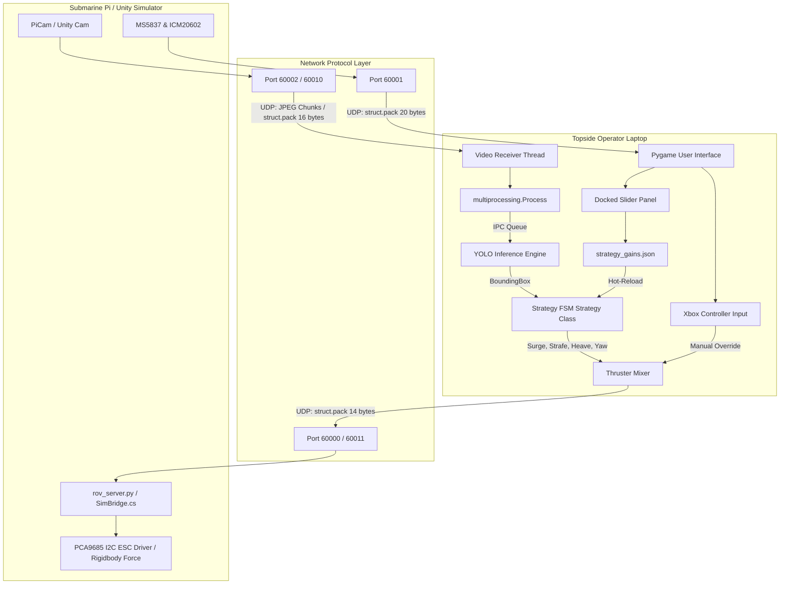
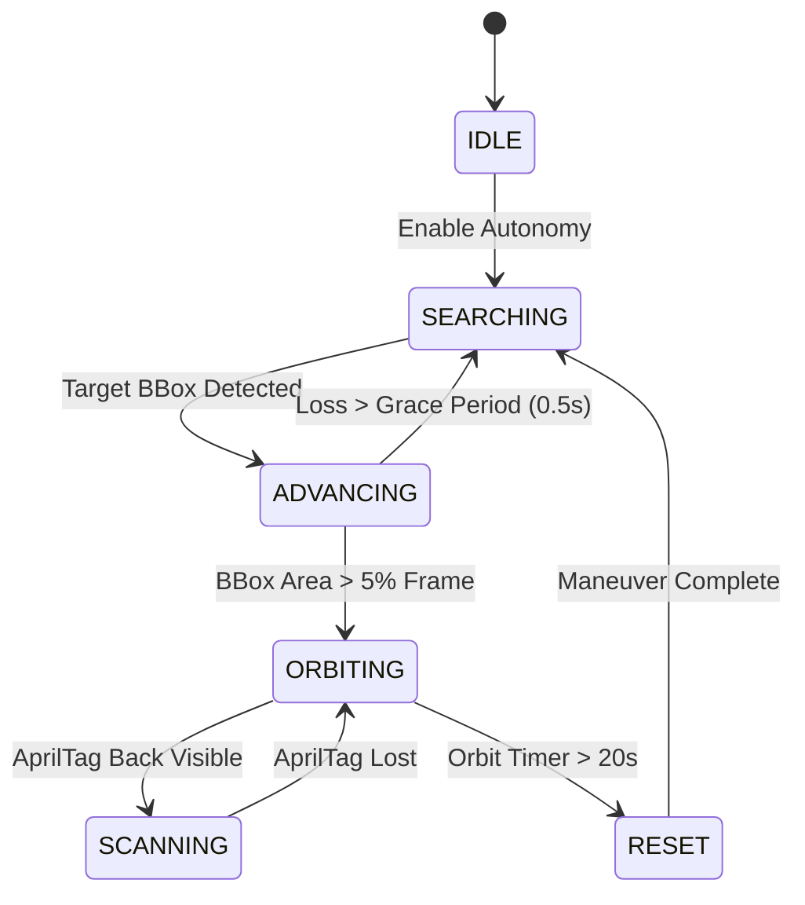

# BlueROV2 Master Technical Handoff Wiki

> [!IMPORTANT]
> **Project Goal**: This repository houses a matched pair of systems for a custom BlueROV2 (r1) underwater vehicle: a 6-DOF physics simulator built in Unity (C#), and a real-sub control & telemetry hardware stack (Raspberry Pi + Python). Both systems share an identical 6-thruster mixing matrix, saturation clamping logic, and UDP binary socket protocol. Control strategies (finite state machines, computer vision loops, and reinforcement learning policies) developed in simulation drop onto physical hardware with zero code rewrites.

---

## Table of Contents
1. [System Architecture & Master Topology](#1-system-architecture--master-topology)
2. [Submarine Hardware & Low-Level Electronics (Raspberry Pi)](#2-submarine-hardware--low-level-electronics-raspberry-pi)
   - [2.1 PCA9685 PWM Controller & ESCs (`pca9685.py`)](#21-pca9685-pwm-controller--escs-pca9685py)
   - [2.2 MS5837 Depth & Pressure Sensor (`ms5837.py`)](#22-ms5837-depth--pressure-sensor-ms5837py)
   - [2.3 ICM20602 Gyroscope & Accelerometer (`icm20602.py`)](#23-icm20602-gyroscope--accelerometer-icm20602py)
3. [Networking Protocols & Communications Layer](#3-networking-protocols--communications-layer)
   - [3.1 UDP Thruster & Light Binary Packet Format (`<7H`)](#31-udp-thruster--light-binary-packet-format-7h)
   - [3.2 Video Streaming Chunking & Frame Reassembly (`!HHH`)](#32-video-streaming-chunking--frame-reassembly-hhh)
   - [3.3 Telemetry Stream Protocol (`<dff`)](#33-telemetry-stream-protocol-dff)
   - [3.4 Failsafe Watchdogs & Threading Architecture](#34-failsafe-watchdogs--threading-architecture)
4. [Kinematics, Thruster Mixing & Closed-Loop Control](#4-kinematics-thruster-mixing--closed-loop-control)
   - [4.1 Vectored Thruster Mixing Matrix](#41-vectored-thruster-mixing-matrix)
   - [4.2 Actuator Saturation & Axis Coupling](#42-actuator-saturation--axis-coupling)
   - [4.3 Closed-Loop Depth PI Control](#43-closed-loop-depth-pi-control)
   - [4.4 Circular Yaw Angle Math](#44-circular-yaw-angle-math)
5. [Topside Software Architecture (`rov_client.py`)](#5-topside-software-architecture-rov_clientpy)
   - [5.1 Event Loop & Operating Modes](#51-event-loop--operating-modes)
   - [5.2 Multiprocessing Strategy (Bypassing Python GIL)](#52-multiprocessing-strategy-bypassing-python-gil)
   - [5.3 Asynchronous MCAP Data Logging](#53-asynchronous-mcap-data-logging)
6. [Computer Vision & Dataset Tooling (YOLO & AprilTag)](#6-computer-vision--dataset-tooling-yolo--apriltag)
   - [6.1 YOLO Model Fine-Tuning (`train.py`)](#61-yolo-model-fine-tuning-trainpy)
   - [6.2 Frame Extraction & Diagnostics (`render.py`, `extract_frames.py`)](#62-frame-extraction--diagnostics-renderpy-extract_framespy)
   - [6.3 AprilTag Target Detection & Mission Control](#63-apriltag-target-detection--mission-control)
7. [Autonomy Strategy Brain & Finite State Machine](#7-autonomy-strategy-brain--finite-state-machine)
   - [7.1 BoundingBox Framing & Upward Bias](#71-boundingbox-framing--upward-bias)
   - [7.2 Finite State Machine (FSM) State Transitions](#72-finite-state-machine-fsm-state-transitions)
   - [7.3 Anti-Stall Mechanics (Dash & Reset Maneuvers)](#73-anti-stall-mechanics-dash--reset-maneuvers)
   - [7.4 Hot-Reloadable JSON Gain Architecture](#74-hot-reloadable-json-gain-architecture)
8. [Unity Simulator Architecture (C# Source Code)](#8-unity-simulator-architecture-c-source-code)
   - [8.1 Hydrodynamics Physics Engine (`Hydrodynamics.cs`)](#81-hydrodynamics-physics-engine-hydrodynamicscs)
   - [8.2 Unity Network Protocol Bridge (`SimBridge.cs`)](#82-unity-network-protocol-bridge-simbridgecs)
   - [8.3 Thruster Mixing Parity (`ThrusterMixer.cs`)](#83-thruster-mixing-parity-thrustermixercs)
   - [8.4 Sim-to-Real Fidelity Tuning Harness (`TuningHarness.cs`)](#84-sim-to-real-fidelity-tuning-harness-tuningharnesscs)
   - [8.5 Random Spawn Teleportation (`RandomSpawn.cs`)](#85-random-spawn-teleportation-randomspawncs)
9. [Python Simulator Runners (`run_sim.py`, `run_evade.py`)](#9-python-simulator-runners-run_simpy-run_evadepy)
   - [9.1 Main Simulation Runner (`run_sim.py`)](#91-main-simulation-runner-run_simpy)
   - [9.2 Sparring Target Evade Runner (`run_evade.py`)](#92-sparring-target-evade-runner-run_evadepy)
10. [Operator Runbook & Handoff Guide](#10-operator-runbook--handoff-guide)
    - [10.1 Hardware Setup & Networking Configuration](#101-hardware-setup--networking-configuration)
    - [10.2 Daily Deployment Checklist](#102-daily-deployment-checklist)
    - [10.3 Bench Diagnostics & Troubleshooting](#103-bench-diagnostics--troubleshooting)

---

## 1. System Architecture & Master Topology

The system architecture spans three primary physical/logical nodes:
1. **Onboard Submarine (Raspberry Pi)**: Runs `rov_server.py`, communicating with hardware sensor ICs and ESC driver boards via I2C/SPI buses, receiving thruster commands over UDP, streaming camera frames topside, and broadcasting sensor telemetry.
2. **Topside Ground Station (Laptop)**: Runs `rov_client.py`, providing a Pygame GUI, manual gamepad control, multiprocessing YOLO object detection, AprilTag tracking, dynamic state-machine strategy execution, and automated MCAP mission logging.
3. **Unity 3D Physics Simulator**: Simulates 6-DOF hydrodynamics (added mass, linear/quadratic damping, buoyancy torques, Coriolis coupling), mirrors the onboard server's UDP protocol (`SimBridge.cs`), and presents virtual camera bounding box feeds to the strategy brain.



---

## 2. Submarine Hardware & Low-Level Electronics (Raspberry Pi)

### 2.1 PCA9685 PWM Controller & ESCs (`pca9685.py`)
The Raspberry Pi delegates hardware PWM generation to an NXP **PCA9685** 16-channel 12-bit PWM controller over I2C (`bus=1`). 

#### Electrical & Mathematical Formulae
Standard Electronic Speed Controllers (ESCs) require a 50 Hz PWM control signal (period $T = 20\text{ ms} = 20,000\ \mu\text{s}$). The PCA9685 slices this 20 ms window into $2^{12} = 4096$ discrete ticks.

The conversion formula from pulse width in microseconds ($\text{PWM}_{\mu\text{s}}$) to raw 12-bit register ticks is:
$$\text{Ticks} = \text{round}\left( 4095 \times \frac{\text{PWM}_{\mu\text{s}}}{20,000\ \mu\text{s}} \right)$$

- **1100 $\mu$s (Full Reverse / Light OFF)**: $\approx 225\text{ ticks}$
- **1500 $\mu$s (Neutral / Motors Stopped)**: $\approx 307\text{ ticks}$
- **1900 $\mu$s (Full Forward / Light ON)**: $\approx 389\text{ ticks}$

#### Prescaler Setup & Register Sleep Logic
To set the internal clock to 50 Hz, the PCA9685 scales down its internal 25 MHz oscillator using a prescaler:
$$\text{Prescaler} = \text{round}\left( \frac{25\text{ MHz}}{4096 \times 50\text{ Hz}} \right) - 1 = 121 \quad (0x79)$$

Per datasheet rules, the prescaler can **only** be modified while the chip is in Sleep Mode (`MODE1_SLEEP` bit 4 set). The driver (`pca9685-python`) executes:
```python
# 1. Force chip into sleep mode
self.write(REG_MODE1, [MODE1_EXTCLK | MODE1_SLEEP | MODE1_AI])
# 2. Write prescaler value (121)
self.write(REG_PRESCALE, [prescaler & 0xFF])
# 3. Clear sleep bit to resume operation
self.write(REG_MODE1, [MODE1_EXTCLK | MODE1_AI])
```

#### Pin Channel Mapping
| Channel | Function | Signal Range ($\mu$s) |
|---|---|---|
| `0` | Front-Left Horizontal Thruster (FL) | 1100 - 1900 |
| `1` | Front-Right Horizontal Thruster (FR) | 1100 - 1900 |
| `2` | Rear-Left Horizontal Thruster (RL) | 1100 - 1900 |
| `3` | Rear-Right Horizontal Thruster (RR) | 1100 - 1900 |
| `4` | Vertical Thruster 1 (V1) | 1100 - 1900 |
| `5` | Vertical Thruster 2 (V2) | 1100 - 1900 |
| `9` | Submarine LED Light | 1100 (OFF) - 1900 (ON) |
| `15` | Camera Tilt Servo | Custom pulse (aiming) |

---

### 2.2 MS5837 Depth & Pressure Sensor (`ms5837.py`)
The **MS5837-30BA** piezoresistive pressure sensor communicates over I2C (`bus=6` on Pi). It provides 24-bit pressure and temperature measurements.

#### Factory Calibration (PROM) & CRC Validation
During factory production, 6 calibration coefficients ($C_1$ through $C_6$) are stored in the sensor's PROM. At boot, `ms5837.py` reads these coefficients and executes a 4-bit Cyclic Redundancy Check (CRC4) to ensure I2C line noise hasn't corrupted the parameters.

#### Second-Order Temperature Compensation
Because piezoresistive silicon changes physical resistance under temperature shifts, raw pressure $D_1$ and temperature $D_2$ undergo non-linear polynomial corrections:
$$dT = D_2 - C_5 \times 256$$
$$T = 2000 + \frac{dT \times C_6}{2^{23}}$$

If $T < 20^\circ\text{C}$ (typical underwater environment), second-order correction terms are subtracted:
$$T_i = \frac{11 \times dT^2}{34359738368}$$
$$\text{OFF}_i = \frac{31 \times (T - 2000)^2}{8}$$
$$\text{SENS}_i = \frac{63 \times (T - 2000)^2}{32}$$

Hydrostatic depth ($d$) is calculated using fluid density $\rho$:
$$P_{\text{mbar}} = \frac{\text{OFF} - \text{OFF}_i + \frac{D_1 \times (\text{SENS} - \text{SENS}_i)}{2097152}}{81920}$$
$$\text{Depth (meters)} = \frac{(P_{\text{mbar}} - P_{\text{surface}}) \times 100}{\rho \times g}$$
- **Freshwater Density**: $\rho = 997\text{ kg/m}^3$
- **Saltwater Density**: $\rho = 1029\text{ kg/m}^3$

---

### 2.3 ICM20602 Gyroscope & Accelerometer (`icm20602.py`)
The **ICM20602** 6-axis IMU communicates via **SPI** (`bus=1`, `cs=2`) at 10 MHz.

#### Why SPI Gyroscope over Magnetometer Compass?
Thruster motors draw up to 60+ Amperes during rapid maneuvers. High currents running through unshielded tether and internal wiring generate severe localized magnetic fields ($\vec{B} \propto I$), completely distorting magnetometer readings. Thus, heading is derived by integrating the Gyroscope's Z-axis rate of turn ($\omega_z$).

#### SPI Transaction Protocol
In SPI communications, reading a register requires setting the Most Significant Bit (MSB, bit 7) to 1:
```python
xferdata[0] = reg | 0x80  # Bitwise OR sets MSB high for READ operation
```

#### Bias Estimation & Dead-Reckoning Integration
Gyroscopes possess a static offset error (resting drift). At boot, `HeadingTracker` collects 60 stationary samples over 300 ms to compute static bias $\beta_z$:
$$\beta_z = \frac{1}{N} \sum_{i=1}^{N} \omega_{z,i}$$

During runtime, true yaw rate is bias-corrected and integrated numerically:
$$\text{Heading}(t) = \text{Heading}(t - \Delta t) + (\omega_z - \beta_z) \times \Delta t$$

---

## 3. Networking Protocols & Communications Layer

### 3.1 UDP Thruster & Light Binary Packet Format (`<7H`)
To minimize latency and avoid TCP head-of-line blocking, motor commands transmit over UDP port `60000` (or `60011` in simulation).

The packet packs 7 unsigned 16-bit integers (`uint16`) into 14 raw binary bytes using Python's `struct` library:
- **Format String**: `"<7H"`
- **`<`**: Little-endian byte ordering (ensuring cross-compatibility between ARM Raspberry Pi and x86 Topside CPUs).
- **`7H`**: 7 unsigned shorts ($7 \times 2\text{ bytes} = 14\text{ bytes}$).

```python
# Client / Sim Runner Side: Pack commands (1100 to 1900 us)
packet = struct.pack("<7H", fl_pwm, fr_pwm, rl_pwm, rr_pwm, v1_pwm, v2_pwm, light_pwm)

# Server / Unity SimBridge Side: Unpack 14 bytes instantly
fl, fr, rl, rr, v1, v2, light = struct.unpack("<7H", data)
```

---

### 3.2 Video Streaming Chunking & Frame Reassembly (`!HHH`)
High-resolution camera frames compressed as JPEG often exceed the standard Ethernet Maximum Transmission Unit (MTU) of 1,500 bytes and the UDP limit of 65,507 bytes. The `video_loop` thread manually fragments JPEG byte arrays into 60,000-byte blocks.

#### Packet Chunk Header (`!HHH`)
Each video chunk prepends a 6-byte header formatted in Big-Endian network order (`!`):
1. **Frame ID (`uint16`)**: Wraps at 65535.
2. **Total Blocks (`uint16`)**: Total chunks in current frame.
3. **Block Index (`uint16`)**: Zero-based index of current chunk.

```python
header = struct.pack("!HHH", fid & 0xFFFF, blocks, idx)
sock.sendto(header + chunk_payload, (client_ip, port))
```

#### Topside Asynchronous Reassembly
The client maintains a `defaultdict(dict)` keyed by `fid`. Once `len(chunks) == total_blocks`, `cv2.imdecode` reconstructs the frame in memory.

---

### 3.3 Telemetry Stream Protocol (`<dff`)
Depth and heading stream topside over UDP port `60001` at 50 Hz.
- **Format String**: `"<dff"` (20 bytes)
- **`d`**: Double-precision float64 (Unix epoch timestamp).
- **`f`**: Single-precision float32 (Water depth in meters).
- **`f`**: Single-precision float32 (Integrated yaw heading in degrees).

---

### 3.4 Failsafe Watchdogs & Threading Architecture
The submarine server executes three isolated POSIX threads:
1. `thruster_loop`: High-priority socket listener & PCA9685 hardware writer.
2. `video_loop`: OpenCV frame capture & UDP streamer.
3. `sensor_loop`: I2C/SPI sensor reader & telemetry broadcaster.

> [!WARNING]
> **Safety Watchdog**: If the tether is cut or the topside client crashes, `thruster_loop` detects packet absence via `THR_TIMEOUT = 0.5s`. It immediately overwrites all PCA9685 motor registers to `1500` (Neutral), preventing thruster runaway. Unity's `SimBridge.cs` enforces the exact same 0.5s timeout.

---

## 4. Kinematics, Thruster Mixing & Closed-Loop Control

### 4.1 Vectored Thruster Mixing Matrix
The BlueROV2 uses four horizontal thrusters mounted at $45^\circ$ angles relative to the longitudinal axis, and two vertical thrusters.

```
      Bow (Front)
   FL (45°)   FR (-45°)
      \       /
       \  V1 /
        [ROV]
       /  V2 \
      /       \
   RL (135°) RR (-135°)
      Stern (Rear)
```

The mathematical transformation from 4-DOF motion commands $(\text{surge}, \text{strafe}, \text{heave}, \text{yaw}) \in [-1.0, 1.0]^4$ to individual thruster outputs is:

$$\begin{bmatrix} \text{FL} \\ \text{FR} \\ \text{RL} \\ \text{RR} \\ \text{V1} \\ \text{V2} \end{bmatrix} = \text{clamp}\begin{pmatrix} \begin{bmatrix} 1 & -1 & 0 & -1 \\ 1 & 1 & 0 & 1 \\ 1 & 1 & 0 & -1 \\ 1 & -1 & 0 & 1 \\ 0 & 0 & 1 & 0 \\ 0 & 0 & -1 & 0 \end{bmatrix} \begin{bmatrix} \text{surge} \\ \text{strafe} \\ \text{heave} \\ \text{yaw} \end{bmatrix} \end{pmatrix}$$

#### Implementation Code
```python
def mix(surge: float, strafe: float, heave: float, yaw: float):
    fl = clamp(surge - strafe - yaw)
    fr = clamp(surge + strafe + yaw)
    rl = clamp(surge + strafe - yaw)
    rr = clamp(surge - strafe + yaw)
    v1 = clamp(heave)
    v2 = clamp(-heave)
    return fl, fr, rl, rr, v1, v2
```

---

### 4.2 Actuator Saturation & Axis Coupling
If an operator commands full forward ($\text{surge} = 1.0$) and full turn ($\text{yaw} = 1.0$), the unclipped sum for Front-Right is $1.0 + 1.0 = 2.0$. The hard `clamp(-1.0, 1.0)` clips this to $1.0$.

> [!NOTE]
> Hardware actuator saturation causes non-linear axis coupling at high thrust levels. The Unity physics engine (`ThrusterMixer.cs`) implements this exact saturation step, reproducing identical saturation behaviors in simulation.

---

### 4.3 Closed-Loop Depth PI Control
Topside closed-loop depth holding implements a Proportional-Integral (PI) controller:

$$e(t) = d_{\text{measured}} - d_{\text{target}}$$
$$u(t) = \text{clamp}\left( K_p e(t) + K_i \int_0^t e(\tau) d\tau, -1.0, 1.0 \right)$$

```python
err = current_depth - target_depth
p_term = HOLD_KP * err

if abs(err) >= HOLD_DEADBAND:  # 0.02m deadband ignores sensor noise
    self._hold_i += err * dt
    self._hold_i = max(-i_cap, min(i_cap, self._hold_i))  # Anti-windup clamping

i_term = HOLD_KI * self._hold_i
cmd = clamp(p_term + i_term)
```
- **$K_i$ Role**: Counteracts the positive net buoyancy of the ROV, continuously ramping down thrust until hovering perfectly stationary.

---

### 4.4 Circular Yaw Angle Math
Angular errors must wrap along the shortest arc on the 1-sphere $S^1$ within $[-180^\circ, 180^\circ)$:

```python
def _yaw_error(target_deg: float, current_deg: float) -> float:
    return (target_deg - current_deg + 180.0) % 360.0 - 180.0
```

---

## 5. Topside Software Architecture (`rov_client.py`)

### 5.1 Event Loop & Operating Modes
The main topside application executes a 30 Hz Pygame event loop (`clock.tick(30)`).
1. **Manual Gamepad Mode**: Direct Xbox joystick mapping to surge, strafe, heave, yaw.
2. **Autonomous Mode**: Feeds live YOLO bounding boxes into the Strategy FSM.
3. **AprilTag Mission Mode**: Tracks unique tag IDs, triggering LED flashes upon mission completion.
4. **Test Panel Mode**: Executes open-loop calibration step pulses for fidelity tuning.

---

### 5.2 Multiprocessing Strategy (Bypassing Python GIL)
Because Python's Global Interpreter Lock (GIL) prevents multi-threaded CPU parallelization, running PyTorch neural network inference in a thread would freeze the Pygame UI loop.

The detector runs in a completely separate process via `multiprocessing.Process`:

```python
ctx = mp.get_context("spawn")  # "spawn" avoids CUDA/OpenCV fork deadlocks
self.yolo_in = ctx.Queue(maxsize=1)
self.yolo_out = ctx.Queue(maxsize=1)

self.yolo_proc = ctx.Process(
    target=_yolo_worker,
    args=(weights, conf, self.yolo_in, self.yolo_out, stop_event),
    daemon=True
)
```

---

### 5.3 Asynchronous MCAP Data Logging
Telemetry ticks and vision detections log to Foxglove `.mcap` files protected by a mutual exclusion thread lock (`threading.Lock`), flushing buffers to disk every 1.0 second.

---

## 6. Computer Vision & Dataset Tooling (YOLO & AprilTag)

### 6.1 YOLO Model Fine-Tuning (`train.py`)
`train.py` fine-tunes YOLO26n / YOLOv8 on custom Roboflow datasets, automatically selecting hardware backends (`CUDA` $\to$ `Apple MPS` $\to$ `CPU`).

```bash
python train.py --data /path/to/roboflow/data.yaml --epochs 100 --imgsz 640
```
Trained weights land at `runs/detect/<experiment_name>/weights/best.pt`.

---

### 6.2 Frame Extraction & Diagnostics
- `render.py`: Runs off-sub model verification, overlaying inference latency and FPS.
- `extract_frames.py`: Extracts dataset frames from recorded MP4 logs at target sampling rates.

---

## 7. Autonomy Strategy Brain & Finite State Machine

### 7.1 BoundingBox Framing & Upward Bias
To keep the sub elevated above pool deck obstacles, target framing aims at the top edge of the bounding box rather than the geometric center:

```python
@property
def center(self) -> Tuple[float, float]:
    return (self.x + self.width / 2, self.y)  # y is top-edge -> induces upward bias
```

---

### 7.2 Finite State Machine (FSM) State Transitions



- **`SEARCHING`**: Executes 360° yaw spin + sinusoidal depth bobbing.
- **`ADVANCING`**: Closes in on target with an angled offset (`approach_offset_px = 80px`).
- **`ORBITING`**: Circles opponent at constant radius using proportional surge hold.
- **`SCANNING`**: Holds stationary view of target back to log AprilTags.

---

### 7.3 Anti-Stall Mechanics
1. **Post-Flip DASH**: Reversing orbit direction triggers a 1.5s dash at 100% strafe to break geometry locks.
2. **3-Stage RESET Maneuver**: If stalemated for 20s, executes:
   - Stage 1: Heave UP/DOWN (alternating vertically each reset).
   - Stage 2: Surge FORWARD.
   - Stage 3: Yaw 180°.

---

### 7.4 Hot-Reloadable JSON Gain Architecture
`Strategy` checks the OS modification time (`os.path.getmtime`) of `strategy_gains.json` on every loop cycle. Edits made via the UI slider panel instantly reload into active memory without interrupting operation.

---

## 8. Unity Simulator Architecture (C# Source Code)

### 8.1 Hydrodynamics Physics Engine (`Hydrodynamics.cs`)
The Unity physics component implements the 6-DOF Fossen underwater hydrodynamics model using standard body-frame conventions:
- **Translation $(X, Y, Z)$**: Surge ($+X$ forward), Heave ($+Y$ up), Sway ($+Z$ sideways).
- **Rotation $(X, Y, Z)$**: Roll (about $X$), Yaw (about $Y$), Pitch (about $Z$).

#### 1. Restoring Forces (Weight & Buoyancy)
$$\mathbf{F}_G = \text{down} \times (m_{\text{dry}} \cdot g)$$
$$\mathbf{F}_B = \text{up} \times (m_{\text{dry}} \cdot g \cdot \text{buoyancyFactor})$$
- Weight applies at Center of Gravity ($\mathbf{r}_{CG} = \text{worldCenterOfMass}$).
- Buoyancy applies at Center of Buoyancy ($\mathbf{r}_{CB} = \mathbf{r}_{CG} + \text{transform.up} \cdot \text{centreOfBuoyancyHeight}$).
- The offset $\text{centreOfBuoyancyHeight}$ ($0.01\text{m}$) produces restoring torque $\boldsymbol{\tau}_R = (\mathbf{r}_{CB} - \mathbf{r}_{CG}) \times \mathbf{F}_B$ for self-righting stability.

#### 2. Effective Mass Acceleration Scaling
Unity's `Rigidbody` solver assumes a single scalar mass $m_{\text{dry}}$. However, anisotropic translational added mass $\mathbf{m}_a = (\text{addedMassLinear.x}, \text{addedMassLinear.y}, \text{addedMassLinear.z})^T$ increases effective inertia along each axis ($m_{\text{eff}, i} = m_{\text{dry}} + m_{a,i}$). To ensure Unity's solver ($a_i = F_i / m_{\text{dry}}$) matches true physical acceleration ($a_i = f_i / m_{\text{eff}, i}$), all applied translational forces are scaled:
$$F_{i,\text{applied}} = f_i \cdot \frac{m_{\text{dry}}}{m_{\text{dry}} + m_{a,i}}$$

#### 3. Linear & Quadratic Hydrodynamic Damping
Linear skin friction $\mathbf{D}_l$ and quadratic form drag $\mathbf{D}_q$ act on body velocity $\mathbf{v}$ and angular velocity $\mathbf{w}$:
$$f_{\text{damping}, i} = -\left( D_{l,i} + D_{q,i} |v_i| \right) v_i$$
$$t_{\text{damping}, i} = -\left( D_{l,r,i} + D_{q,r,i} |w_i| \right) w_i$$
- Rotational added inertia is added directly to Unity's inertia tensor (`rb.inertiaTensor = dryInertia + addedMassAngular`), so torques require no force scaling.

#### 4. Added-Mass Coriolis & Centripetal Coupling
When translating and rotating simultaneously, anisotropic linear added mass produces coupling forces and torques:
$$\mathbf{a}_1 = \mathbf{M}_{A,\text{linear}} \odot \mathbf{v} = \begin{bmatrix} m_{a,x} \cdot v_x \\ m_{a,y} \cdot v_y \\ m_{a,z} \cdot v_z \end{bmatrix}$$
$$\mathbf{f}_{\text{Coriolis}} = -(\mathbf{w} \times \mathbf{a}_1)$$
$$\boldsymbol{\tau}_{\text{Coriolis}} = -(\mathbf{v} \times \mathbf{a}_1)$$

---

### 8.2 Unity Network Protocol Bridge (`SimBridge.cs`)
`SimBridge.cs` attaches to the main sub GameObject in Unity:

#### 1. Inbound Thruster Packet Decoder (`ReceiveLoop`)
- Listens on UDP port `60011` (or `60013` for target) for 14-byte thruster packets (`<7H`).
- Recovers normalized commands $\in [-1.0, 1.0]$:
  $$\text{surge} = \frac{\text{FL} + \text{FR} + \text{RL} + \text{RR}}{4}, \quad \text{strafe} = \frac{-\text{FL} + \text{FR} + \text{RL} - \text{RR}}{4}$$
  $$\text{yaw} = \frac{-\text{FL} + \text{FR} - \text{RL} + \text{RR}}{4}, \quad \text{heave} = \frac{\text{V1} - \text{V2}}{2}$$
- Enforces thread-safe 0.5s packet timeout via `System.Environment.TickCount`.

#### 2. Outbound Bounding Box Projection (`LateUpdate`)
- Projects local-space mesh bounding boxes of the target sub into camera viewport space.
- Flips Y axis to match OpenCV conventions: $\text{py} = (1.0 - \text{vp.y}) \times \text{imageHeight}$.
- Packs bounding box parameters into a 16-byte binary UDP packet (`<4f`: `cx, cy, w, h`) and broadcasts to Python over port `60010`.

#### 3. Game View Debug Overlay (`OnGUI`)
- Renders crosshair target at image center $(320, 240)$.
- Outlines visible target sub with green bounding box and center red marker.
- Displays live HUD telemetry panel showing target visibility status and active control commands.

---

### 8.3 Thruster Mixing Parity (`ThrusterMixer.cs`)
`ThrusterMixer.cs` provides a static C# struct and mixing method matching Python's mixing matrix 1:1:
```csharp
public static ThrusterOutput Mix(float surge, float strafe, float heave, float yaw) {
    return new ThrusterOutput {
        fl = Mathf.Clamp(surge - strafe - yaw, -1f, 1f),
        fr = Mathf.Clamp(surge + strafe + yaw, -1f, 1f),
        rl = Mathf.Clamp(surge + strafe - yaw, -1f, 1f),
        rr = Mathf.Clamp(surge - strafe + yaw, -1f, 1f),
        v1 = Mathf.Clamp(heave, -1f, 1f),
        v2 = Mathf.Clamp(-heave, -1f, 1f),
    };
}
```

---

### 8.4 Sim-to-Real Fidelity Tuning Harness (`TuningHarness.cs`)
`TuningHarness.cs` provides a legacy IMGUI workbench for fidelity tuning:

#### 1. Open-Loop Step Tests
Executes pulse commands for duration $t_{\text{test}} = 3.0\text{s}$ at amplitude $1.0$, tracks powered distance, coasting distance (glide until speed $< 0.02\text{ m/s}$ or yaw rate $< 1.0^\circ/\text{s}$), and speed curves.

#### 2. Offline Bisection Auto-Match Algorithm (`AutoMatch`)
Solves for two unknown parameters ($\text{dragScale}$ and $\text{thrustGain}$) from two physical pool measurements ($\text{realPowered}$ and $\text{realGlide}$):
- **Inner Loop (40 iterations)**: Solves for thrust gain matching $\text{realPowered}$ distance for a trial drag scale.
- **Outer Loop (40 iterations)**: Solves for drag scale matching $\text{realGlide}$ distance.
- Updates Unity `SubController` gains and scales linear/quadratic drag vectors in `Hydrodynamics`.

#### 3. Parameter Persistence & Live UDP Gains
- Saves/loads parameters to `Assets/parameters/sub_tuning.json`.
- Broadcasts `centeringKp` float over UDP to Python `strategy_full.py` port `60012`.

---

### 8.5 Random Spawn Teleportation (`RandomSpawn.cs`)
- Teleports submarine GameObjects on Play start inside volume `areaCenter = (0, 1.5, 0)` and `areaSize = (13, 2, 13)`.
- Applies random yaw rotation (`Quaternion.Euler(0, Random.Range(0, 360), 0)`).
- Sets `rb.position`/`rb.rotation`, zeros velocities, and calls `Physics.SyncTransforms()`.

---

## 9. Python Simulator Runners (`run_sim.py`, `run_evade.py`)

### 9.1 Main Simulation Runner (`run_sim.py`)
Connects the Python `Strategy` brain to Unity:
1. Listens on UDP port `60010` for 16-byte `<4f` target bounding boxes, draining socket to the latest packet to eliminate latency.
2. Invokes `surge, strafe, heave, yaw, flash = strat.update(box, real_dt)`.
3. Converts commands to `<7H` binary thruster packet with `AMP = 400` ($1500 \pm 400\ \mu\text{s}$) and broadcasts to Unity port `60011` at 50 Hz.
4. Supports `--mock` mode with synthetic scripted target trajectory (`mock_box(t)`) for offline FSM logic verification without Unity.

### 9.2 Sparring Target Evade Runner (`run_evade.py`)
Runs the frozen target sub's brain (`strategy_target.py`) as a baseline opponent:
- Dynamically rebinds `run_sim.Strategy = Strategy` from `strategy_target.py`.
- Connects to target sub UDP ports `60012` (inbound boxes) and `60013` (outbound thrusters).
- Enables 2-sub competitive sparring matches inside Unity.

---

## 10. Operator Runbook & Handoff Guide

### 10.1 Hardware Setup & Networking Configuration
Configure the Raspberry Pi with a static IP address:
```bash
sudo nmcli connection add type ethernet ifname eth0 con-name eth0-static ipv4.addresses 192.168.2.10/24 ipv4.method manual
sudo nmcli connection up eth0-static
```

Create server credentials file `~/.rov_server_creds`:
```ini
[DEFAULT]
thruster_port = 60000
imu_and_depth_port = 60001
video_port = 60002
video_quality = 75

[lan]
rov_ip = 192.168.2.10
client_ip = 192.168.2.1

[wifi]
rov_ip = 192.168.2.150
client_ip = 192.168.2.200
```

---

### 10.2 Daily Deployment Checklist

#### 1. Hardware Submarine Dive:
```bash
# On Raspberry Pi:
python3 server/rov-server.py

# On Topside Laptop:
python3 client/rov_client.py --weights best.pt --strategy new_strategy_full
```

#### 2. Unity Simulation Match:
```bash
# In Unity Editor: Press Play (Scene containing SimBridge & RandomSpawn)

# Terminal 1 (Main Sub Strategy):
python3 run_sim.py

# Terminal 2 (Sparring Opponent Target Sub):
python3 run_evade.py
```

---

### 10.3 Bench Diagnostics & Troubleshooting
- **Light Channel Identification**:
  ```bash
  python3 bench/light_finder.py
  ```
- **Camera Servo Alignment**:
  ```bash
  python3 bench/camera_aim.py
  ```
- **Gamepad Button Mapping Check**:
  ```bash
  python3 bench/gamepad_test.py
  ```

---
*Wiki documentation compiled for project handoff. All system parameters defined in `strategy_gains.json` and `README.md`.*
